# First Steps

- [First Steps](#first-steps)
  - [Hello World Program](#hello-world-program)
  - [3. Defining the Main Method](#3-defining-the-main-method)
    - [Code Example](#code-example)
      - [code](#code)
      - [output](#output)
  - [4. Hello World Challenge and Common Errors](#4-hello-world-challenge-and-common-errors)
    - [Challenge](#challenge)
      - [Question](#question)
      - [Answer](#answer)
        - [Code](#code-1)
          - [output](#output-1)
  - [5. Variables](#5-variables)
    - [Challenge](#challenge-1)
      - [Question](#question-1)
      - [Answer](#answer-1)
        - [Code](#code-2)
          - [output](#output-2)
    - [String Literal](#string-literal)
    - [Code Example](#code-example-1)
      - [code](#code-3)
      - [output](#output-3)
  - [6. Starting out with Expressions](#6-starting-out-with-expressions)
    - [Challenge](#challenge-2)
      - [Question](#question-2)
      - [Answer](#answer-2)
        - [Code](#code-4)
          - [output](#output-4)
    - [Code Example](#code-example-2)
      - [code](#code-5)
      - [output](#output-5)
    - [Challenge](#challenge-3)
      - [Question](#question-3)
      - [Answer](#answer-3)
        - [Code](#code-6)
          - [output](#output-6)
  - [7. Primitive Types](#7-primitive-types)
    - [Java packages](#java-packages)
    - [Wrapper Class](#wrapper-class)
    - [Code Example](#code-example-3)
      - [code](#code-7)
      - [output](#output-7)
  - [8. byte, short, long and width](#8-byte-short-long-and-width)
    - [Code Example](#code-example-4)
      - [code](#code-8)
      - [output](#output-8)
    - [long values](#long-values)
    - [Code Example](#code-example-5)
      - [code](#code-9)
      - [output](#output-9)
  - [9. Casting in Java](#9-casting-in-java)
    - [Code Example](#code-example-6)
      - [code](#code-10)
      - [output](#output-10)
  - [10. Primitive Types Challenge](#10-primitive-types-challenge)
    - [Challenge](#challenge-4)
      - [Question](#question-4)
      - [Answer](#answer-4)
        - [Code](#code-11)
          - [output](#output-11)
  - [11. float and double Primitive Types](#11-float-and-double-primitive-types)
    - [Code Example](#code-example-7)
      - [code](#code-12)
      - [output](#output-12)
    - [Challenge](#challenge-5)
      - [Question](#question-5)
      - [Answer](#answer-5)
        - [Code](#code-13)
          - [output](#output-13)
  - [12. Floating Point Precision and a Challenge](#12-floating-point-precision-and-a-challenge)
    - [Code Example](#code-example-8)
      - [code](#code-14)
      - [output](#output-14)
    - [Challenge](#challenge-6)
      - [Question](#question-6)
      - [Answer](#answer-6)
        - [Code](#code-15)
          - [output](#output-15)
    - [Code Example](#code-example-9)
      - [code](#code-16)
      - [output](#output-16)
  - [13. The char and boolean Primitive Data Types](#13-the-char-and-boolean-primitive-data-types)
    - [Char Type](#char-type)
    - [Unicode](#unicode)
    - [Boolean](#boolean)
    - [Code Example](#code-example-10)
      - [code](#code-17)
  - [14. Primitive Types Recap and the String Data Type](#14-primitive-types-recap-and-the-string-data-type)
  - [15. Operators, Operands and Expressions](#15-operators-operands-and-expressions)
  - [16. Abbreviating Operators](#16-abbreviating-operators)
  - [17. if-then Statement](#17-if-then-statement)
  - [18. Logical and Operator](#18-logical-and-operator)
  - [19. Logical OR Operator](#19-logical-or-operator)
  - [20. Assignment Operator VS Equals to Operator](#20-assignment-operator-vs-equals-to-operator)
  - [21. Ternary Operator](#21-ternary-operator)
  - [22. Operator Precedence and Operator Challenge](#22-operator-precedence-and-operator-challenge)
  - [23. First Steps Summary](#23-first-steps-summary)
  - [24. End of Remaster](#24-end-of-remaster)

## Hello World Program

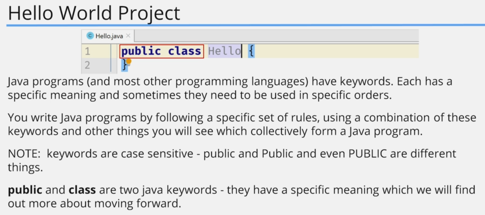
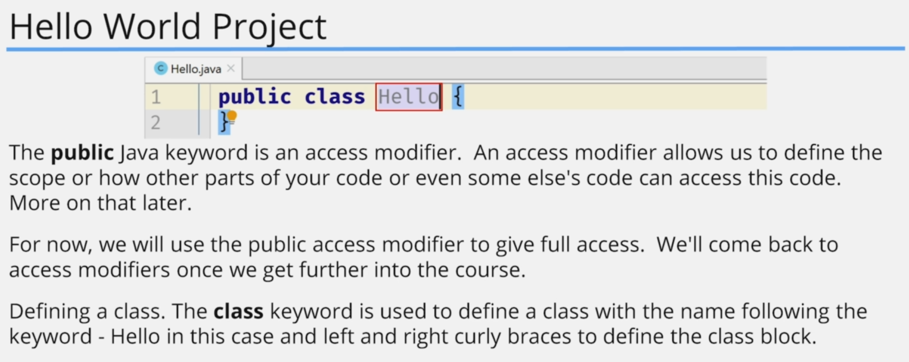
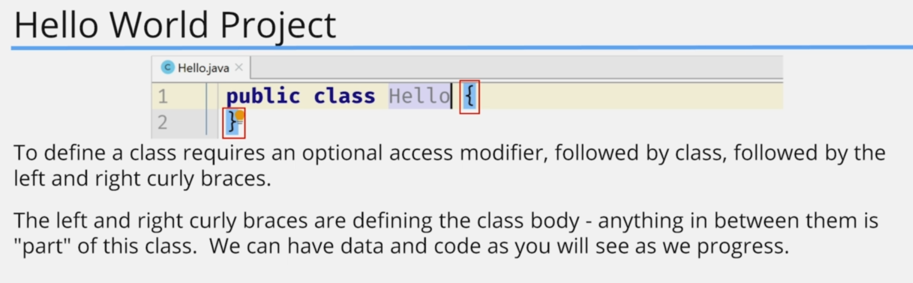

## 3. Defining the Main Method

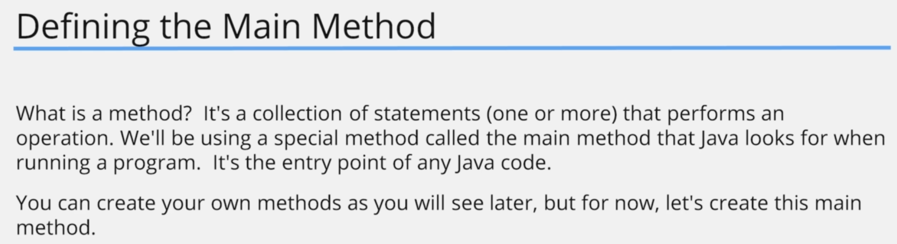
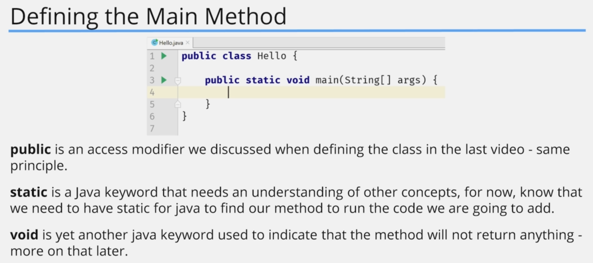

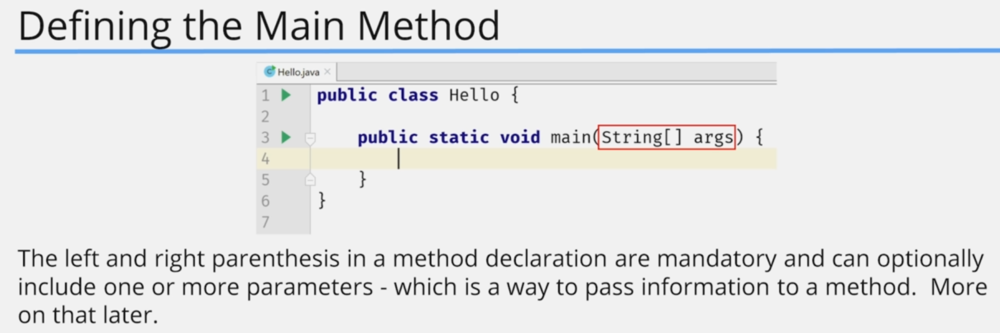
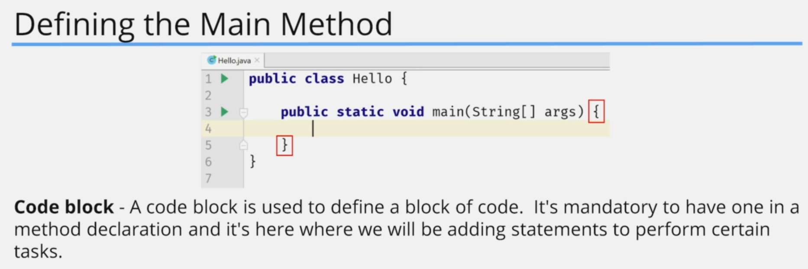
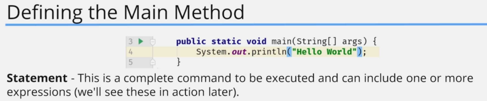

### Code Example

#### code

let's create a Hello Class

```java
public class Hello {
    public static void main(String[] args) {
        System.out.println("Hello World");
    }
}

```

#### output

```shell
🔥 -> Hello World
```

## 4. Hello World Challenge and Common Errors

### Challenge

#### Question


#### Answer

##### Code

```java
public class Hello {
    public static void main(String[] args) {
        System.out.println("Hello Chamara");
    }
}

```

###### output

```shell
🔥 -> Hello Chamara
```

we can see the error from the ide

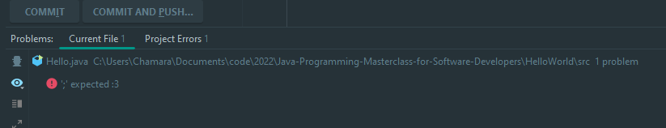

## 5. Variables

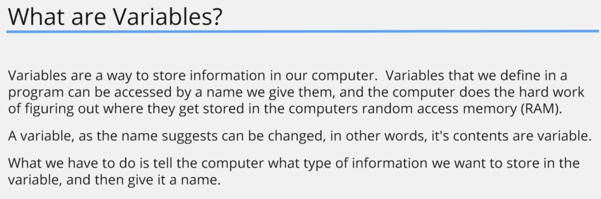
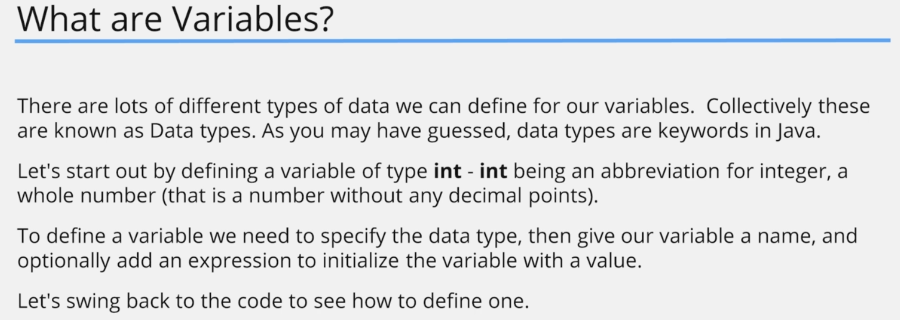
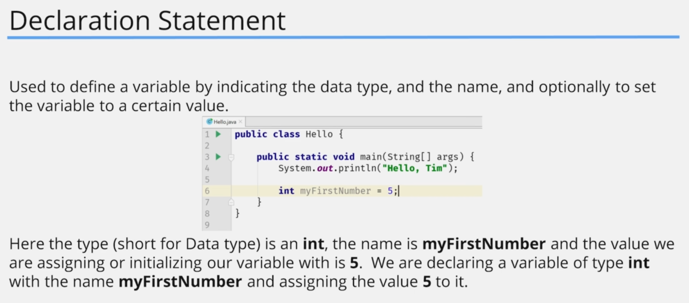
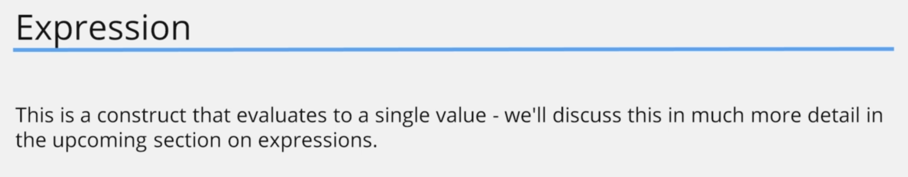

### Challenge

#### Question

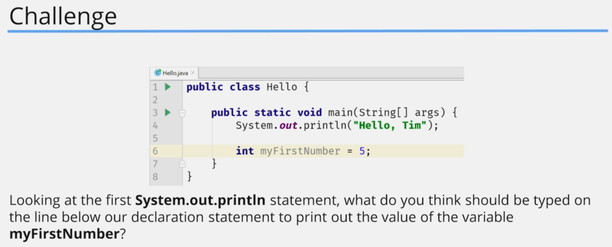

#### Answer

##### Code

```java
public class Hello {
    public static void main(String[] args) {
        int myFirstNumber = 5;
        System.out.println(myFirstNumber);
    }
}

```

###### output

```shell
🔥 ->  5
```

### String Literal

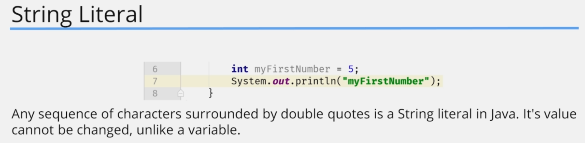

we can use more complex operations on the assignment

### Code Example

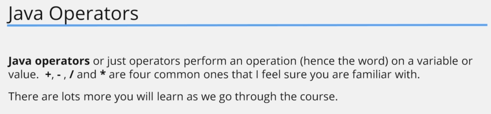

#### code

```java
public class Hello {
    public static void main(String[] args) {
        int myFirstNumber = 5;
        int mySecondNumber = (5 + 3) * 23;
        System.out.println(myFirstNumber);
        System.out.println(mySecondNumber);
    }
}


```

#### output

```shell
🔥 ->  5
🔥 ->  184
```

## 6. Starting out with Expressions

### Challenge

#### Question

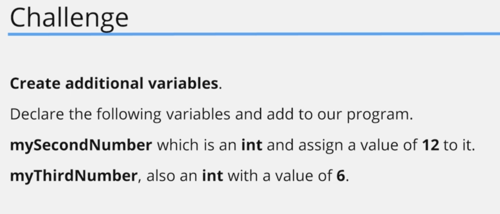

#### Answer

##### Code

```java
public class Hello {
    public static void main(String[] args) {
        int myFirstNumber = 5;
        System.out.println(myFirstNumber);
        int mySecondNumber = 12;
        System.out.println(mySecondNumber);
        int myThirdNumber = 6;
        System.out.println(myThirdNumber);
    }
}

```

###### output

```shell
🔥 ->   5
        12
        6

```

let add some variables together

### Code Example

#### code

```java
public class Hello {
    public static void main(String[] args) {
        int myFirstNumber = 5;
        System.out.println(myFirstNumber);
        int mySecondNumber = 12;
        System.out.println(mySecondNumber);
        int myThirdNumber = 6;
        System.out.println(myThirdNumber);

        int result = myFirstNumber + mySecondNumber + myThirdNumber;
        System.out.println(result);

    }
}


```

#### output

```shell
    5
    12
    6
    23
```

### Challenge

#### Question

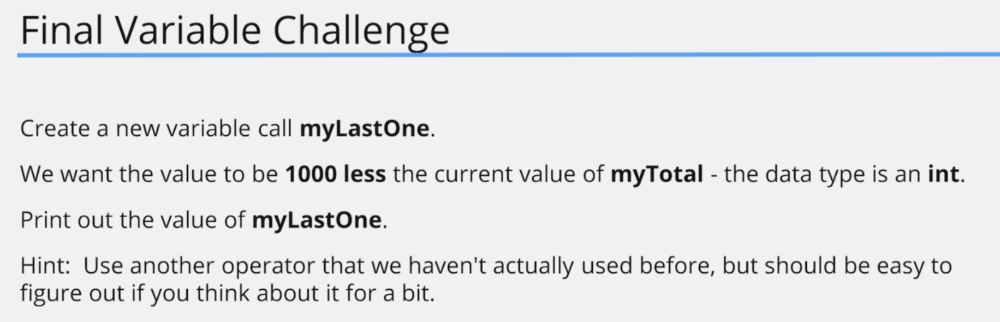

#### Answer

##### Code

```java
public class Hello {
    public static void main(String[] args) {
        int myFirstNumber = 5;
        System.out.println(myFirstNumber);
        int mySecondNumber = 12;
        System.out.println(mySecondNumber);
        int myThirdNumber = 6;
        System.out.println(myThirdNumber);

        int result = myFirstNumber + mySecondNumber + myThirdNumber;
        System.out.println(result);

        int myLastInt;

        myLastInt = 1000 - result;
        System.out.println(myLastInt);
    }
}

```

###### output

```shell
5
12
6
23
977

```

## 7. Primitive Types

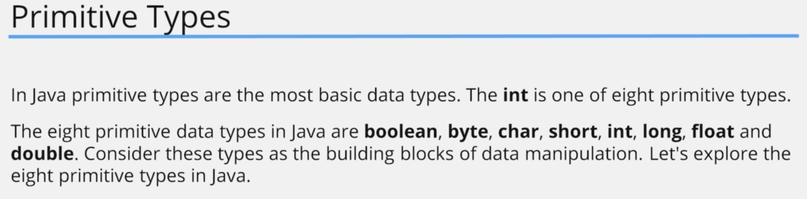

### Java packages

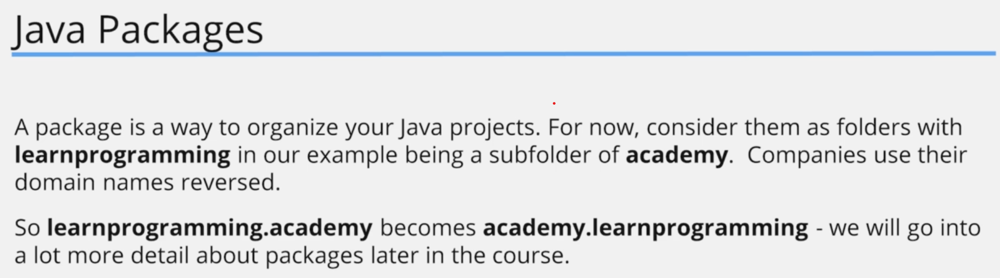

### Wrapper Class

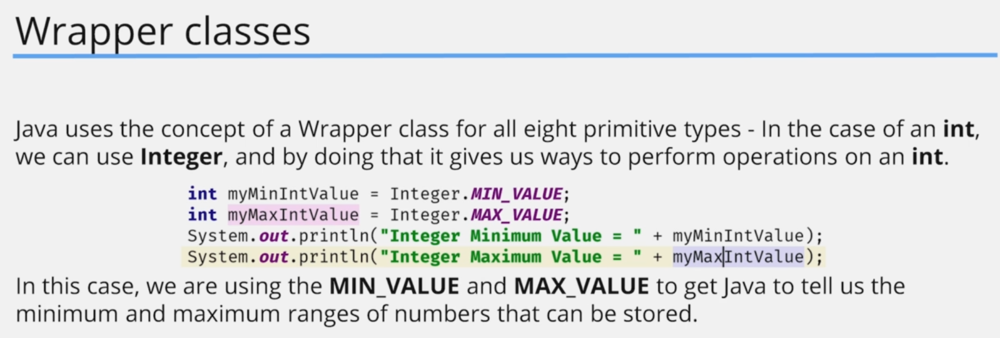

### Code Example

#### code

```java
public class Main {
    public static void main(String[] args) {
        int myIntValue = 122323;
        int maxIntValue = Integer.MAX_VALUE;
        int minIntValue = Integer.MIN_VALUE;
        System.out.println("Minimum Integer value : " + minIntValue);
        System.out.println("Maximum Integer value : " + maxIntValue);

        System.out.println("Busted Max Value " + (maxIntValue + 1));
        System.out.println("Busted Min Value " + (minIntValue - 1));
    }
}

```

#### output

```shell
Minimum Integer value : -2147483648
Maximum Integer value : 2147483647
Busted Max Value -2147483648
Busted Min Value 2147483647
```

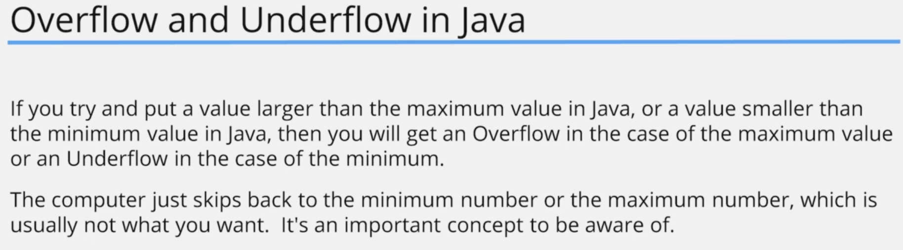

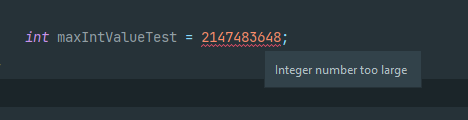

## 8. byte, short, long and width

### Code Example

#### code

```java
public class Main {
    public static void main(String[] args) {
        int myIntValue = 122_323;
        int maxIntValue = Integer.MAX_VALUE;
        int minIntValue = Integer.MIN_VALUE;
        System.out.println("Minimum Integer value : " + minIntValue);
        System.out.println("Maximum Integer value : " + maxIntValue);

        System.out.println("Busted Max Value " + (maxIntValue + 1));
        System.out.println("Busted Min Value " + (minIntValue - 1));
        int maxIntValueTest = 2147483647;

        byte myMinByteValue = Byte.MIN_VALUE;
        byte myMaxByteValue = Byte.MAX_VALUE;
        System.out.println("Minimum Byte value : " + myMaxByteValue);
        System.out.println("Maximum Byte value : " + myMinByteValue);

        short myMinShortValue = Short.MIN_VALUE;
        short myMaxShortValue = Short.MAX_VALUE;
        System.out.println("Minimum Short value : " + myMaxShortValue);
        System.out.println("Maximum Short value : " + myMinShortValue);


    }
}

```

#### output

```shell
Minimum Integer value : -2147483648
Maximum Integer value : 2147483647
Busted Max Value -2147483648
Busted Min Value 2147483647
Minimum Byte value : 127
Maximum Byte value : -128
Minimum Short value : 32767
Maximum Short value : -32768
```

DEtails about these data types
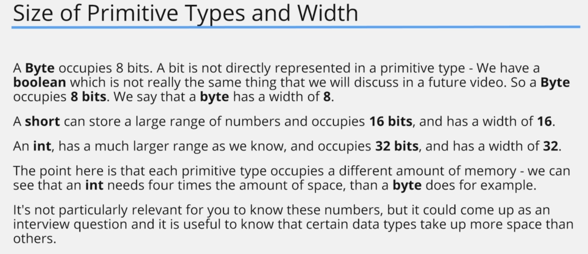

### long values

### Code Example

#### code

```java
public class Main {
    public static void main(String[] args) {
        long myLongValue = 121212L;
        long myMinLongValue = Long.MIN_VALUE;
        long myMaxLongValue = Long.MAX_VALUE;
        System.out.println("Minimum Long value : " + myMaxLongValue);
        System.out.println("Maximum Long value : " + myMinLongValue);
        long bigLongValue = 2147483647121212L;
        System.out.println(bigLongValue);
    }
}

```

#### output

```shell
Minimum Long value : 9223372036854775807
Maximum Long value : -9223372036854775808
2147483647121212
```

## 9. Casting in Java

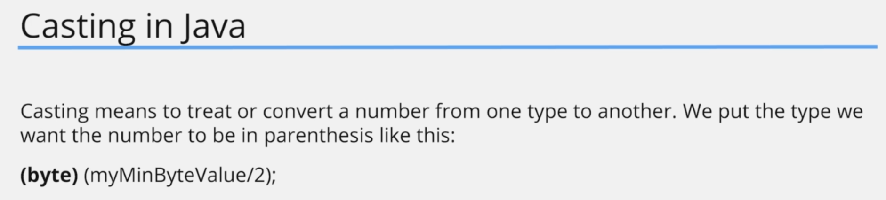

### Code Example

#### code

```java
int myIntValueNew = maxIntValue / 2;
        byte myTestByteValue = (byte) (myMaxByteValue / 2);
        short myNewShortValue = (short) (myMaxShortValue / 2);
        System.out.println(myNewShortValue);

```

#### output

```shell
16383
```

## 10. Primitive Types Challenge

### Challenge

#### Question
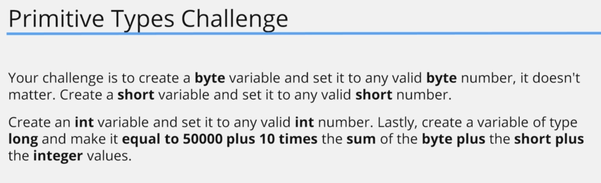

#### Answer

##### Code

```java
public class Main {
    public static void main(String[] args) {
        byte anyByteValue = 122;
        short anyShortValue = 12222;
        int anyIntValue = 12222;

        long total = 50000L + 10L *(anyByteValue+anyIntValue+anyShortValue);
        System.out.println("Total Value : " + total);
//      if we use short value we have to cast
//      values inside the parentheses are considered as integers
        short totalShort = (short) (1000 + 10*(anyByteValue+anyIntValue+anyShortValue));
//      integer is the best value to use as a
//      variable because java handles the casting default
    }
}
```

###### output

```shell
🔥 -> Total Value : 74566
```

## 11. float and double Primitive Types
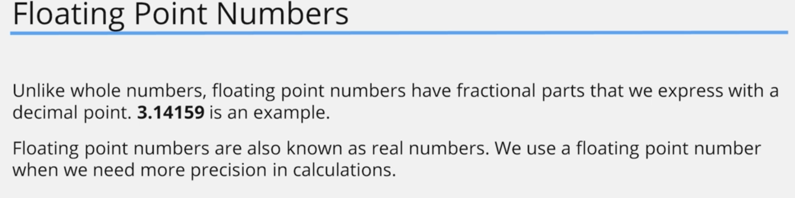
### Code Example

#### code


```java
public class Main {
    public static void main(String[] args) {

        float maxFloatValue = Float.MAX_VALUE;
        float minFloatValue = Float.MIN_VALUE;
        System.out.println("Max Float Value : "+maxFloatValue);
        System.out.println("Min Float Value : "+minFloatValue);

        double maxDoubleValue = Double.MAX_VALUE;
        double minDoubleValue = Double.MIN_VALUE;
        System.out.println("Max Double Value : "+maxDoubleValue);
        System.out.println("Min Double Value : "+minDoubleValue);
    }
}

```

#### output

```shell
Max Float Value : 3.4028235E38
Min Float Value : 1.4E-45
Max Double Value : 1.7976931348623157E308
Min Double Value : 4.9E-324
```

### Challenge

#### Question
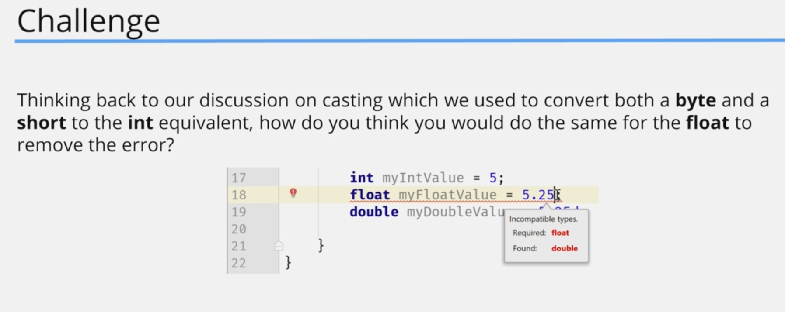

#### Answer

##### Code

```java
public class Main {
    public static void main(String[] args) {
//        in decimal numbers default value java assumes is double
//        so we can use cast
        float testFloat = (float) 34.34;
        float testFloat = 34.34f;
        double testDouble = 23123123.234234234d;
//        double is to prefer data type to use;
    }
}
```

###### output
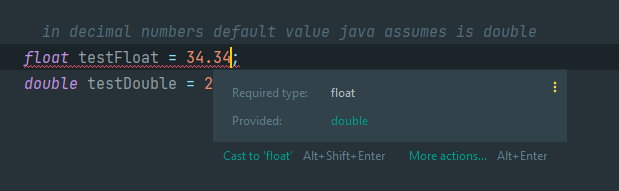

## 12. Floating Point Precision and a Challenge
### Code Example

#### code


```java
public class Main {
    public static void main(String[] args) {

        int myIntValue = 5 / 3;
        float myFloatValue = 5f / 3f;
//        double has more preseason than the float;
//        doubles can process faster than the filters on modern computers
        double myDoubleValue = 5.00 / 3.00;
        System.out.println(myIntValue);
        System.out.println(myFloatValue);
        System.out.println(myDoubleValue);

    }
}

```

#### output

```shell
1
1.6666666
1.6666666666666667

```

### Challenge

#### Question
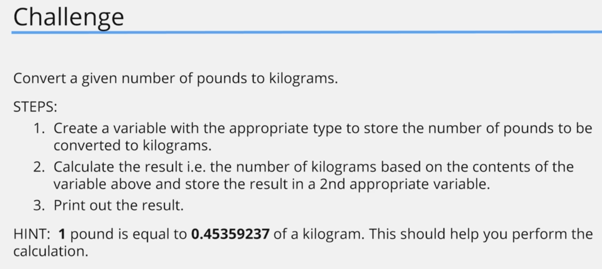

#### Answer

##### Code

```java
public class Main {
    public static void main(String[] args) {

        double numberOfPounds = 200d;
        double kilogramsPerPound = 0.45359237d;
        double convertedToKgValue = (double) (numberOfPounds * kilogramsPerPound);
        System.out.println(numberOfPounds + " pounds equal to " + convertedToKgValue + " kg");
        
    }
}
```

###### output

```shell
🔥 -> 200.0 pounds equal to 90.718474 kg
```

### Code Example

#### code


```java
public class Main {
    public static void main(String[] args) {
        double pi = Math.PI;
//        we can format the number for the readability.
        double formattedVariable = 2_122_122.23_232_232d;
        System.out.println(pi);
        System.out.println(formattedVariable);

    }
}

```

#### output

```shell
3.141592653589793
2122122.23232232
```
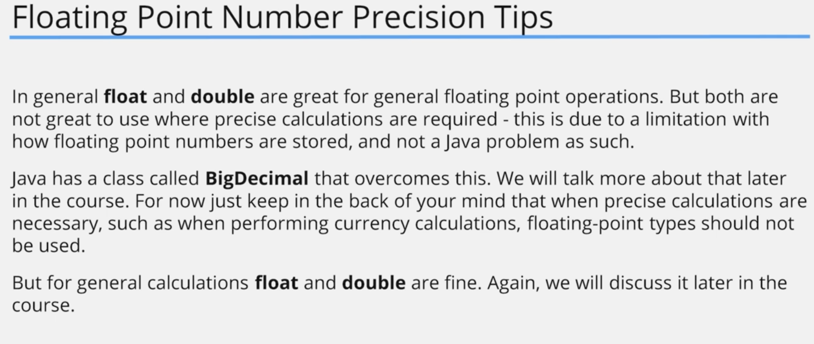

## 13. The char and boolean Primitive Data Types
### Char Type
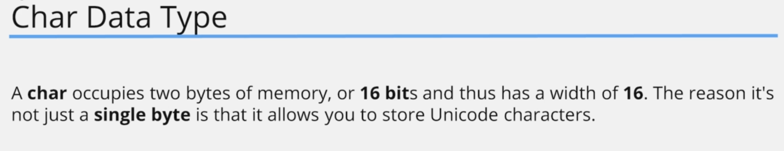
### Unicode
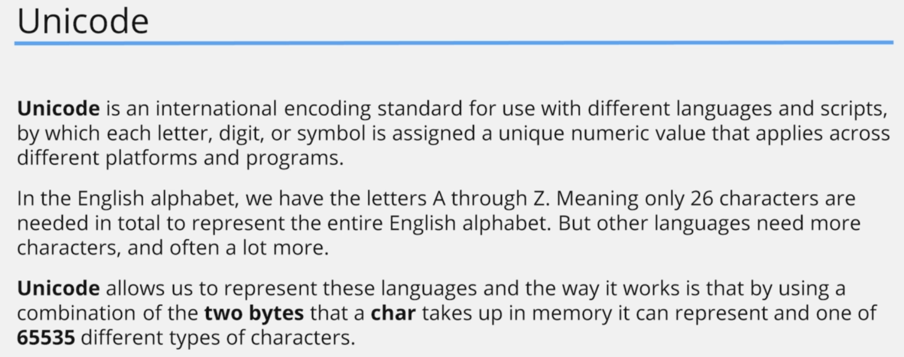
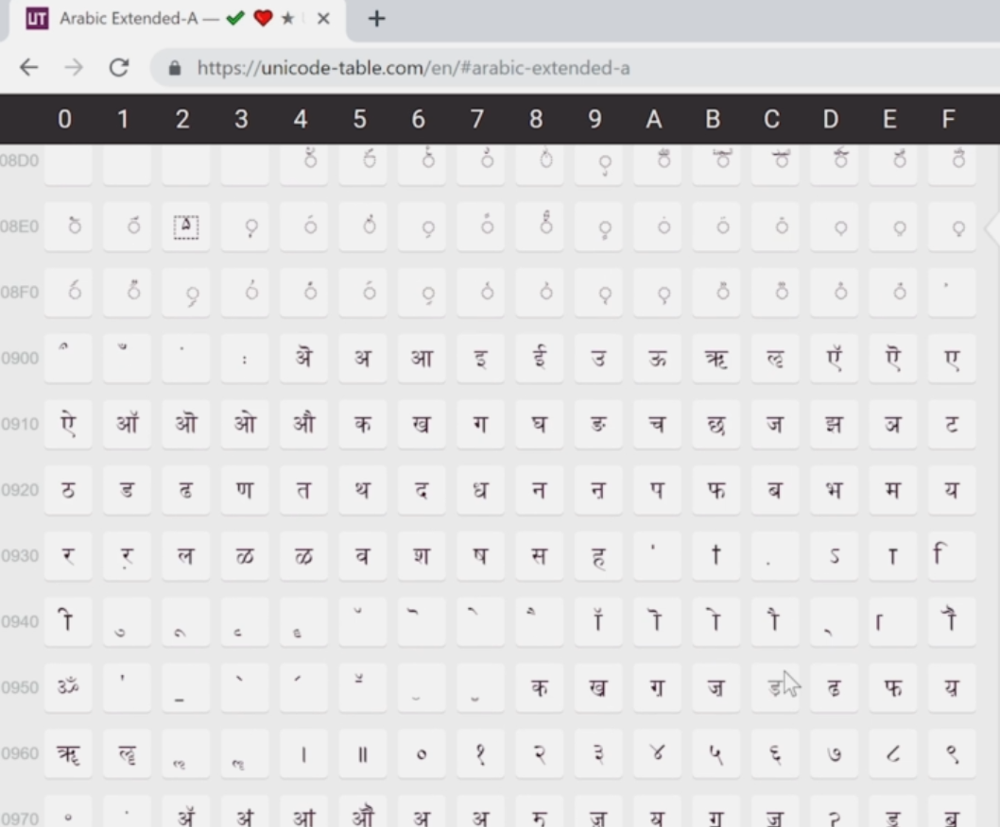
### Boolean
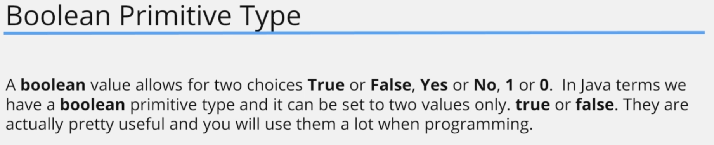

### Code Example

#### code


```java
public class Main {
    public static void main(String[] args) {
        char myChar = 'D';
        char myUnicodeChar = '\u0044';
        System.out.println(myChar);
        System.out.println(myUnicodeChar);

        char myCopyWrightChar = '\u00A9';
        System.out.println(myCopyWrightChar);

        boolean myTrueValue = true;
        boolean myFalseValue = false;

        boolean isAgeOver21 = false;

    }
}

```

## 14. Primitive Types Recap and the String Data Type

## 15. Operators, Operands and Expressions


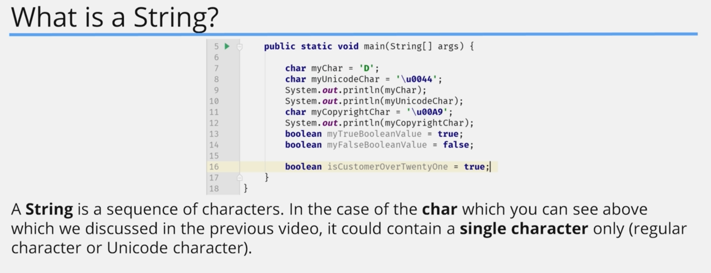
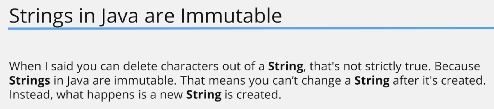
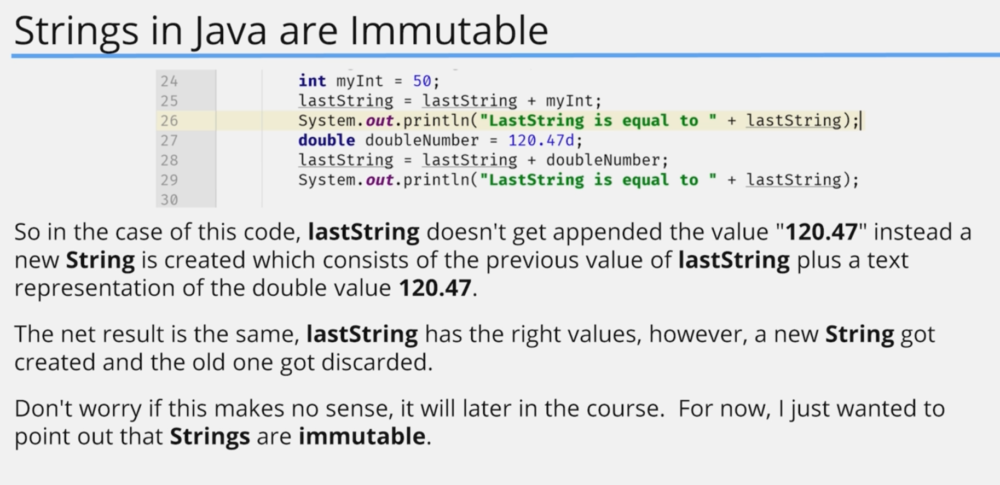
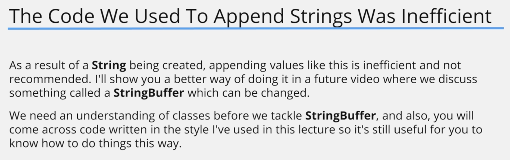
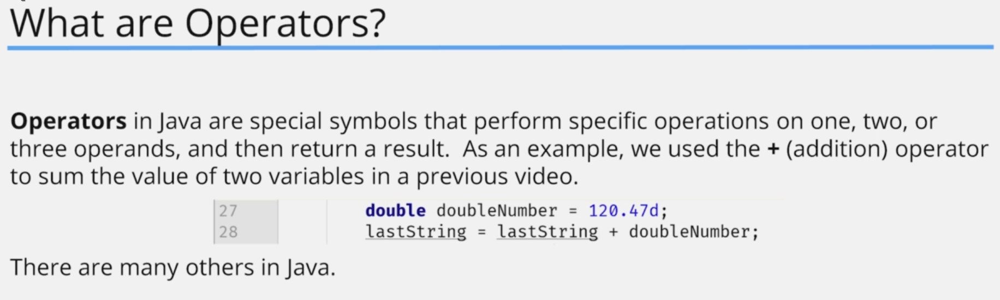
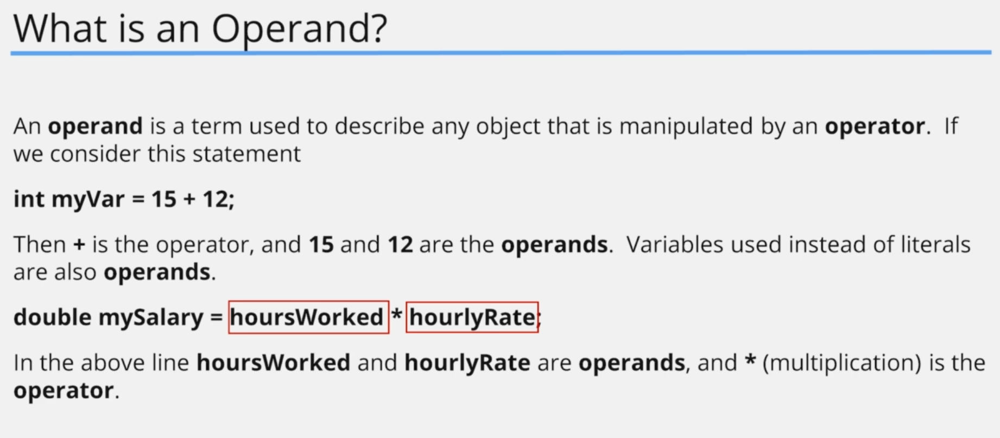

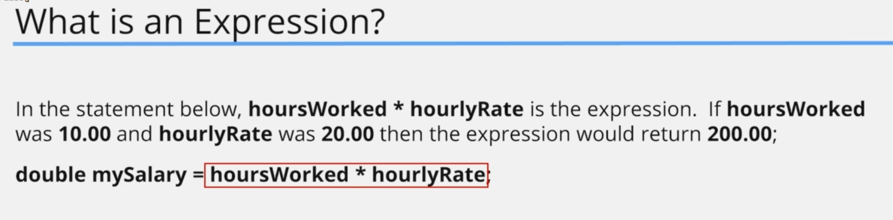
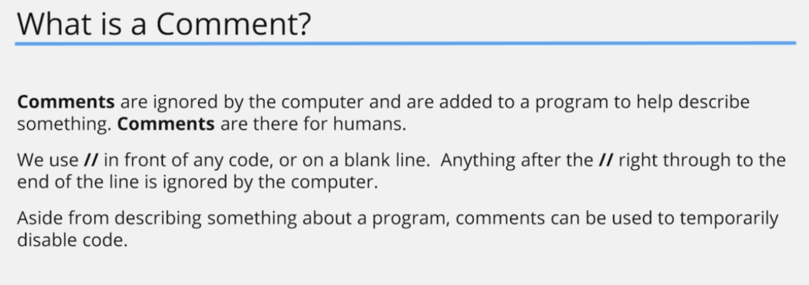
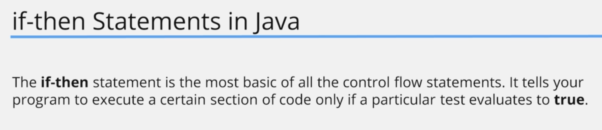
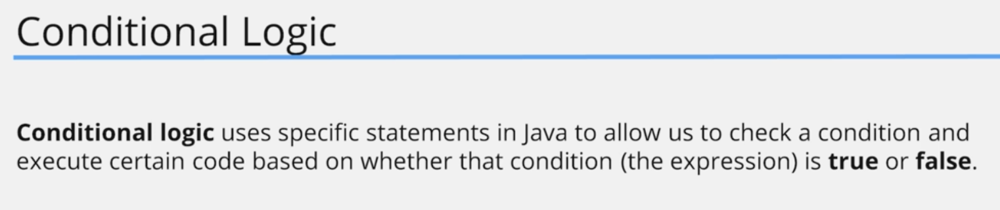
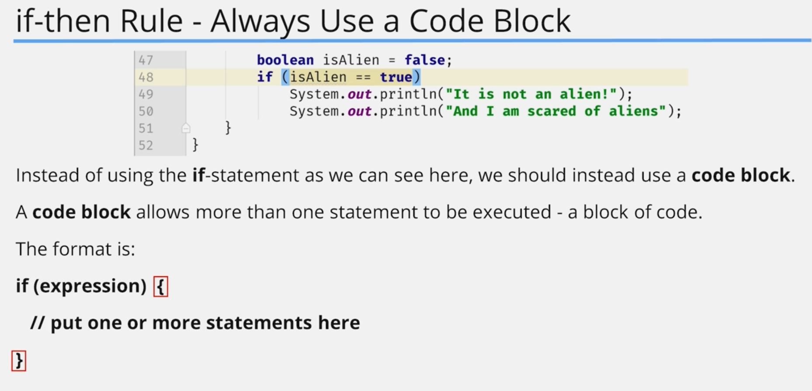
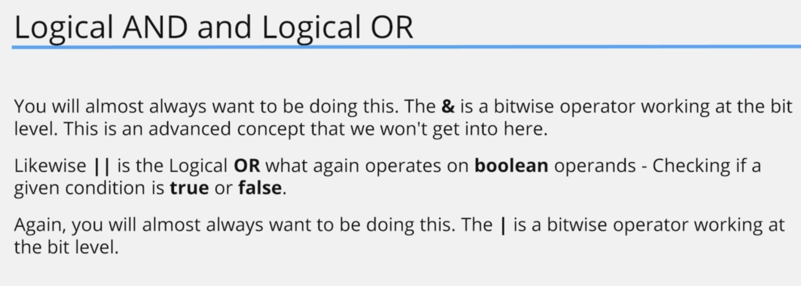
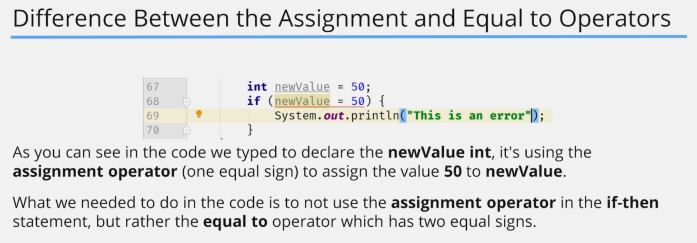
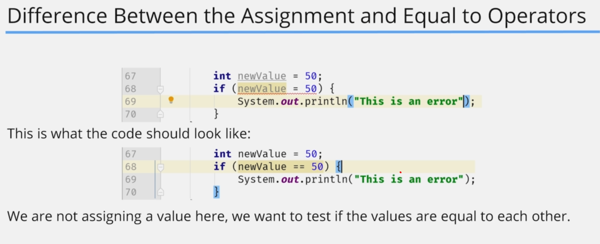
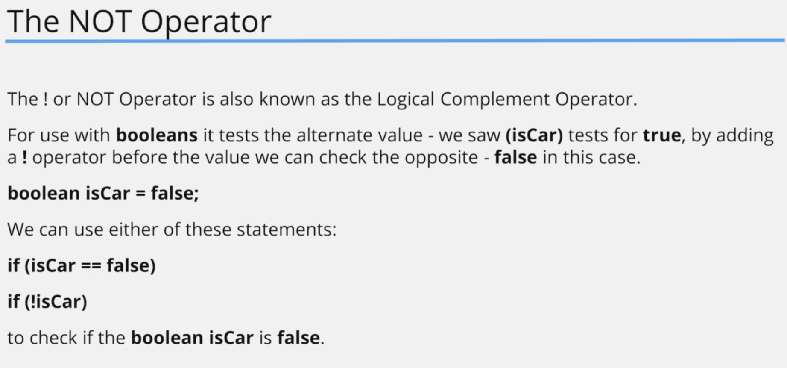


## 16. Abbreviating Operators

## 17. if-then Statement

## 18. Logical and Operator

## 19. Logical OR Operator

## 20. Assignment Operator VS Equals to Operator

## 21. Ternary Operator

## 22. Operator Precedence and Operator Challenge

## 23. First Steps Summary

## 24. End of Remaster
