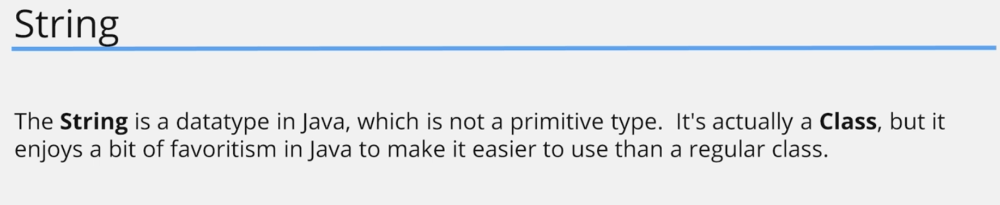
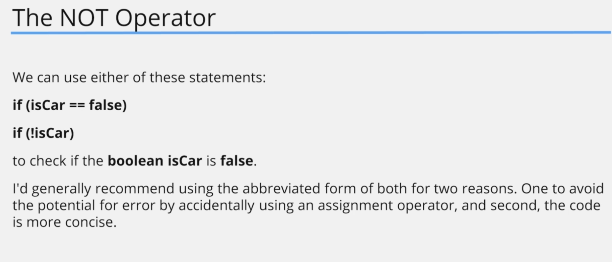

# First Steps
- [First Steps](#first-steps)
  - [Hello World Program](#hello-world-program)
  - [3. Defining the Main Method](#3-defining-the-main-method)
    - [Code Example](#code-example)
      - [code](#code)
      - [output](#output)
  - [4. Hello World Challenge and Common Errors](#4-hello-world-challenge-and-common-errors)
    - [Challenge](#challenge)
      - [Question](#question)
      - [Answer](#answer)
        - [Code](#code-1)
          - [output](#output-1)
  - [5. Variables](#5-variables)
    - [Challenge](#challenge-1)
      - [Question](#question-1)
      - [Answer](#answer-1)
        - [Code](#code-2)
          - [output](#output-2)
    - [String Literal](#string-literal)
    - [Code Example](#code-example-1)
      - [code](#code-3)
      - [output](#output-3)
  - [6. Starting out with Expressions](#6-starting-out-with-expressions)
    - [Challenge](#challenge-2)
      - [Question](#question-2)
      - [Answer](#answer-2)
        - [Code](#code-4)
          - [output](#output-4)
    - [Code Example](#code-example-2)
      - [code](#code-5)
      - [output](#output-5)
    - [Challenge](#challenge-3)
      - [Question](#question-3)
      - [Answer](#answer-3)
        - [Code](#code-6)
          - [output](#output-6)
  - [7. Primitive Types](#7-primitive-types)
    - [Java packages](#java-packages)
    - [Wrapper Class](#wrapper-class)
    - [Code Example](#code-example-3)
      - [code](#code-7)
      - [output](#output-7)
  - [8. byte, short, long and width](#8-byte-short-long-and-width)
  - [9. Casting in Java](#9-casting-in-java)
  - [10. Primitive Types Challenge](#10-primitive-types-challenge)
  - [11. float and double Primitive Types](#11-float-and-double-primitive-types)
  - [12. Floating Point Precision and a Challenge](#12-floating-point-precision-and-a-challenge)
  - [13. The char and boolean Primitive Data Types](#13-the-char-and-boolean-primitive-data-types)
  - [14. Primitive Types Recap and the String Data Type](#14-primitive-types-recap-and-the-string-data-type)
  - [15. Operators, Operands and Expressions](#15-operators-operands-and-expressions)
  - [16. Abbreviating Operators](#16-abbreviating-operators)
  - [17. if-then Statement](#17-if-then-statement)
  - [18. Logical and Operator](#18-logical-and-operator)
  - [19. Logical OR Operator](#19-logical-or-operator)
  - [20. Assignment Operator VS Equals to Operator](#20-assignment-operator-vs-equals-to-operator)
  - [21. Ternary Operator](#21-ternary-operator)
  - [22. Operator Precedence and Operator Challenge](#22-operator-precedence-and-operator-challenge)
  - [23. First Steps Summary](#23-first-steps-summary)
  - [24. End of Remaster](#24-end-of-remaster)
## Hello World Program


## 3. Defining the Main Method


### Code Example

#### code

let's create a Hello Class

```java
public class Hello {
    public static void main(String[] args) {
        System.out.println("Hello World");
    }
}

```

#### output

```shell
🔥 -> Hello World
```

## 4. Hello World Challenge and Common Errors

### Challenge


#### Question


#### Answer

##### Code

```java
public class Hello {
    public static void main(String[] args) {
        System.out.println("Hello Chamara");
    }
}

```

###### output

```shell
🔥 -> Hello Chamara
```
we can see the error from the ide


## 5. Variables


### Challenge

#### Question


#### Answer

##### Code

```java
public class Hello {
    public static void main(String[] args) {
        int myFirstNumber = 5;
        System.out.println(myFirstNumber);
    }
}

```

###### output

```shell
🔥 ->  5
```
### String Literal


we can use more complex operations on the assignment
### Code Example


#### code

```java
public class Hello {
    public static void main(String[] args) {
        int myFirstNumber = 5;
        int mySecondNumber = (5 + 3) * 23;
        System.out.println(myFirstNumber);
        System.out.println(mySecondNumber);
    }
}


```

#### output

```shell
🔥 ->  5
🔥 ->  184
```

## 6. Starting out with Expressions
### Challenge

#### Question


#### Answer

##### Code

```java
public class Hello {
    public static void main(String[] args) {
        int myFirstNumber = 5;
        System.out.println(myFirstNumber);
        int mySecondNumber = 12;
        System.out.println(mySecondNumber);
        int myThirdNumber = 6;
        System.out.println(myThirdNumber);
    }
}

```

###### output

```shell
🔥 ->   5
        12
        6

```
let add some variables together
### Code Example

#### code

```java
public class Hello {
    public static void main(String[] args) {
        int myFirstNumber = 5;
        System.out.println(myFirstNumber);
        int mySecondNumber = 12;
        System.out.println(mySecondNumber);
        int myThirdNumber = 6;
        System.out.println(myThirdNumber);

        int result = myFirstNumber + mySecondNumber + myThirdNumber;
        System.out.println(result);

    }
}


```

#### output

```shell
    5
    12
    6
    23
```
### Challenge

#### Question


#### Answer

##### Code

```java
public class Hello {
    public static void main(String[] args) {
        int myFirstNumber = 5;
        System.out.println(myFirstNumber);
        int mySecondNumber = 12;
        System.out.println(mySecondNumber);
        int myThirdNumber = 6;
        System.out.println(myThirdNumber);

        int result = myFirstNumber + mySecondNumber + myThirdNumber;
        System.out.println(result);

        int myLastInt;

        myLastInt = 1000 - result;
        System.out.println(myLastInt);
    }
}

```

###### output

```shell
5
12
6
23
977

```


## 7. Primitive Types

### Java packages


### Wrapper Class


### Code Example

#### code


```java
public class Main {
    public static void main(String[] args) {
        int myIntValue = 122323;
        int maxIntValue = Integer.MAX_VALUE;
        int minIntValue = Integer.MIN_VALUE;
        System.out.println("Minimum Integer value : " + minIntValue);
        System.out.println("Maximum Integer value : " + maxIntValue);

        System.out.println("Busted Max Value " + (maxIntValue + 1));
        System.out.println("Busted Min Value " + (minIntValue - 1));
    }
}

```

#### output

```shell
Minimum Integer value : -2147483648
Maximum Integer value : 2147483647
Busted Max Value -2147483648
Busted Min Value 2147483647
```


## 8. byte, short, long and width

## 9. Casting in Java








## 10. Primitive Types Challenge

## 11. float and double Primitive Types

## 12. Floating Point Precision and a Challenge

## 13. The char and boolean Primitive Data Types

## 14. Primitive Types Recap and the String Data Type

## 15. Operators, Operands and Expressions

## 16. Abbreviating Operators

## 17. if-then Statement

## 18. Logical and Operator

## 19. Logical OR Operator

## 20. Assignment Operator VS Equals to Operator

## 21. Ternary Operator

## 22. Operator Precedence and Operator Challenge

## 23. First Steps Summary

## 24. End of Remaster
