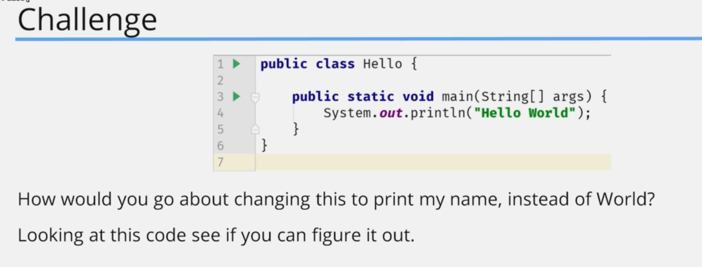
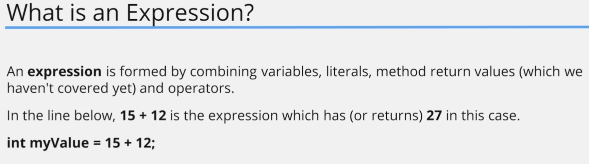

# First Steps

## Hello World Program


## 3. Defining the Main Method


### Code Example
#### code
let's create a Hello Class

```java
public class Hello {
    public static void main(String[] args) {
        System.out.println("Hello World");
    }
}

```

#### output

```shell
Hello World
```

## 4. Hello World Challenge and Common Errors

### Code Example

#### code

let's create a Hello Class

```java


```

#### output

```shell

```







## 5. Variables

## 6. Starting out with Expressions

## 7. Primitive Types

## 8. byte, short, long and width

## 9. Casting in Java

## 10. Primitive Types Challenge

## 11. float and double Primitive Types

## 12. Floating Point Precision and a Challenge

## 13. The char and boolean Primitive Data Types

## 14. Primitive Types Recap and the String Data Type

## 15. Operators, Operands and Expressions

## 16. Abbreviating Operators

## 17. if-then Statement

## 18. Logical and Operator

## 19. Logical OR Operator

## 20. Assignment Operator VS Equals to Operator

## 21. Ternary Operator

## 22. Operator Precedence and Operator Challenge

## 23. First Steps Summary

## 24. End of Remaster
