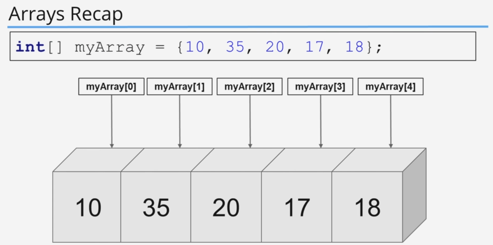

# Java Tutorial Expressions, Statements, Code blocks, Methods and more

- [Java Tutorial Expressions, Statements, Code blocks, Methods and more](#java-tutorial-expressions-statements-code-blocks-methods-and-more)
  - [2. Keywords And Expressions](#2-keywords-and-expressions)
    - [Code Example](#code-example)
      - [code](#code)
      - [output](#output)
    - [Challenge](#challenge)
      - [Question](#question)
      - [Answer](#answer)
        - [Code](#code-1)
  - [3. Statements, Whitespace and Indentation (Code Organization)](#3-statements-whitespace-and-indentation-code-organization)
  - [4. Code Blocks And The If Then Else Control Statements](#4-code-blocks-and-the-if-then-else-control-statements)
    - [if condition](#if-condition)
    - [Code Example](#code-example-1)
      - [code](#code-2)
      - [output](#output-1)
    - [Code Example](#code-example-2)
      - [code](#code-3)
      - [output](#output-2)
    - [Code Example](#code-example-3)
      - [code](#code-4)
      - [output](#output-3)
    - [Code Example](#code-example-4)
      - [code](#code-5)
      - [output](#output-4)
    - [Else block](#else-block)
    - [Code Example](#code-example-5)
      - [code](#code-6)
      - [output](#output-5)
    - [Else If](#else-if)
    - [Code Example](#code-example-6)
      - [code](#code-7)
      - [output](#output-6)
    - [Code Blocks](#code-blocks)
    - [Code Example](#code-example-7)
      - [code](#code-8)
      - [output](#output-7)
    - [Scope](#scope)
    - [Challenge](#challenge-1)
      - [Question](#question-1)
      - [Answer](#answer-1)
        - [Code](#code-9)
          - [output](#output-8)
  - [5. if then else Recap](#5-if-then-else-recap)
    - [Code Example](#code-example-8)
      - [code](#code-10)
      - [output](#output-9)
  - [6. Methods In Java](#6-methods-in-java)
    - [Code Example](#code-example-9)
      - [code](#code-11)
      - [output](#output-10)
  - [7. More On Methods And A Challenge](#7-more-on-methods-and-a-challenge)
    - [Code Example](#code-example-10)
      - [code](#code-12)
      - [output](#output-11)
  - [8. Method Challenge - Final Code Changes](#8-method-challenge---final-code-changes)
  - [9. DiffMerge Tool Introduction](#9-diffmerge-tool-introduction)
  - [10. Install DiffMerge](#10-install-diffmerge)
  - [11. Using DiffMerge](#11-using-diffmerge)
  - [12. Coding Exercises](#12-coding-exercises)
  - [13. Coding Exercises Example Part 1](#13-coding-exercises-example-part-1)
  - [14. Coding Exercises Example Part 2](#14-coding-exercises-example-part-2)
  - [15. Coding Exercises Example Part 3](#15-coding-exercises-example-part-3)
  - [23. Method Overloading](#23-method-overloading)
    - [Code Example](#code-example-11)
      - [code](#code-13)
      - [output](#output-12)
  - [24. Method Overloading Recap](#24-method-overloading-recap)
    - [Code Example](#code-example-12)
      - [code](#code-14)
      - [output](#output-13)
  - [25. Seconds and Minutes Challenge](#25-seconds-and-minutes-challenge)
  - [26. Bonus Challenge Solution](#26-bonus-challenge-solution)

## 2. Keywords And Expressions

[list of java key words](https://en.wikipedia.org/wiki/List_of_Java_keywords)
key words are highlighted in color on most browsers.

expressions are building blocks that will build programs.
there are consist of variables, literals, operators, and more.

### Code Example

#### code

```java
public class Main {
    public static void main(String[] args) {
//        this is the expression kilometers = (100*1.6)
//        with the data type we are creating a valid java statement
        double kilometers = (100*1.6);
        int highScore = 50;
//        anything inside the bracket is also an expression
        if(highScore==50){
//            values inside a quotes are also expressions
//            this is the expression "This is an expression"
            System.out.println("This is an expression");
        }
    }
}

```

#### output

```shell
This is an expression
```

### Challenge

#### Question

```java
public class Main {
    public static void main(String[] args) {
// coding challenge
//        find the expressions
        int score = 100;
        if(score >99){
            System.out.println("you got the high score");
            score = 0;
        }
    }
}

```

#### Answer

##### Code

```text
//  Answer
//  score = 100
//  score >99
//  "you got the high score"
//  score = 0;

```

## 3. Statements, Whitespace and Indentation (Code Organization)

So we will talk about statements, white spaces and indentation in this Section.

## 4. Code Blocks And The If Then Else Control Statements

### if condition

### Code Example

#### code

```java
public class Main {
    public static void main(String[] args) {
        boolean gameOver = true;
        int score = 5000;
        int levelCompleted = 5;
        int bonus = 100;

        if (score == 5000) {
            System.out.println("You score was 5000");
        }
    }
}
```

#### output

```shell
You score was 5000
```

Or we can use without the curly brasses.

### Code Example

#### code

```java
public class Main {
    public static void main(String[] args) {
        boolean gameOver = true;
        int score = 5000;
        int levelCompleted = 5;
        int bonus = 100;

        if (score == 5000)
            System.out.println("You score was 5000");

    }
}
```

#### output

```shell
You score was 5000
```

but

When we are using an if conditions without the curly braces it only consider the first line only. whatever comes after the first line will not include as  inside of the if condition it will execute no matter what.

### Code Example

#### code

```java
public class Main {
    public static void main(String[] args) {
        boolean gameOver = true;
        int score = 6000;
        int levelCompleted = 5;
        int bonus = 100;

        if (score == 5000)
            System.out.println("You score was 5000");
        System.out.println("This is not inside the if condition");
    }
}

```

#### output

```shell
This is not inside the if condition
```

So if we want to execute multiple lines inside if condition, we have to use curly braces.

### Code Example

#### code

```java

public class Main {
    public static void main(String[] args) {
        boolean gameOver = true;
        int score = 5000;
        int levelCompleted = 5;
        int bonus = 100;

        if (score == 5000) {
            System.out.println("You score was 5000");
            System.out.println("This is not inside the if condition");
        }
    }
}
```

#### output

```shell
You score was 5000
This is not inside the if condition
```

### Else block

### Code Example

#### code

```java
public class Main {
    public static void main(String[] args) {
        boolean gameOver = true;
        int score = 5000;
        int levelCompleted = 5;
        int bonus = 100;

        if (score == 6000) {
            System.out.println("You score was 5000");
            System.out.println("This is not inside the if condition");
        } else {
            System.out.println("this is the else block");
        }
    }
}

```

#### output

```shell
this is the else block
```

In the above example, discovery is equal to 5000, so the first tip condition will fail. Then the code looks for another condition. So when that happens. We have the else condition, so if the if condition is not satisfied then it will look for the else condition so it will execute got here as output.

### Else If

We can expand this further with else if.
If you have more than one condition to test, we can use else if.

### Code Example

#### code

```java
public class Main {
    public static void main(String[] args) {
        boolean gameOver = true;
        int score = 500;
        int levelCompleted = 5;
        int bonus = 100;

        if (score > 1000 && score < 5000) {
            System.out.println("You score was 5000");
            System.out.println("This is not inside the if condition");
        } else if (score < 1000) {
            System.out.println("your Score is less than 1000");
        } else {
            System.out.println("this is the else block");
        }
    }
}

```

#### output

```shell
your Score is less than 1000
```

### Code Blocks

### Code Example

#### code

```java
public class Main {
    public static void main(String[] args) {
        boolean gameOver = true;
        int score = 500;
        int levelCompleted = 5;
        int bonus = 100;

        if (gameOver == true) {
            int finalScore = score + (levelCompleted * bonus);
            System.out.println("your Final Score is : " + finalScore);
        }
    }
}

```

#### output

```shell
your Final Score is : 1000
```

So here we have created a final score variable inside the if conditions code block. So the scope of this final score will be limited to the if conditions code block. So you cannot access the final score outside of the if condition code block. As soon as the condition executed. Final score variable will be destroyed.
So the variables declared inside a code block is limited to that code block.
Side note.

```java
if (gameOver) { .....
```

### Scope

So the concept of adding variables inside curly braces are called Scope.

Side Note ⚠️
When considering if conditions. We can abbreviate the conditions to short syntax. So instead of writing the whole game over, equals equals true. We can just put the variable. Java view. Compare. The game over value to be truthy.

### Challenge

#### Question


#### Answer

##### Code

```java
public class Main {
    public static void main(String[] args) {
        boolean gameOver = true;
        int score = 500;
        int levelCompleted = 5;
        int bonus = 100;

        if (gameOver) {
            int finalScore = score + (levelCompleted * bonus);
            System.out.println("your Final Score is : " + finalScore);
        }

        score = 10000;
        levelCompleted = 8;
        bonus = 200;

        if (gameOver) {
            int finalScore = score + (levelCompleted * bonus);
            System.out.println("your Final Score is : " + finalScore);
        }

    }
}
```

###### output

```shell
your Final Score is : 1000
Your Final Score is : 11600
```

Side Note ⚠️

A side note here.Check the above example.We can see the printing part has been duplicated.Let's say in the future.We want to change the final score formula.If you only change it once.And forget to change the other places.We will get faulty values.So for this kind of implementation, we have to Think about a better solution.

## 5. if then else Recap

### Code Example

#### code

```java


```

#### output

```shell

```

## 6. Methods In Java

### Code Example

#### code

```java


```

#### output

```shell

```

## 7. More On Methods And A Challenge

### Code Example

#### code

```java


```

#### output

```shell

```

## 8. Method Challenge - Final Code Changes

## 9. DiffMerge Tool Introduction

## 10. Install DiffMerge

## 11. Using DiffMerge

## 12. Coding Exercises

## 13. Coding Exercises Example Part 1

## 14. Coding Exercises Example Part 2

## 15. Coding Exercises Example Part 3

## 23. Method Overloading

### Code Example

#### code

```java


```

#### output

```shell

```

## 24. Method Overloading Recap

### Code Example

#### code

```java


```

#### output

```shell

```

## 25. Seconds and Minutes Challenge

## 26. Bonus Challenge Solution





