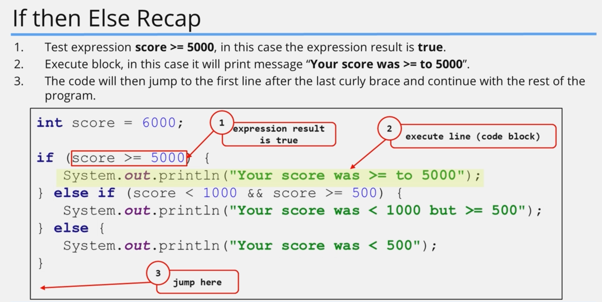
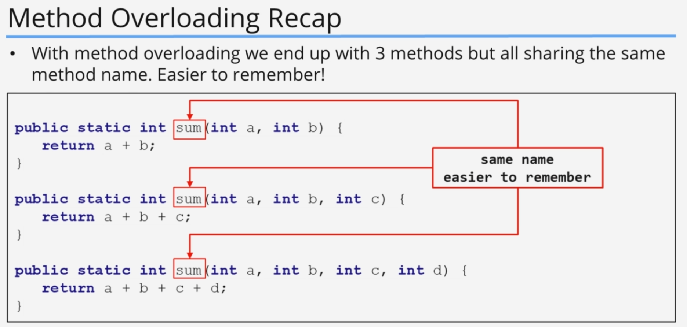
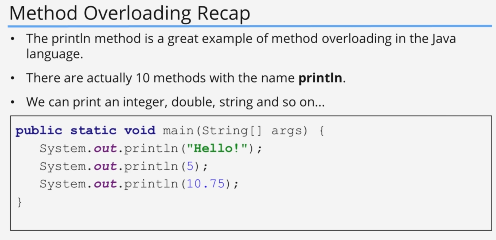
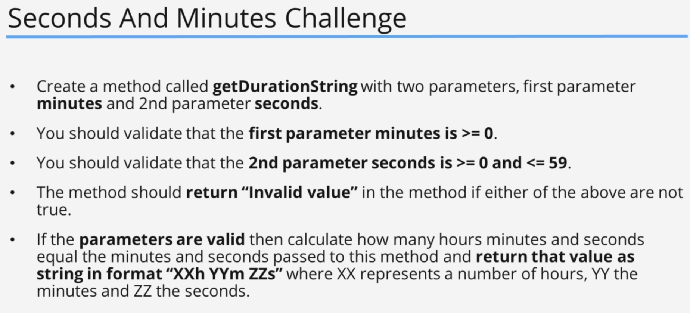
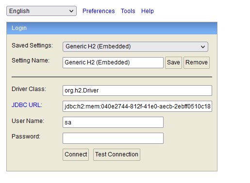
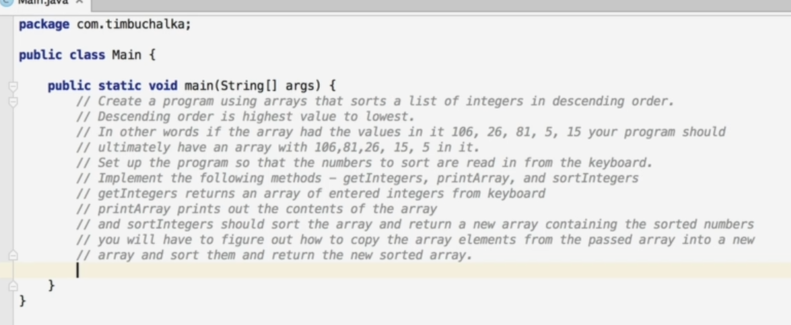
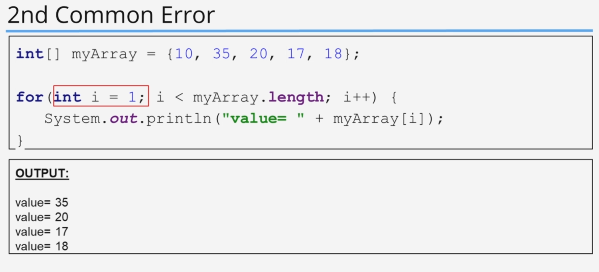
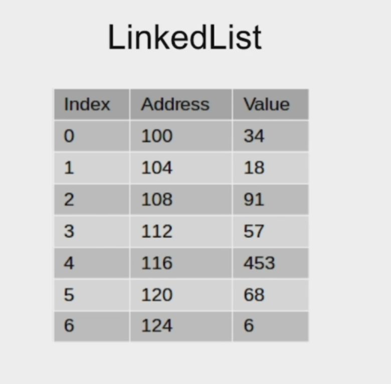

## 2. Keywords And Expressions
### Code Example

#### code
```java


```

#### output

```shell

```

## 3. Statements, Whitespace and Indentation (Code Organization)
### Code Example

#### code
```java


```

#### output

```shell

```

## 4. Code Blocks And The If Then Else Control Statements
### Code Example

#### code
```java


```

#### output

```shell

```

## 5. if then else Recap
### Code Example

#### code
```java


```

#### output

```shell

```

## 6. Methods In Java
### Code Example

#### code
```java


```

#### output

```shell

```

## 7. More On Methods And A Challenge
### Code Example

#### code
```java


```

#### output

```shell

```

## 8. Method Challenge - Final Code Changes

## 9. DiffMerge Tool Introduction
## 10. Install DiffMerge
## 11. Using DiffMerge
## 12. Coding Exercises
## 13. Coding Exercises Example Part 1
## 14. Coding Exercises Example Part 2
## 15. Coding Exercises Example Part 3
## 23. Method Overloading
### Code Example

#### code
```java


```

#### output

```shell

```

## 24. Method Overloading Recap
### Code Example

#### code
```java


```

#### output

```shell

```

## 25. Seconds and Minutes Challenge
## 26. Bonus Challenge Solution























