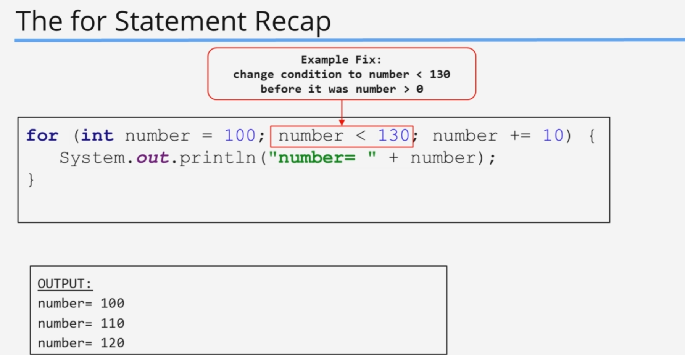

# Control Flow Statements

- [Control Flow Statements](#control-flow-statements)
  - [The switch statement (+Challenge Exercise)](#the-switch-statement-challenge-exercise)
    - [Code Example](#code-example)
      - [code](#code)
      - [output](#output)
    - [Challenge](#challenge)
      - [Question](#question)
      - [Answer](#answer)
        - [Code](#code-1)
          - [output](#output-1)
    - [Code Example](#code-example-1)
      - [code](#code-2)
      - [output](#output-2)
  - [Day of the Week Challenge](#day-of-the-week-challenge)
    - [Challenge](#challenge-1)
      - [Question](#question-1)
      - [Answer](#answer-1)
        - [Code](#code-3)
          - [output](#output-3)
  - [The for Statement (+Challenge Exercise)](#the-for-statement-challenge-exercise)
    - [Code Example](#code-example-2)
      - [code](#code-4)
      - [output](#output-4)
    - [Challenge](#challenge-2)
      - [Question](#question-2)
      - [Answer](#answer-2)
        - [Code](#code-5)
          - [output](#output-5)
  - [For Loop Recap](#for-loop-recap)
  - [Sum 3 and 5 Challenge](#sum-3-and-5-challenge)
    - [Challenge](#challenge-3)
      - [Question](#question-3)
      - [Answer](#answer-3)
        - [Code](#code-6)
          - [output](#output-6)
  - [The while and do while statements (+Challenge Exercise)](#the-while-and-do-while-statements-challenge-exercise)
    - [Code Example](#code-example-3)
      - [code](#code-7)
      - [output](#output-7)
    - [Challenge](#challenge-4)
      - [Question](#question-4)
      - [Answer](#answer-4)
        - [Code](#code-8)
          - [output](#output-8)
  - [While and Do While Recap](#while-and-do-while-recap)
  - [Digit Sum Challenge](#digit-sum-challenge)
  - [Parsing Values from a String](#parsing-values-from-a-string)
  - [Reading User Input](#reading-user-input)
  - [Problems and Solutions](#problems-and-solutions)
  - [Reading User Input Challenge](#reading-user-input-challenge)
  - [Min and Max Challenge](#min-and-max-challenge)

## The switch statement (+Challenge Exercise)

### Code Example

#### code

```java
// only works with byte, short, int, char,
// by using the break statement we are
// stopping the app from going to the next case
// we can use multiple case statements combined
public class Main {
    public static void main(String[] args) {
        int switchValue = 4;
        switch (switchValue) {
            case 1:
                System.out.println("value is one");
                break;
            case 2:
                System.out.println("value is two");
                break;
            case 3:
            case 4:
            case 5:
                System.out.println("was it 3 or 4 or 5");
                System.out.println("Actual value is "+switchValue);
                break;
            default:
                System.out.println("Value is not 1 or 2");
                break;
//                we don't need to put the break here but just to be consistent we can leave it there
        }
    }
}

```

#### output

```shell
was it 3 or 4 or 5
Actual value is 4
```

### Challenge

#### Question


#### Answer

##### Code

```java

public class Main {
    public static void main(String[] args) {
        char character = 'A';
        switch (character) {
            case 'A':
                System.out.println("Character is : " + character);
                break;
            case 'B':
                System.out.println("Character is : " + character);
                break;
            case 'C':
                System.out.println("Character is : " + character);
                break;
            case 'D':
                System.out.println("Character is : " + character);
                break;
            case 'E':
                System.out.println("Character is : " + character);
                break;
            default:
                System.out.println("Character is not A,B,C,D,E");
                break;
        }

    }
}
```

###### output

```shell
🔥 -> Character is : A
```

now we can use Strings with switch statements too

### Code Example

#### code

```java
public class Main {
    public static void main(String[] args) {
        String character = "A";
        switch (character.toLowerCase()) {
            case "a":
                System.out.println("Character is : " + character);
                break;
            case "b":
                System.out.println("Character is : " + character);
                break;
            case "c":
                System.out.println("Character is : " + character);
                break;
            case "d":
                System.out.println("Character is : " + character);
                break;
            case "e":
                System.out.println("Character is : " + character);
                break;
            default:
                System.out.println("Character is not A,B,C,D,E");
                break;
        }

    }
}
```

#### output

```shell
Character is : a
```

## Day of the Week Challenge

### Challenge

#### Question


#### Answer

##### Code

```java
public class Main {
    public static void main(String[] args) {

        printDayOfTheWeek(0);
        printDayOfTheWeek(1);
        printDayOfTheWeek(2);
        printDayOfTheWeek(3);
        printDayOfTheWeek(4);
        printDayOfTheWeek(5);
        printDayOfTheWeek(6);
        printDayOfTheWeek(7);
        printDayOfTheWeek(-1);
        printDayOfTheWeek(10);

        printDayOfThWeekUsingIfElse(0);
        printDayOfThWeekUsingIfElse(1);
        printDayOfThWeekUsingIfElse(2);
        printDayOfThWeekUsingIfElse(3);
        printDayOfThWeekUsingIfElse(4);
        printDayOfThWeekUsingIfElse(5);
        printDayOfThWeekUsingIfElse(6);
        printDayOfThWeekUsingIfElse(7);
        printDayOfThWeekUsingIfElse(-1);
        printDayOfThWeekUsingIfElse(10);

    }

    public static void printDayOfTheWeek(int number) {
        switch (number) {
            case 0:
                System.out.println("Monday");
                break;
            case 1:
                System.out.println("Tuesday");
                break;
            case 2:
                System.out.println("Wednesday");
                break;
            case 3:
                System.out.println("Thursday");
                break;
            case 4:
                System.out.println("Friday");
                break;
            case 5:
                System.out.println("Saturday");
                break;
            case 6:
                System.out.println("Sunday");
                break;
            default:
                System.out.println("invalid date");
        }
    }

    public static void printDayOfThWeekUsingIfElse(int day) {
        if (day == 0) {
            System.out.println("Monday");
        } else if (day == 1) {
            System.out.println("Tuesday");
        } else if (day == 2) {
            System.out.println("Wednesday");
        } else if (day == 3) {
            System.out.println("Thursday");
        } else if (day == 4) {
            System.out.println("Friday");
        } else if (day == 5) {
            System.out.println("Saturday");
        } else if (day == 6) {
            System.out.println("Sunday");
        } else {
            System.out.println("invalid date");
        }
    }
}
```

###### output

```shell
Monday
Tuesday
Wednesday
Thursday
Friday
Saturday
Sunday
invalid date
invalid date
invalid date
Monday
Tuesday
Wednesday
Thursday
Friday
Saturday
Sunday
invalid date
invalid date
invalid date
```

## The for Statement (+Challenge Exercise)

### Code Example

#### code

```java
public class Main {
    public static void main(String[] args) {
        for(int i = 2;i<9;i++){
            System.out.println("10000 at "+(i)+"% interest is: "+String.format("%.2f",calculateInterest(10000,i)));
        }
        System.out.println("***********************************************************");
        for(int i = 8;i>1;i--){
            System.out.println("10000 at "+(i)+"% interest is: "+String.format("%.2f",calculateInterest(10000,i)));
        }
    }

    public static double calculateInterest(double amount, double interest) {
        return amount * (interest / 100);
    }
}

```

#### output

```shell
10000 at 2% interest is: 200.00
10000 at 3% interest is: 300.00
10000 at 4% interest is: 400.00
10000 at 5% interest is: 500.00
10000 at 6% interest is: 600.00
10000 at 7% interest is: 700.00
10000 at 8% interest is: 800.00
***********************************************************
10000 at 8% interest is: 800.00
10000 at 7% interest is: 700.00
10000 at 6% interest is: 600.00
10000 at 5% interest is: 500.00
10000 at 4% interest is: 400.00
10000 at 3% interest is: 300.00
10000 at 2% interest is: 200.00
```

### Challenge

#### Question


#### Answer

##### Code

```java
public class Main {
    public static void main(String[] args) {
        int primeNumberCount = 0;
        for (int i = 5; i < 100; i++) {
            if (isPrimeNumber(i)) {
                System.out.println("prime number : " + i);
                primeNumberCount++;
            }
            if (primeNumberCount == 3) {
                break;
            }
        }
    }

    public static double calculateInterest(double amount, double interest) {
        return amount * (interest / 100);
    }

    public static boolean isPrimeNumber(int number) {
        if (number == 1) {
            return false;
        }
        for(int i =2;i<=number/2;i++){
            if(number%i==0){
                return false;
            }
        }
        return true;
    }
}
```

###### output

```shell
prime number : 5
prime number : 7
prime number : 11
```

## For Loop Recap




## Sum 3 and 5 Challenge

### Challenge

#### Question


#### Answer

##### Code

```java
public class Main {
    public static void main(String[] args) {
        long numberCount = 0;
        long sum = 0;
        for (int i = 1; i <= 1000; i++) {
            if (i % 3 == 0 && i % 5 == 0) {
                System.out.println("This number is divided by 3 and 5 : " + i);
                sum+=i;
                numberCount++;
            }
            if(numberCount==5){
                break;
            }
        }
        System.out.println("SUM : "+sum);
    }
}
```

###### output

```shell
This number is divided by 3 and 5 : 15
This number is divided by 3 and 5 : 30
This number is divided by 3 and 5 : 45
This number is divided by 3 and 5 : 60
This number is divided by 3 and 5 : 75
SUM : 225
```

## The while and do while statements (+Challenge Exercise)


### Code Example

#### code

```java
public class Main {
    public static void main(String[] args) {
        int count = 1;
        while (count != 7) {
            System.out.println("count is : " + count);
            count++;
        }
        System.out.println("****************** for loop comparison **********************");
        for (int i = 1; i != 7; i++) {
            System.out.println("count is : " + i);
        }

        System.out.println("****************** while true **********************");
        count = 1;
        while (true) {
            if (count == 7) {
                break;
            }
            System.out.println("count is : " + count);
            count++;
        }
        System.out.println("****************** Do while **********************");
        count = 1;
        do {
            System.out.println("count is : " + count);
            count++;
        } while (count != 7);
    }

      public static boolean isEvenNumber(int number){
        if ((number%2)==0){
            return true;
        }
        return false;
    }
     System.out.println("****************** Do while challenge **********************");
        int number = 1;
        int finishNumber = 20;
        while(number<=finishNumber){
            number++;
            if(!isEvenNumber(number)){
                continue;
            }
            System.out.println("Even Number : "+number);
        }
}

```

#### output

```shell
count is : 1
count is : 2
count is : 3
count is : 4
count is : 5
count is : 6
****************** for loop comparison **********************
count is : 1
count is : 2
count is : 3
count is : 4
count is : 5
count is : 6
****************** while true **********************
count is : 1
count is : 2
count is : 3
count is : 4
count is : 5
count is : 6
****************** Do while **********************
count is : 1
count is : 2
count is : 3
count is : 4
count is : 5
count is : 6
****************** Do while challenge **********************
Even Number : 2
Even Number : 4
Even Number : 6
Even Number : 8
Even Number : 10
Even Number : 12
Even Number : 14
Even Number : 16
Even Number : 18
Even Number : 20
```

### Challenge

#### Question


#### Answer

##### Code

```java
public class Main {
    public static void main(String[] args) {
        System.out.println("****************** Do while challenge **********************");
        int number = 1;
        int finishNumber = 20;
        int evenNumbersFound = 0;
        while (number <= finishNumber) {
            number++;
            if (!isEvenNumber(number)) {
                continue;
            }
            evenNumbersFound++;
            System.out.println("Even Number : " + number);
            if(evenNumbersFound == 5){
                break;
            }
        }
        System.out.println("Total numbers of even numbers found : "+evenNumbersFound);

    }

    public static boolean isEvenNumber(int number) {
        if ((number % 2) == 0) {
            return true;
        }
        return false;
    }
}
```

###### output

```shell
****************** Do while challenge **********************
Even Number : 2
Even Number : 4
Even Number : 6
Even Number : 8
Even Number : 10
Total numbers of even numbers found : 5
```

## While and Do While Recap

## Digit Sum Challenge

## Parsing Values from a String

## Reading User Input

## Problems and Solutions

## Reading User Input Challenge

## Min and Max Challenge
