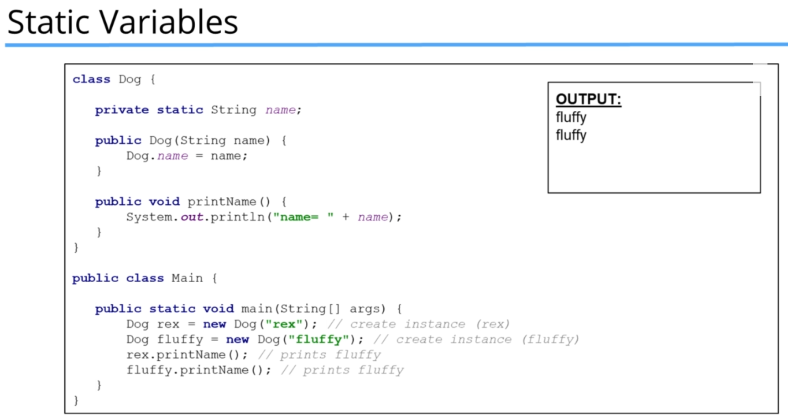

# OOP Part 1 - Classes, Constructors and Inheritance

## Classes Part 1

### Code Example

#### code

```java
public class Car {
    private int doors;
    private int wheels;
    private String model;
    private String engine;
    private String color;
}

public class Main {
    public static void main(String[] args) {
        Car porsche = new Car();
        Car holden = new Car();

    }
}

```

## Classes Part 2

### Code Example

#### code

```java
public class Car {
    private int doors;
    private int wheels;
    private String model;
    private String engine;
    private String color;

    public String getModel() {
        return model;
    }

    public void setModel(String model) {
        String validModel = model.toLowerCase();
        if (validModel.equals("carrera") || validModel.equals("commodore")) {
            this.model = model;
        } else {
            this.model = "Unknown";
        }
    }
}

public class Main {
    public static void main(String[] args) {
        Car porsche = new Car();
        Car holden = new Car();

        porsche.setModel("911");
        System.out.println("Model is "+porsche.getModel());

        porsche.setModel("carrera");
        System.out.println("Model is "+porsche.getModel());

        porsche.setModel("commodore");
        System.out.println("Model is "+porsche.getModel());

    }
}

```

#### output

```shell
Model is Unknown
Model is carrera
Model is commodore
```

## Constructors - Part 1 (+Challenge Exercise)

### Challenge

#### Question

#### Answer

##### Code

```java
public class Bank {
    private int accountNumber;
    private double balance;
    private String customerName;
    private String email;
    private String phoneNumber;

    public void deposit(double amount) {
        this.balance += amount;
        System.out.println("your current balance is : $" + this.balance);
    }

    public void withdraw(double amount) {
        if (this.balance - amount < 0) {
            System.out.println("insufficient funds");
        } else {
            this.balance -= amount;
            System.out.println("your current balance is : $" + this.balance);
        }
    }

    public int getAccountNumber() {
        return accountNumber;
    }

    public void setAccountNumber(int accountNumber) {
        this.accountNumber = accountNumber;
    }

    public double getBalance() {
        return balance;
    }

    public void setBalance(double balance) {
        this.balance = balance;
    }

    public String getCustomerName() {
        return customerName;
    }

    public void setCustomerName(String customerName) {
        this.customerName = customerName;
    }

    public String getEmail() {
        return email;
    }

    public void setEmail(String email) {
        this.email = email;
    }

    public String getPhoneNumber() {
        return phoneNumber;
    }

    public void setPhoneNumber(String phoneNumber) {
        this.phoneNumber = phoneNumber;
    }
}

public class Main {
    public static void main(String[] args) {
        Bank bank = new Bank();
        bank.setCustomerName("Chamara");
        bank.setEmail("ccweerasinghe1994@gmail.com");
        bank.setPhoneNumber("0767199431");
        bank.setAccountNumber(123456789);

        bank.deposit(1200);
        bank.withdraw(422);
        bank.withdraw(422);
        bank.withdraw(422);
    }
}

```

###### output

```shell
your current balance is : $1200.0
your current balance is : $778.0
your current balance is : $356.0
insufficient funds
```

### Code Example

#### code

```java
public class Bank {
    private int accountNumber;
    private double balance;
    private String customerName;
    private String email;
    private String phoneNumber;

    public Bank() {
        this(00000000000,0000,"default name","default email","000000000");
        System.out.println("Empty Constructor is called");
    }

    public Bank(int accountNumber, double balance, String customerName, String email, String phoneNumber) {
        System.out.println("Bank Constructor with parameters called");
        this.accountNumber = accountNumber;
        this.balance = balance;
        this.customerName = customerName;
        this.email = email;
        this.phoneNumber = phoneNumber;
    }

    public void deposit(double amount) {
        this.balance += amount;
        System.out.println("your current balance is : $" + this.balance);
    }

    public void withdraw(double amount) {
        if (this.balance - amount < 0) {
            System.out.println("insufficient funds");
        } else {
            this.balance -= amount;
            System.out.println("your current balance is : $" + this.balance);
        }
    }

    public int getAccountNumber() {
        return accountNumber;
    }

    public void setAccountNumber(int accountNumber) {
        this.accountNumber = accountNumber;
    }

    public double getBalance() {
        return balance;
    }

    public void setBalance(double balance) {
        this.balance = balance;
    }

    public String getCustomerName() {
        return customerName;
    }

    public void setCustomerName(String customerName) {
        this.customerName = customerName;
    }

    public String getEmail() {
        return email;
    }

    public void setEmail(String email) {
        this.email = email;
    }

    public String getPhoneNumber() {
        return phoneNumber;
    }

    public void setPhoneNumber(String phoneNumber) {
        this.phoneNumber = phoneNumber;
    }
}


public class Main {
    public static void main(String[] args) {
        Bank bank = new Bank();
        System.out.println("name "+bank.getCustomerName());
        System.out.println("email "+bank.getEmail());

        bank.deposit(1200);
        bank.withdraw(422);
        bank.withdraw(422);
        bank.withdraw(422);
    }
}

```

#### output

```shell
Bank Constructor with parameters called
Empty Constructor is called
name default name
email default email
your current balance is : $1200.0
your current balance is : $778.0
your current balance is : $356.0
insufficient funds
```

## Constructors - Part 2 (+Challenge Exercise)

### Challenge

#### Question


#### Answer

##### Code

```java
public class VipCustomer {
    private String name;
    private double creditLimit;
    private String email;


    public VipCustomer() {
        this("default name", 10000000, "default email");
        System.out.println("Empty Constructor is called");
    }

    public VipCustomer(String name, double creditLimit) {
        this(name, creditLimit, "default email");
        System.out.println("Constructor with two parameters is called");
    }

    public VipCustomer(String name, double creditLimit, String email) {
        System.out.println("Constructor with full parameters is called");
        this.name = name;
        this.creditLimit = creditLimit;
        this.email = email;
    }

    public String getName() {
        return name;
    }

    public double getCreditLimit() {
        return creditLimit;
    }

    public String getEmail() {
        return email;
    }
}

public class Main {
    public static void main(String[] args) {
        VipCustomer elon = new VipCustomer();
        System.out.println(elon.getName() +
                " is a vip customer and his email is " + elon.getEmail() + ". and has a credit limit of " + elon.getCreditLimit());
        VipCustomer brain = new VipCustomer("andrew", 200000);
        System.out.println(brain.getName() +
                " is a vip customer and his email is " + brain.getEmail() + ". and has a credit limit of " + brain.getCreditLimit());
        VipCustomer andrew = new VipCustomer("andrew", 30000, "andrew@gmail.com");
        System.out.println(andrew.getName() +
                " is a vip customer and his email is " + andrew.getEmail() + ". and has a credit limit of " + andrew.getCreditLimit());

    }
}

```

###### output

```shell
Constructor with full parameters is called
Empty Constructor is called
default name is a vip customer and his email is default email. and has a credit limit of 1.0E7
Constructor with full parameters is called
Constructor with two parameters is called
andrew is a vip customer and his email is default email. and has a credit limit of 200000.0
Constructor with full parameters is called
andrew is a vip customer and his email is andrew@gmail.com. and has a credit limit of 30000.0
```

## Inheritance - Part 1

### Code Example

#### code

```java

public class Animal {
    private String name;
    private int brain;
    private int body;
    private int size;
    private int weight;

    public Animal(String name, int brain, int body, int size, int weight) {
        this.name = name;
        this.brain = brain;
        this.body = body;
        this.size = size;
        this.weight = weight;
    }

    public void eat(){
        System.out.println("Animal.eat() is called");
    }

    public void move(){
        System.out.println("Animal.move() is called");
    }

    public String getName() {
        return name;
    }

    public int getBrain() {
        return brain;
    }

    public int getBody() {
        return body;
    }

    public int getSize() {
        return size;
    }

    public int getWeight() {
        return weight;
    }
}

public class Dog extends Animal {
    private int eyes;
    private int legs;
    private int tail;
    private int teeth;
    private String coat;

    public Dog(String name, int size, int weight, int eyes, int legs, int tail, int teeth, String coat) {
        super(name, 1, 1, size, weight);
        this.eyes = eyes;
        this.legs = legs;
        this.tail = tail;
        this.teeth = teeth;
        this.coat = coat;
    }

    private void chew(){
        System.out.println("Dog.chew() called");
    }

    @Override
    public void eat() {

        System.out.println("Dog.eat() called");
        chew();
        super.eat();
    }
}

public class Main {
    public static void main(String[] args) {
        Animal animal = new Animal("Animal",1,1,5,5);

        Dog dog = new Dog("lucy",6,20,2,4,1,33,"thick");
        dog.eat();

    }
}

```

#### output

```shell
Dog.eat() called
Dog.chew() called
Animal.eat() is called
```

## Inheritance - Part 2

### Code Example

#### code

```java
public class Dog extends Animal {
    private int eyes;
    private int legs;
    private int tail;
    private int teeth;
    private String coat;

    public Dog(String name, int size, int weight, int eyes, int legs, int tail, int teeth, String coat) {
        super(name, 1, 1, size, weight);
        this.eyes = eyes;
        this.legs = legs;
        this.tail = tail;
        this.teeth = teeth;
        this.coat = coat;
    }

    private void chew() {
        System.out.println("Dog.chew() called");
    }

    @Override
    public void eat() {

        System.out.println("Dog.eat() called");
        chew();
        super.eat();
    }

    public void walk() {
        System.out.println("Dog.walk() is called");
//        move(2);
        move(2);
    }

    public void run(){
        System.out.println("Dog.run() is called");
        move(10);
    }
    private void moveLegs(int speed){
        System.out.println("Dog.moveLegs() called");
    }
    @Override
    public void move(int speed) {
        System.out.println("Dog.move() called");
        moveLegs(speed);
        super.move(speed);
    }
}

public class Fish extends Animal {
    private int gils;
    private int eyes;
    private int fins;

    public Fish(String name, int size, int weight, int gils, int eyes, int fins) {
        super(name, 1, 1, size, weight);
        this.gils = gils;
        this.eyes = eyes;
        this.fins = fins;
    }

    public void rest() {

    }

    private void moveMuscles() {

    }

    private void moveBackFins() {

    }

    private void swim(int speed) {
        moveMuscles();
        moveBackFins();
        move(speed);
    }
}

public class Animal {
    private String name;
    private int brain;
    private int body;
    private int size;
    private int weight;

    public Animal(String name, int brain, int body, int size, int weight) {
        this.name = name;
        this.brain = brain;
        this.body = body;
        this.size = size;
        this.weight = weight;
    }

    public void eat() {
        System.out.println("Animal.eat() is called");
    }

    public void move(int speed) {
        System.out.println("Animal.move() is called. Animal is moving at " + speed);
    }

    public String getName() {
        return name;
    }

    public int getBrain() {
        return brain;
    }

    public int getBody() {
        return body;
    }

    public int getSize() {
        return size;
    }

    public int getWeight() {
        return weight;
    }
}

public class Main {
    public static void main(String[] args) {
        Animal animal = new Animal("Animal",1,1,5,5);

        Dog dog = new Dog("lucy",6,20,2,4,1,33,"thick");
        dog.eat();
        dog.walk();
        dog.run();

    }
}

```

#### output

```shell
Dog.eat() called
Dog.chew() called
Animal.eat() is called
Dog.walk() is called
Dog.move() called
Dog.moveLegs() called
Animal.move() is called. Animal is moving at 2
Dog.run() is called
Dog.move() called
Dog.moveLegs() called
Animal.move() is called. Animal is moving at 10
```

## Reference vs Object vs Instance vs Class


## this vs super


## Method Overloading vs Overriding Recap


## Static vs Instance Methods





## Static vs Instance Variables

## Inheritance Challenge Part 1 (+Challenge Exercise)

## Inheritance Challenge Part 2
