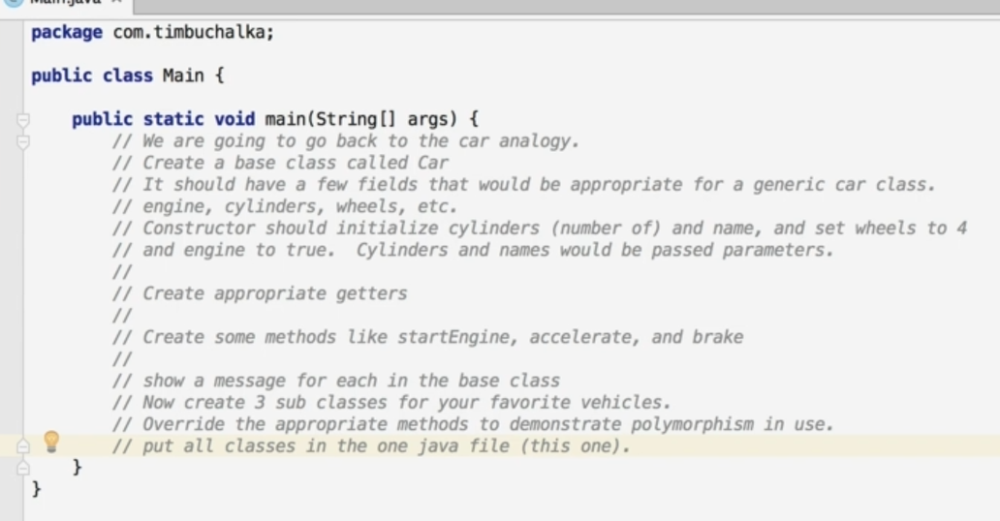
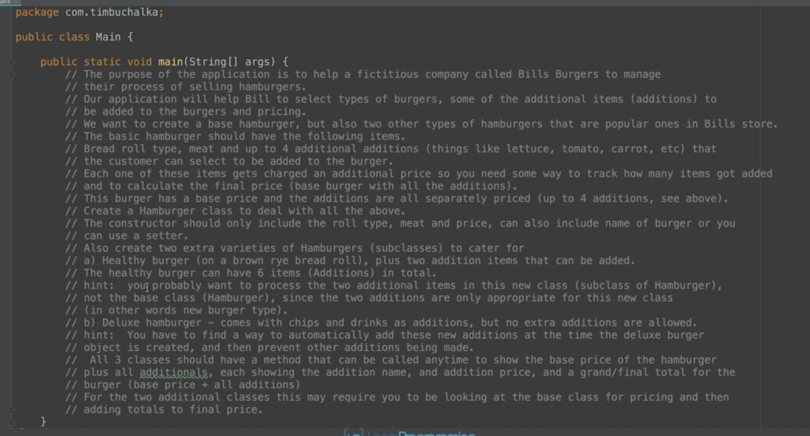

# Composition, Encapsulation, and Polymorphism

- [Composition, Encapsulation, and Polymorphism](#composition-encapsulation-and-polymorphism)
  - [Composition](#composition)
    - [Code Example](#code-example)
      - [code](#code)
  - [Composition Part 2 (+Challenge Exercise)](#composition-part-2-challenge-exercise)
    - [Code Example](#code-example-1)
      - [code](#code-1)
      - [output](#output)
    - [Challenge](#challenge)
      - [Question](#question)
      - [Answer](#answer)
        - [Code](#code-2)
          - [output](#output-1)
  - [Encapsulation](#encapsulation)
    - [Code Example](#code-example-2)
      - [code](#code-3)
      - [output](#output-2)
  - [Encapsulation (+Challenge Exercise)](#encapsulation-challenge-exercise)
    - [Challenge](#challenge-1)
      - [Question](#question-1)
      - [Answer](#answer-1)
        - [Code](#code-4)
          - [output](#output-3)
  - [Polymorphism](#polymorphism)
    - [Code Example](#code-example-3)
      - [code](#code-5)
      - [output](#output-4)
  - [Polymorphism (+Challenge Exercise)](#polymorphism-challenge-exercise)
    - [Challenge](#challenge-2)
      - [Question](#question-2)
      - [Answer](#answer-2)
        - [Code](#code-6)
          - [output](#output-5)
  - [OOP Master Challenge Exercise](#oop-master-challenge-exercise)
    - [Challenge](#challenge-3)
      - [Question](#question-3)
      - [Answer](#answer-3)
        - [Code](#code-7)
          - [output](#output-6)

## Composition

we use composition when we have to have the has a relationship.

### Code Example

#### code

```java
public class MotherBoard {
    private String manufacturer;
    private String model;
    private int ramSlots;
    private String bios;

    public MotherBoard(String manufacturer, String model, int ramSlots, String bios) {
        this.manufacturer = manufacturer;
        this.model = model;
        this.ramSlots = ramSlots;
        this.bios = bios;
    }

    public void loadProgramme(String programName) {
        System.out.println("Program " + programName + " is loading");
    }

    public String getManufacturer() {
        return manufacturer;
    }

    public String getModel() {
        return model;
    }

    public int getRamSlots() {
        return ramSlots;
    }

    public String getBios() {
        return bios;
    }
}

public class Monitor {
    private String model;
    private String manufacture;
    private int size;
    private Resolution nativeResolution;

    public Monitor(String model, String manufacture, int size, Resolution nativeResolution) {
        this.model = model;
        this.manufacture = manufacture;
        this.size = size;
        this.nativeResolution = nativeResolution;
    }

    public void drawingPixels(int x, int y, String color) {
        System.out.println("Drawing pixels at x: " + x + " y: " + " with color " + color);
    }
}

public class Case {
    private String model;
    private String manufacturer;
    private Dimensions dimensions;

    public Case(String model, String manufacturer, Dimensions dimensions) {
        this.model = model;
        this.manufacturer = manufacturer;
        this.dimensions = dimensions;
    }

    public void pressPowerButton() {
        System.out.println("Power button is pressed");
    }

    public String getModel() {
        return model;
    }

    public String getManufacturer() {
        return manufacturer;
    }

    public Dimensions getDimensions() {
        return dimensions;
    }
}

public class Dimensions {
    private int width;
    private int height;
    private int depth;

    public Dimensions(int width, int height, int depth) {
        this.width = width;
        this.height = height;
        this.depth = depth;
    }

    public int getWidth() {
        return width;
    }

    public int getHeight() {
        return height;
    }

    public int getDepth() {
        return depth;
    }
}

public class PC {
    private Case theCase;
    private Monitor monitor;
    private MotherBoard motherBoard;

    public PC(Case theCase, Monitor monitor, MotherBoard motherBoard) {
        this.theCase = theCase;
        this.monitor = monitor;
        this.motherBoard = motherBoard;
    }

    public Case getTheCase() {
        return theCase;
    }

    public Monitor getMonitor() {
        return monitor;
    }

    public MotherBoard getMotherBoard() {
        return motherBoard;
    }
}

public class Resolution {
    private int width;
    private int height;

    public Resolution(int width, int height) {
        this.width = width;
        this.height = height;
    }

    public int getWidth() {
        return width;
    }

    public int getHeight() {
        return height;
    }
}

public class Main {
    public static void main(String[] args) {
        Dimensions dimensions = new Dimensions(23,18,3);
        Case theCase = new Case("23b","Dell",dimensions);
        Resolution nativeResolution = new Resolution(1920,1080);
        Monitor monitor = new Monitor("abc","Dell",12,nativeResolution);
        MotherBoard motherBoard = new MotherBoard("sdsd","Dell",4,"sdjfsjdfg");

        PC pc = new PC(theCase,monitor,motherBoard);

        pc.getMonitor().drawingPixels(12,45,"red");
        pc.getMotherBoard().loadProgramme("windows 1.0");
        pc.getTheCase().pressPowerButton();

    }
}


```

## Composition Part 2 (+Challenge Exercise)

### Code Example

#### code

```java
public class PC {
    private Case theCase;
    private Monitor monitor;
    private MotherBoard motherBoard;

    public PC(Case theCase, Monitor monitor, MotherBoard motherBoard) {
        this.theCase = theCase;
        this.monitor = monitor;
        this.motherBoard = motherBoard;
    }

    public void drawLogo(){
//        fancy graphics
        monitor.drawingPixels(12,23,"red");
    }
    public void powerUp(){
        theCase.pressPowerButton();
        drawLogo();
    }

}

public class Main {
    public static void main(String[] args) {
        Dimensions dimensions = new Dimensions(23,18,3);
        Case theCase = new Case("23b","Dell",dimensions);
        Resolution nativeResolution = new Resolution(1920,1080);
        Monitor monitor = new Monitor("abc","Dell",12,nativeResolution);
        MotherBoard motherBoard = new MotherBoard("sdsd","Dell",4,"sdjfsjdfg");

        PC pc = new PC(theCase,monitor,motherBoard);

        pc.powerUp();

    }
}

```

#### output

```shell
Power button is pressed
Drawing pixels at x: 12 y:  with color red

```

### Challenge

#### Question


#### Answer

##### Code

```java
public class Wall {
    private String color;

    public Wall(String color) {
        this.color = color;
    }

    public String getColor() {
        return color;
    }
}

public class Windows {
    private int width;
    private int height;

    public Windows(int width, int height) {
        this.width = width;
        this.height = height;
    }

    public int getWidth() {
        return width;
    }

    public int getHeight() {
        return height;
    }

    public void open(){
        System.out.println("window is opening");
    }

}

public class Couch {
    private String model;

    public Couch(String model) {
        this.model = model;
    }

    public String getModel() {
        return model;
    }
}

public class Tv {
    private String model;

    public Tv(String model) {
        this.model = model;
    }

    public String getModel() {
        return model;
    }
}

import java.awt.*;

public class Room {
    private Wall wall1;
    private Wall wall2;
    private Wall wall3;
    private Wall wall4;
    private Windows window;
    private Couch couch;
    private Tv tv;

    public Room(Wall wall1, Wall wall2, Wall wall3, Wall wall4, Windows window, Couch couch, Tv tv) {
        this.wall1 = wall1;
        this.wall2 = wall2;
        this.wall3 = wall3;
        this.wall4 = wall4;
        this.window = window;
        this.couch = couch;
        this.tv = tv;
    }

    public void OpenWindow(){
        window.open();
    }
}

public class Main {
    public static void main(String[] args) {
        Wall wall1 = new Wall("red");
        Wall wall2 = new Wall("red");
        Wall wall3 = new Wall("red");
        Wall wall4 = new Wall("red");
        Windows windows = new Windows(12,12);
        Couch couch = new Couch("sdfsdf");
        Tv tv = new Tv("sdfsdlhf");

        Room room = new Room(wall1,wall2,wall3,wall4,windows,couch,tv);

        room.OpenWindow();
    }
}

```

###### output

```shell
🔥 -> window is opening
```

## Encapsulation

### Code Example

#### code

```java
public class Player {
    public String name;
    public int health;
    public String weapon;

    public void loseHealth(int damage) {
        this.health -= damage;
        if (this.health <= 0) {
            System.out.println("Player knocked out");
//            reduce the player life by one
        }
    }

    public int healthRemaining() {
        return this.health;
    }
}

public class EnhancedPlayer {
    private String name;
    private int health = 100;
    private String weapon;

    public EnhancedPlayer(String name, int health, String weapon) {
        this.name = name;
        if (health > 0 && health <= 100) {
            this.health = health;
        }
        this.weapon = weapon;
    }

    public void loseHealth(int damage) {
        this.health -= damage;
        if (this.health <= 0) {
            System.out.println("Player knocked out");
//            reduce the player life by one
        }
    }

    public int getHealth() {
        return health;
    }
}

public class Main {
    public static void main(String[] args) {
//        Player player = new Player();
//        player.name = "Tim";
//        player.health = 20;
//        player.weapon = "Sword";
//
//        int damage = 10;
//        player.loseHealth(damage);
//        System.out.println("Health Remaining " + player.healthRemaining());
//
//        damage = 11;
//        player.health = 189;
//        player.loseHealth(damage);
//        System.out.println("Health Remaining " + player.healthRemaining());

        EnhancedPlayer player = new EnhancedPlayer("kevin", 200, "sword");
        System.out.println("health is : " + player.getHealth());

    }
}
```

#### output

```shell
health is : 100
```

## Encapsulation (+Challenge Exercise)

### Challenge

#### Question


#### Answer

##### Code

```java
public class Printer {
    private double tonerLevel = 100;
    private int numberOfPagesPrinted = 0;
    private boolean isDuplex = false;

    public Printer(boolean isDuplex) {
        this.isDuplex = isDuplex;
    }

    public void printPage(int noOfPages) {

        if (this.tonerLevel - (noOfPages / 10) <= 0) {
            System.out.println("Sorry Cannot print this many pages");
        } else {
            this.tonerLevel -= noOfPages / 10 + noOfPages % 2;
            if (isDuplex) {
                System.out.println("this printer is a duplex printer");
                this.numberOfPagesPrinted += noOfPages / 2 + noOfPages % 2;
            } else {
                this.numberOfPagesPrinted += noOfPages;
            }
        }
    }

    public void fillTheToner(int amount) {
        if (this.tonerLevel + amount > 100) {
            this.tonerLevel = 100;
        } else {
            this.tonerLevel += amount;
        }
    }

    public double getTonerLevel() {
        return tonerLevel;
    }

    public int getNumberOfPagesPrinted() {
        return numberOfPagesPrinted;
    }
}

public class Main {
    public static void main(String[] args) {
        Printer printer = new Printer(true);
        printer.printPage(200);
        System.out.println("Toner Level :"+printer.getTonerLevel());
        System.out.println("Pages Printed :"+printer.getNumberOfPagesPrinted());
        printer.printPage(100);
        System.out.println("Toner Level :"+printer.getTonerLevel());
        System.out.println("Pages Printed :"+printer.getNumberOfPagesPrinted());
    }
}

```

###### output

```shell
this printer is a duplex printer
Toner Level :80.0
Pages Printed :100
this printer is a duplex printer
Toner Level :70.0
Pages Printed :150
```

`

## Polymorphism

### Code Example

#### code

```java

public class Main {
    public static void main(String[] args) {
        for (int i = 0; i < 11; i++) {
            Movie randomMovie = randomMovie();
            System.out.println("-------------------------------------------------------------------");
            System.out.println("Selected Movie : " + randomMovie.getName());
            System.out.println("Plot : " + randomMovie.plot());
            System.out.println("-------------------------------------------------------------------");
        }
    }

    public static Movie randomMovie() {
        int randomNumber = (int) (Math.random() * 6 + 1);
        System.out.println("Random number generated : " + randomNumber);

        switch (randomNumber) {
            case 1:
                return new Jaws();
            case 2:
                return new Deadpool();
            case 3:
                return new Xmen();
            case 4:
                return new Hulk();
            case 5:
                return new MazeRunner();
            case 6:
                return new Forgettable();
            default:
                return null;
        }
    }
}

class Movie {
    String name;

    public Movie(String name) {
        this.name = name;
    }

    public String getName() {
        return name;
    }

    public String plot() {
        return "there is no plot";
    }
}

class Jaws extends Movie {
    public Jaws() {
        super("jaws");
    }

    @Override
    public String plot() {
        return "A shark eats humans";
    }
}

class Deadpool extends Movie {
    public Deadpool() {
        super("deadpool");
    }

    @Override
    public String plot() {
        return "deadpool kills people";
    }
}

class Xmen extends Movie {
    public Xmen() {
        super("x-men");
    }

    @Override
    public String plot() {
        return "x-men saves the world";
    }
}

class MazeRunner extends Movie {
    public MazeRunner() {
        super("mazeRunner");
    }

    @Override
    public String plot() {
        return "kids try to escape a maze";
    }
}

class Hulk extends Movie {
    public Hulk() {
        super("hulk");
    }

    @Override
    public String plot() {
        return "hulk saves the world";
    }
}

class Forgettable extends Movie {
    public Forgettable() {
        super("Forgettable");
    }
}
```

#### output

```shell
Random number generated : 1
-------------------------------------------------------------------
Selected Movie : jaws
Plot : A shark eats humans
-------------------------------------------------------------------
Random number generated : 6
-------------------------------------------------------------------
Selected Movie : Forgettable
Plot : there is no plot
-------------------------------------------------------------------
Random number generated : 1
-------------------------------------------------------------------
Selected Movie : jaws
Plot : A shark eats humans
-------------------------------------------------------------------
Random number generated : 1
-------------------------------------------------------------------
Selected Movie : jaws
Plot : A shark eats humans
-------------------------------------------------------------------
Random number generated : 2
-------------------------------------------------------------------
Selected Movie : deadpool
Plot : deadpool kills people
-------------------------------------------------------------------
Random number generated : 4
-------------------------------------------------------------------
Selected Movie : hulk
Plot : hulk saves the world
-------------------------------------------------------------------
Random number generated : 2
-------------------------------------------------------------------
Selected Movie : deadpool
Plot : deadpool kills people
-------------------------------------------------------------------
Random number generated : 4
-------------------------------------------------------------------
Selected Movie : hulk
Plot : hulk saves the world
-------------------------------------------------------------------
Random number generated : 5
-------------------------------------------------------------------
Selected Movie : mazeRunner
Plot : kids try to escape a maze
-------------------------------------------------------------------
Random number generated : 6
-------------------------------------------------------------------
Selected Movie : Forgettable
Plot : there is no plot
-------------------------------------------------------------------
Random number generated : 1
-------------------------------------------------------------------
Selected Movie : jaws
Plot : A shark eats humans
-------------------------------------------------------------------
```

## Polymorphism (+Challenge Exercise)

### Challenge

#### Question



#### Answer

##### Code

```java
package chamara.java;

public class Car {
    private int wheels;
    private int cylinders;
    private boolean engine;

    private String name;

    public Car(int cylinders, String name) {
        this.wheels = 4;
        this.cylinders = cylinders;
        this.engine = true;
        this.name = name;
    }

    public int getCylinders() {
        return cylinders;
    }

    public String getName() {
        return name;
    }

    public void startEngine(){
        System.out.println("Car() -> vehicle is starting");
    }

    public void accelerating(){
        System.out.println("Car() -> accelerating");
    }

    public void braking(){
        System.out.println("Car() -> braking");
    }
}

package chamara.java;

class Civic extends Car{
    public Civic() {
        super(10, "civic");
    }
    @Override
    public void startEngine() {
        System.out.println("civic is starting");
    }

    @Override
    public void accelerating() {
        System.out.println("civic is accelerating");
    }

    @Override
    public void braking() {
        System.out.println("civic is braking");
    }
}

package chamara.java;

public class Main {
    public static void main(String[] args) {
        Car car = new Car(12,"car");
        System.out.println(car.getName());
        System.out.println(car.getCylinders());

        car.startEngine();
        car.accelerating();
        car.braking();

        Civic civic = new Civic();
        civic.startEngine();
        civic.accelerating();
        civic.braking();
    }
}
```

###### output

```shell
car
12
Car() -> vehicle is starting
Car() -> accelerating
Car() -> braking
civic is starting
civic is accelerating
civic is braking
```

## OOP Master Challenge Exercise

### Challenge

#### Question



#### Answer

##### Code

```java
public class Hamburger {
    private String name;
    private String breadRole;
    private String meat;
    private double price;

    private String option1;
    private double option1Price;
    private String option2;
    private double option2Price;
    private String option3;
    private double option3Price;
    private String option4;
    private double option4Price;

    public Hamburger(String name, String breadRole, String meat, double price) {
        this.name = name;
        this.breadRole = breadRole;
        this.meat = meat;
        this.price = price;
    }

    public String getName() {
        return name;
    }

    public String getBreadRole() {
        return breadRole;
    }

    public String getMeat() {
        return meat;
    }

    public double getTotalBill() {
        double hamburgerPrice = this.price;
        System.out.println("Your " + this.name + " burger with " + this.meat + ", " + this.breadRole + " is " + this.price);
        if (this.option1 != null) {
            System.out.println("extra " + this.option1 + " is added for " + this.option1Price);
            hamburgerPrice += this.option1Price;
        }
        if (this.option2 != null) {
            System.out.println("extra " + this.option2 + " is added for " + this.option2Price);
            hamburgerPrice += this.option2Price;
        }
        if (this.option3 != null) {
            System.out.println("extra " + this.option3 + " is added for " + this.option3Price);
            hamburgerPrice += this.option3Price;
        }
        if (this.option4 != null) {
            System.out.println("extra " + this.option4 + " is added for " + this.option4Price);
            hamburgerPrice += this.option4Price;
        }
        return hamburgerPrice;
    }

    public void addOption1(String option, double price) {
        this.option1 = option;
        this.option1Price = price;
    }

    public void addOption2(String option, double price) {
        this.option2 = option;
        this.option2Price = price;
    }

    public void addOption3(String option, double price) {
        this.option3 = option;
        this.option3Price = price;
    }

    public void addOption4(String option, double price) {
        this.option4 = option;
        this.option4Price = price;
    }

}


public class HealthyBurger extends Hamburger {
    private String healthyOption1;
    private double healthyOption1Price;
    private String healthyOption2;
    private double healthyOption2Price;

    public HealthyBurger(String meat, double price) {
        super("healthy", "rye", meat, price);
    }

    public void addHealthyOption1(String option, double price) {
        this.healthyOption1 = option;
        this.healthyOption1Price = price;
    }

    public void addHealthyOption2(String option, double price) {
        this.healthyOption2 = option;
        this.healthyOption2Price = price;
    }

    @Override
    public double getTotalBill() {
        double price = super.getTotalBill();
        if (this.healthyOption1 != null) {
            System.out.println("extra " + this.healthyOption1 + " is added for " + this.healthyOption1Price);
            price += this.healthyOption1Price;
        }
        if (this.healthyOption2 != null) {
            System.out.println("extra " + this.healthyOption2 + " is added for " + this.healthyOption2Price);
            price += this.healthyOption2Price;
        }
        return price;
    }
}


public class DeluxeBurger extends Hamburger {
    public DeluxeBurger(String meat, double price) {
        super("deluxe", "white", meat, price);
        super.addOption1("chips", 2);
        super.addOption2("drink", 4);
    }

    @Override
    public void addOption1(String option, double price) {
        System.out.println("cannot add extras");
    }

    @Override
    public void addOption2(String option, double price) {
        System.out.println("cannot add extras");
    }

    @Override
    public void addOption3(String option, double price) {
        System.out.println("cannot add extras");
    }

    @Override
    public void addOption4(String option, double price) {
        System.out.println("cannot add extras");
    }

}

public class Main {
    public static void main(String[] args) {
        Hamburger hamburger = new Hamburger("normal", "white", "sousage", 3.23);
        hamburger.addOption1("Tomato", 0.21);
        hamburger.addOption2("lettuce", 0.21);
        hamburger.addOption3("carrot", 0.21);
        hamburger.addOption4("onion", 0.21);
        double price = hamburger.getTotalBill();
        System.out.println("Total Price for the burger " + price);


        HealthyBurger healthyBurger = new HealthyBurger("sousage", 3.23);
        healthyBurger.addOption1("Tomato", 0.21);
        healthyBurger.addOption2("lettuce", 0.21);
        healthyBurger.addOption3("carrot", 0.21);
        healthyBurger.addOption4("onion", 0.21);
        healthyBurger.addHealthyOption1("bisil", 12.1);
        healthyBurger.addHealthyOption2("olive", 12.1);

        double Newprice = healthyBurger.getTotalBill();
        System.out.println("Total Price for the burger " + Newprice);

        DeluxeBurger deluxeBurger = new DeluxeBurger("pork", 12);
        deluxeBurger.addOption1("Tomato", 0.21);
        deluxeBurger.addOption2("lettuce", 0.21);
        deluxeBurger.addOption3("carrot", 0.21);
        deluxeBurger.addOption4("onion", 0.21);
        double deluxeBurgerTotalBill = deluxeBurger.getTotalBill();
        System.out.println("Total Price for the burger " + deluxeBurgerTotalBill);
    }
}

```

###### output

```shell
Your normal burger with sousage, white is 3.23
extra Tomato is added for 0.21
extra lettuce is added for 0.21
extra carrot is added for 0.21
extra onion is added for 0.21
Total Price for the burger 4.07
Your healthy burger with sousage, rye is 3.23
extra Tomato is added for 0.21
extra lettuce is added for 0.21
extra carrot is added for 0.21
extra onion is added for 0.21
extra bisil is added for 12.1
extra olive is added for 12.1
Total Price for the burger 28.270000000000003
cannot add extras
cannot add extras
cannot add extras
cannot add extras
Your deluxe burger with pork, white is 12.0
extra chips is added for 2.0
extra drink is added for 4.0
Total Price for the burger 18.0
```
