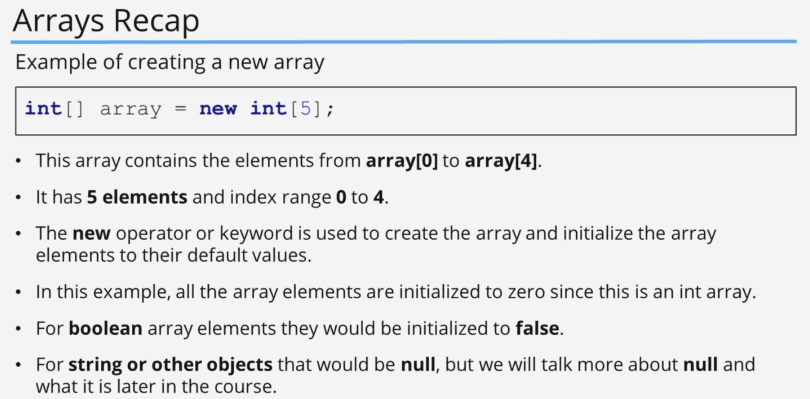
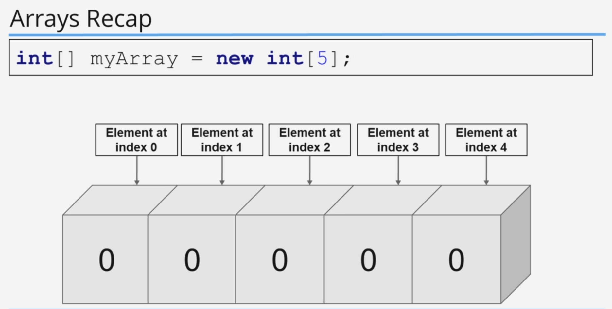
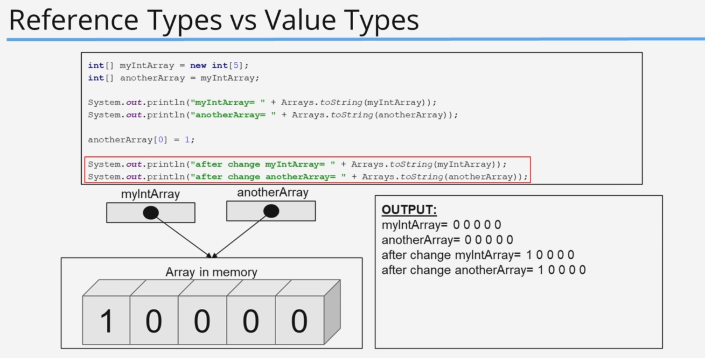
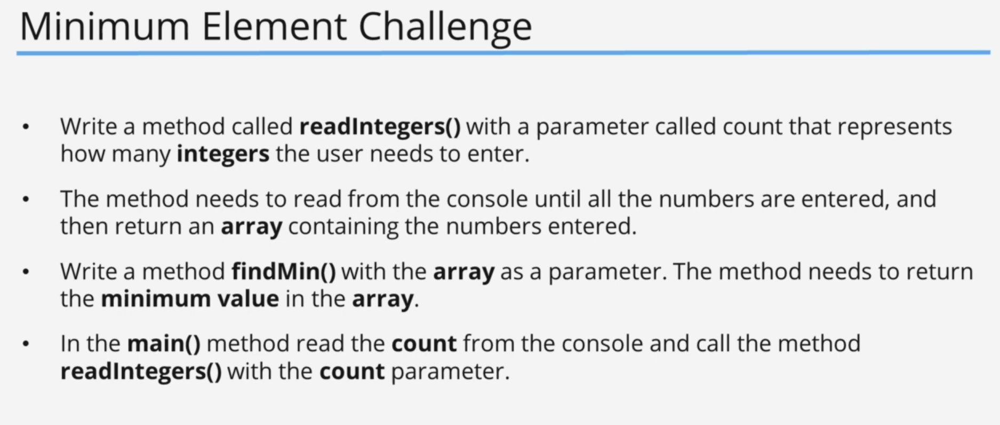
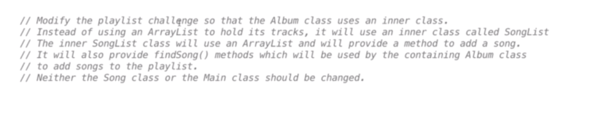

# Arrays, Java inbuilt Lists, Autoboxing and Unboxing

## 1. Arrays

### Code Example

#### code

```java
public class Main {
    public static void main(String[] args) {
        System.out.println("Hello world!");

        int[] myVariable;
        myVariable = new int[5];
        myVariable[2] = 12;

        double[] myDoubleArray = new double[3];

        int[] myIntArray = {1, 2, 3, 5};

        System.out.println(myIntArray[0]);
        System.out.println(myIntArray[1]);
        System.out.println(myIntArray[2]);
        System.out.println(myIntArray[3]);

        int[] myIntArray2 = new int[10];

        for (int i = 0; i < myIntArray2.length; i++) {
            myIntArray2[i] = i * 10;
        }

        printArray(myIntArray2);

    }

    public static void printArray(int[] array) {
        for (int i = 0; i < array.length; i++) {
            System.out.println("Iteration " + i + ", value " + array[i]);
        }
    }
}

```

#### output

```shell
1
2
3
5
Iteration 0, value 0
Iteration 1, value 10
Iteration 2, value 20
Iteration 3, value 30
Iteration 4, value 40
Iteration 5, value 50
Iteration 6, value 60
Iteration 7, value 70
Iteration 8, value 80
Iteration 9, value 90
```

### Code Example

#### code

```java

import java.util.Scanner;

public class Main {
    private static Scanner scanner = new Scanner(System.in);

    public static void main(String[] args) {
        int[] myIntValues = getIntegerValues(5);
        printArray(myIntValues);
        System.out.println("average is " + getAverage(myIntValues));

    }

    private static int[] getIntegerValues(int i) {
        int[] value = new int[i];
        System.out.println("please enter " + i + " values\r");
        for (int j = 0; j < i; j++) {
            value[j] = scanner.nextInt();
        }
        return value;
    }

    public static void printArray(int[] array) {
        for (int i = 0; i < array.length; i++) {
            System.out.println("Iteration " + i + ", value " + array[i]);
        }
    }

    public static double getAverage(int[] numbers) {
        int sum = 0;
        for (int i = 0; i < numbers.length; i++) {
            sum += numbers[i];
        }
        return (double) sum / (double) numbers.length;
    }
}

```

#### output

```shell
please enter 5 values
12
12
12
12
12
Iteration 0, value 12
Iteration 1, value 12
Iteration 2, value 12
Iteration 3, value 12
Iteration 4, value 12
average is 12.0

```

## 2. Arrays (Challenge Exercise)

### Challenge

My Answer

#### Question


#### Answer

##### Code

```java
import java.util.Scanner;

public class Main {
    private static Scanner scanner = new Scanner(System.in);

    public static void main(String[] args) {

        System.out.println("please enter values to sort\r");
        printArray(sortArray(getArrayFromUser(4)));
    }

    public static int[] getArrayFromUser(int value) {
        int[] array = new int[value];
        for (int i = 0; i < value; i++) {
            array[i] = scanner.nextInt();
        }
        return array;
    }

    public static int[] sortArray(int[] array) {

        for (int i = 0; i < array.length; i++) {
            int max = array[i];
            for (int j = i + 1; j < array.length; j++) {
                if (max < array[j]) {
                    int temp = array[j];
                    array[j] = max;
                    array[i] = temp;
                }
            }
        }
        return array;
    }

    public static void printArray(int[] array) {
        for (int i = 0; i < array.length; i++) {
            System.out.println("Element index " + i + ", value = " + array[i]);
        }
    }
}
```

###### output

```shell
34
2
5
1
Element index 0, value = 34
Element index 1, value = 5
Element index 2, value = 2
Element index 3, value = 1
```

---

### Challenge

second answer

#### Answer

##### Code

```java
import java.util.Scanner;

public class Main {
    private static Scanner scanner = new Scanner(System.in);

    public static void main(String[] args) {


        printArray(sortArray(getArrayFromUser(4)));
    }

    public static int[] getArrayFromUser(int value) {
        System.out.println("please enter values to sort\r");
        int[] array = new int[value];
        for (int i = 0; i < array.length; i++) {
            array[i] = scanner.nextInt();
        }
        return array;
    }

    public static int[] sortArray(int[] array) {
        int[] sortedArray = new int[array.length];
        for (int i = 0; i < array.length; i++) {
            sortedArray[i] = array[i];
        }
        boolean flag = true;
        int temp;
        while (flag) {
            flag = false;
            for (int i = 0; i < sortedArray.length - 1; i++) {
                if (sortedArray[i] < sortedArray[i + 1]) {
                    temp = sortedArray[i];
                    sortedArray[i] = sortedArray[i + 1];
                    sortedArray[i + 1] = temp;
                    flag = true;
                }
            }
        }
        return sortedArray;
    }

    public static void printArray(int[] array) {
        for (int i = 0; i < array.length; i++) {
            System.out.println("Element index " + i + ", value = " + array[i]);
        }
    }
}
```

###### output

```shell
please enter values to sort
33
4
167
1
Element index 0, value = 167
Element index 1, value = 33
Element index 2, value = 4
Element index 3, value = 1
```

## 4. Arrays Recap







## 5. References Types vs Value Types

### Code Example

#### code

```java
import java.lang.reflect.Array;
import java.util.Arrays;

public class Main {
    public static void main(String[] args) {
        System.out.println("------------------- value types---------------------------");
        int myInt = 12;
        int anotherInt = myInt;

        System.out.println("my int value : " + myInt);
        System.out.println("another int value : " + anotherInt);

        anotherInt = 1;

        System.out.println("my int value : " + myInt);
        System.out.println("another int value : " + anotherInt);

        System.out.println("------------------- reference types---------------------------");

        int[] myIntArray = new int[5];
        int[] anotherArray = myIntArray;

        System.out.println("myIntArray -> " + Arrays.toString(myIntArray));
        System.out.println("anotherArray -> " + Arrays.toString(anotherArray));

        System.out.println("-------------------after change reference types---------------------------");
        modifyArray(anotherArray);
        System.out.println("myIntArray -> " + Arrays.toString(myIntArray));
        System.out.println("anotherArray -> " + Arrays.toString(anotherArray));

        System.out.println("-------------------after de referencing reference types---------------------------");

        anotherArray = new int[]{23,1};
        System.out.println("myIntArray -> " + Arrays.toString(myIntArray));
        System.out.println("anotherArray -> " + Arrays.toString(anotherArray));
    }

    public static void modifyArray(int[] array) {
        array[0] = 10;

        array = new int[]{1,1,1,1,1,1,1,1,1};
    }
}

```

#### output

```shell
my int value : 12
another int value : 12
my int value : 12
another int value : 1
------------------- reference types---------------------------
myIntArray -> [0, 0, 0, 0, 0]
anotherArray -> [0, 0, 0, 0, 0]
-------------------after change reference types---------------------------
myIntArray -> [10, 0, 0, 0, 0]
anotherArray -> [10, 0, 0, 0, 0]
-------------------after de referencing reference types---------------------------
myIntArray -> [10, 0, 0, 0, 0]
anotherArray -> [23, 1]
```





## 6. Minimum Element Challenge

### Challenge

#### Question




#### Answer

##### Code

```java
import java.util.Scanner;

public class Main {
    private static Scanner scanner = new Scanner(System.in);

    public static void main(String[] args) {
        System.out.println("enter a count: ");
        int count = scanner.nextInt();
        scanner.nextLine();

        int[] arrayToFindTheMin = readIntegers(count);

        System.out.println("minimum value : " + findMin(arrayToFindTheMin));

    }

    public static int[] readIntegers(int count) {
        int[] array = new int[count];
        System.out.println("Enter " + count + " numbers\r");
        for (int i = 0; i < array.length; i++) {
            System.out.println("Enter numbers " + (i + 1) + "\r");
            int number = scanner.nextInt();
            scanner.nextLine();
            array[i] = number;
        }
        return array;
    }

    public static int findMin(int[] array) {
        int min = array[0];
        for (int i = 1; i < array.length; i++) {
            if (min > array[i]) {
                min = array[i];
            }
        }
        return min;
    }
}
```

###### output

```shell
enter a count: 
5
Enter 5 numbers
Enter numbers 1
2
Enter numbers 2
543
Enter numbers 3
8
Enter numbers 4
1
Enter numbers 5
55
minimum value : 1
```

## 7. Reverse Array Challenge

## 8. List and ArrayList Part 1

how to resize and Array.

### Code Example

#### code

```java
import java.util.Arrays;
import java.util.Scanner;

public class Main {
    private static Scanner scanner = new Scanner(System.in);
    private static int[] baseDate = new int[10];

    public static void main(String[] args) {
        System.out.println("Enter 10 digits : \r");
        getInput();
        System.out.println(Arrays.toString(baseDate));
        resizeTheArray();
        baseDate[10] = 12;
        baseDate[11] = 23;
        System.out.println(Arrays.toString(baseDate));
    }

    public static void getInput() {
        for (int i = 0; i < baseDate.length; i++) {
            baseDate[i] = scanner.nextInt();
            scanner.nextLine();
        }
    }

    public static void resizeTheArray(){
        int[] oldArray = baseDate;

        baseDate = new int[12];

        for (int i = 0; i < oldArray.length; i++) {
            baseDate[i] = oldArray[i];
        }
    }
}

```

#### output

```shell
Enter 10 digits : 
234
234
1234
234
123
123
123
123
12
3123
[234, 234, 1234, 234, 123, 123, 123, 123, 12, 3123]
[234, 234, 1234, 234, 123, 123, 123, 123, 12, 3123, 12, 23]
```

this can become not so easy as our code becomes more expansive.

so the array list is a resizable array.

### Code Example

#### code

```java
import java.util.ArrayList;

public class GroceryList {
    private final ArrayList<String> groceryList = new ArrayList<String>();

    public void addGroceryItem(String item) {
        groceryList.add(item);
    }

    public void printGroceryList() {
        System.out.println("You have " + groceryList.size() + " items in your grocery list");
        for (int i = 0; i < groceryList.size(); i++) {
            System.out.println((i + 1) + ". " + groceryList.get(i));
        }
    }

    public void updateGroceryList(int index, String item) {
        groceryList.set(index, item);
        System.out.println("Grocery list item " + index + "has been updated");
    }

    public void removeItemFromGroceryList(int index) {
        String item = groceryList.get(index);
        groceryList.remove(index);
        System.out.println(item + " has been removed from the grocery list");
    }
}
import java.util.ArrayList;

public class GroceryList {
    private final ArrayList<String> groceryList = new ArrayList<String>();

    public void addGroceryItem(String item) {
        groceryList.add(item);
    }

    public void printGroceryList() {
        System.out.println("You have " + groceryList.size() + " items in your grocery list");
        for (int i = 0; i < groceryList.size(); i++) {
            System.out.println((i + 1) + ". " + groceryList.get(i));
        }
    }

    public void updateGroceryList(int index, String item) {
        groceryList.set(index, item);
        System.out.println("Grocery list item " + index + "has been updated");
    }

    public void removeItemFromGroceryList(int index) {
        String item = groceryList.get(index);
        groceryList.remove(index);
        System.out.println(item + " has been removed from the grocery list");
    }
}


```

## 9. ArrayList Part 2

### Code Example

#### code

```java

import java.util.Scanner;

public class Main {
    private static final Scanner scanner = new Scanner(System.in);
    private static final GroceryList groceryList = new GroceryList();

    public static void main(String[] args) {
        boolean quit = false;
        int choice = 0;
        printInstruction();
        while (!quit) {
            System.out.println("Enter your choice: ");
            choice = scanner.nextInt();
            scanner.nextLine();

            switch (choice) {
                case 0 -> printInstruction();
                case 1 -> groceryList.printGroceryList();
                case 2 -> addItem();
                case 3 -> modifyItem();
                case 4 -> removeItem();
                case 5 -> searchForItem();
                case 6 -> quit = true;
            }
        }

    }

    public static void printInstruction() {
        System.out.println("\nPress ");
        System.out.println("\t 0 - To Print choice options.");
        System.out.println("\t 1 - To Print list of grocery items.");
        System.out.println("\t 2 - To add an item to the list.");
        System.out.println("\t 3 - To modify an item in the list.");
        System.out.println("\t 4 - To remove an item from the list.");
        System.out.println("\t 5 - To search an item from the list.");
        System.out.println("\t 6 - To exit from the list.");
    }

    public static void addItem() {
        System.out.println("Please enter the grocery item: ");
        groceryList.addGroceryItem(scanner.nextLine());
    }

    public static void modifyItem() {
        System.out.println("enter a grocery item number: ");
        int itemNumber = scanner.nextInt();
        scanner.nextLine();
        System.out.println("Enter replacement item: ");
        String newItem = scanner.nextLine();
        groceryList.updateGroceryList(itemNumber - 1, newItem);
    }

    public static void removeItem() {
        System.out.println("enter a grocery item number: ");
        int itemNumber = scanner.nextInt();
        groceryList.removeItemFromGroceryList(itemNumber - 1);
        scanner.nextLine();
    }

    public static void searchForItem() {
        System.out.println("Item to search for: ");
        String itemToSearchFor = scanner.nextLine();
        if (groceryList.findItem(itemToSearchFor) != null) {
            System.out.println("Found " + groceryList.findItem(itemToSearchFor) + " in our grocery list");
        } else {
            System.out.println(itemToSearchFor + " is not in the shopping list");
        }
    }

}
```

#### output

```shell
Press 
  0 - To Print choice options.
  1 - To Print list of grocery items.
  2 - To add an item to the list.
  3 - To modify an item in the list.
  4 - To remove an item from the list.
  5 - To search an item from the list.
  6 - To exit from the list.
Enter your choice: 
2
Please enter the grocery item: 
bread
Enter your choice: 
2
Please enter the grocery item: 
milk
Enter your choice: 
1
You have 2 items in your grocery list
1. bread
2. milk
Enter your choice: 
3
enter a grocery item number: 
1
Enter replacement item: 
amond milk
Grocery list item 01 has been updated
Enter your choice: 
1
You have 2 items in your grocery list
1. amond milk
2. milk
Enter your choice: 
4
enter a grocery item number: 
1
amond milk has been removed from the grocery list
Enter your choice: 
2
Please enter the grocery item: 
milk
Enter your choice: 
1
You have 2 items in your grocery list
1. milk
2. milk
Enter your choice: 
4
enter a grocery item number: 
1
milk has been removed from the grocery list
Enter your choice: 
1
You have 1 items in your grocery list
1. milk
Enter your choice: 
2
Please enter the grocery item: 
cheese
Enter your choice: 
1
You have 2 items in your grocery list
1. milk
2. cheese
Enter your choice: 
5
Item to search for: 
milk
Found milk in our grocery list
Enter your choice: 
6

Process finished with exit code 0
```

## 10. ArrayList Part 3

### Code Example

#### code

```java
import java.util.ArrayList;

public class GroceryList {
    private final ArrayList<String> groceryList = new ArrayList<String>();

    public ArrayList<String> getGroceryList() {
        return groceryList;
    }

    public void addGroceryItem(String item) {
        groceryList.add(item);
    }

    public void printGroceryList() {
        System.out.println("You have " + groceryList.size() + " items in your grocery list");
        for (int i = 0; i < groceryList.size(); i++) {
            System.out.println((i + 1) + ". " + groceryList.get(i));
        }
    }

    public void updateGroceryList(String currentItem, String newItem) {
        int index = findItem(currentItem);
        if (index >= 0) {
            updateGroceryList(index, newItem);
        }
    }

    private void updateGroceryList(int index, String item) {
        groceryList.set(index, item);
        System.out.println("Grocery list item " + index + 1 + " has been updated");
    }

    public void removeItemFromGroceryList(String item) {
        int index = findItem(item);
        if (index >= 0) {
            groceryList.remove(index);
        }
        System.out.println(item + " has been removed from the grocery list");
    }

    private int findItem(String item) {
//        boolean exists = groceryList.contains(item);
        return groceryList.indexOf(item);

    }

    public boolean onFile(String item) {
        int index = findItem(item);
        return index >= 0;
    }
}


-----------------------------------------------------------------------------

import java.util.ArrayList;
import java.util.Scanner;

public class Main {
    private static final Scanner scanner = new Scanner(System.in);
    private static final GroceryList groceryList = new GroceryList();

    public static void main(String[] args) {
        boolean quit = false;
        int choice = 0;
        printInstruction();
        while (!quit) {
            System.out.println("Enter your choice: ");
            choice = scanner.nextInt();
            scanner.nextLine();

            switch (choice) {
                case 0 -> printInstruction();
                case 1 -> groceryList.printGroceryList();
                case 2 -> addItem();
                case 3 -> modifyItem();
                case 4 -> removeItem();
                case 5 -> searchForItem();
                case 6 -> processGroceryList();
                case 7 -> quit = true;
            }
        }

    }

    public static void printInstruction() {
        System.out.println("\nPress ");
        System.out.println("\t 0 - To Print choice options.");
        System.out.println("\t 1 - To Print list of grocery items.");
        System.out.println("\t 2 - To add an item to the list.");
        System.out.println("\t 3 - To modify an item in the list.");
        System.out.println("\t 4 - To remove an item from the list.");
        System.out.println("\t 5 - To search an item from the list.");
        System.out.println("\t 6 - To process the list.");
        System.out.println("\t 7 - To exit from the list.");
    }

    public static void addItem() {
        System.out.println("Please enter the grocery item to add: ");
        groceryList.addGroceryItem(scanner.nextLine());
    }

    public static void modifyItem() {
        System.out.println("enter a grocery item to modify: ");
        String itemToModify = scanner.nextLine();
        System.out.println("Enter replacement item: ");
        String newItem = scanner.nextLine();
        groceryList.updateGroceryList(itemToModify, newItem);
    }

    public static void removeItem() {
        System.out.println("enter a grocery item to remove: ");
        String itemToRemove = scanner.nextLine();
        groceryList.removeItemFromGroceryList(itemToRemove);
    }

    public static void searchForItem() {
        System.out.println("Item to search for: ");
        String itemToSearchFor = scanner.nextLine();
        if (groceryList.onFile(itemToSearchFor)) {
            System.out.println("Found " + itemToSearchFor + " in our grocery list");
        } else {
            System.out.println(itemToSearchFor + " is not in the shopping list");
        }
    }

    public static void processGroceryList() {
        ArrayList<String> newArrayList = new ArrayList<>();
        newArrayList.addAll(groceryList.getGroceryList());
        ArrayList<String> nextArrayList = new ArrayList<>(groceryList.getGroceryList());

        String[] newArray = new String[groceryList.getGroceryList().size()];

        newArray = groceryList.getGroceryList().toArray(newArray);
    }

}

```

#### output

```shell
Press 
  0 - To Print choice options.
  1 - To Print list of grocery items.
  2 - To add an item to the list.
  3 - To modify an item in the list.
  4 - To remove an item from the list.
  5 - To search an item from the list.
  6 - To process the list.
  7 - To exit from the list.
Enter your choice: 
1
You have 0 items in your grocery list
Enter your choice: 
2
Please enter the grocery item to add: 
milk
Enter your choice: 
2
Please enter the grocery item to add: 
bread
Enter your choice: 
3
enter a grocery item to modify: 
milk
Enter replacement item: 
amond milk
Grocery list item 01 has been updated
Enter your choice: 
1
You have 2 items in your grocery list
1. amond milk
2. bread
Enter your choice: 
0

Press 
  0 - To Print choice options.
  1 - To Print list of grocery items.
  2 - To add an item to the list.
  3 - To modify an item in the list.
  4 - To remove an item from the list.
  5 - To search an item from the list.
  6 - To process the list.
  7 - To exit from the list.
Enter your choice: 
5
Item to search for: 
milk
milk is not in the shopping list
Enter your choice: 
5
Item to search for: 
bread
Found bread in our grocery list
Enter your choice: 
4
enter a grocery item to remove: 
bread
bread has been removed from the grocery list
Enter your choice: 
1
You have 1 items in your grocery list
1. amond milk
Enter your choice: 
7

Process finished with exit code 0

```

## 11. ArrayList Challenge Part 1

### Challenge

#### Question


#### Answer

##### Code

```java
public class Contact {
    private final String name;
    private final String PhoneNumber;

    public Contact(String name, String phoneNumber) {
        this.name = name;
        PhoneNumber = phoneNumber;
    }

    public static Contact createContact(String name, String phoneNumber) {
        return new Contact(name, phoneNumber);
    }

    public String getName() {
        return name;
    }

    public String getPhoneNumber() {
        return PhoneNumber;
    }
}


import java.util.ArrayList;

public class MobilePhone {
    private String mobilePhone;
    private ArrayList<Contact> myContacts;

    public MobilePhone(String mobilePhone) {
        this.mobilePhone = mobilePhone;
        this.myContacts = new ArrayList<Contact>();
    }

    public boolean addContact(Contact contact) {
        if (findContact(contact) >= 0) {
            System.out.println("contact already in the contact list");
            return false;
        }
        myContacts.add(contact);
        return true;
    }

    public boolean updateContact(Contact oldContact, Contact newContact) {
        int position = findContact(oldContact);
        if (position < 0) {
            System.out.println("this contact was not found");
            return false;
        }
        myContacts.set(position, newContact);
        System.out.println(oldContact.getName() + " is updated to " + newContact.getName());
        return true;
    }

    private int findContact(Contact contact) {
        return myContacts.indexOf(contact);
    }

    private int findContact(String contactName) {
        for (int i = 0; i < myContacts.size(); i++) {
            Contact contact = myContacts.get(i);
            if (contact.getName().equals(contactName)) {
                return i;
            }
        }
        return -1;
    }
}

```

## 12. ArrayList Challenge Part 2

```java
import java.util.ArrayList;

public class MobilePhone {
    private String mobileNumber;
    private ArrayList<Contact> myContacts;

    public MobilePhone(String mobilePhone) {
        this.mobileNumber = mobilePhone;
        this.myContacts = new ArrayList<Contact>();
    }

    public void printContactList() {
        System.out.println("your contact list has " + myContacts.size() + " items");
        for (Contact contact : myContacts) {
            System.out.println(contact.getName() + " : " + contact.getPhoneNumber());
        }
    }

    public boolean addContact(Contact contact) {
        if (findContact(contact) >= 0) {
            System.out.println("contact already in the contact list");
            return false;
        }
        myContacts.add(contact);
        return true;
    }

    public boolean updateContact(Contact oldContact, Contact newContact) {
        int position = findContact(oldContact);
        if (position < 0) {
            System.out.println("this contact was not found");
            return false;
        }
        myContacts.set(position, newContact);
        System.out.println(oldContact.getName() + " is updated to " + newContact.getName());
        return true;
    }

    public boolean removeContact(Contact contact) {
        int position = findContact(contact);
        if (position < 0) {
            System.out.println("this contact was not found");
            return false;
        }
        myContacts.remove(contact);
        System.out.println("this " + contact.getName() + " is deleted");
        return true;
    }

    private int findContact(Contact contact) {
        return myContacts.indexOf(contact);
    }

    private int findContact(String contactName) {
        for (int i = 0; i < myContacts.size(); i++) {
            Contact contact = myContacts.get(i);
            if (contact.getName().equals(contactName)) {
                return i;
            }
        }
        return -1;
    }

    public String queryContact(Contact contact) {
        if (findContact(contact) >= 0) {
            return contact.getName();
        }
        return null;
    }
}
```

adding main methods

```java
import java.util.Scanner;

public class Main {
    private static final Scanner scanner = new Scanner(System.in);
    private static final MobilePhone myPhone = new MobilePhone("+940702542");

    public static void main(String[] args) {
        boolean quit = false;
        int choise;
        printOptions();
        while (!quit) {
            System.out.println("please enter a option !");
            choise = scanner.nextInt();
            scanner.nextLine();
            switch (choise) {
                case 0 -> printOptions();
                case 1 -> printContactList();
                case 2 -> addContact();
                case 3 -> updateContact();
                case 4 -> removeContact();
                case 5 -> findContact();
                case 6 -> quit = true;
            }
        }

    }

    public static void printContactList() {
        myPhone.printContactList();
    }

    public static void printOptions() {
        System.out.println("\nPress ");
        System.out.println("\t 0 - To Print choice options.");
        System.out.println("\t 1 - To Print list of contacts.");
        System.out.println("\t 2 - To add a contact.");
        System.out.println("\t 3 - To modify a contact.");
        System.out.println("\t 4 - To remove a contact.");
        System.out.println("\t 5 - To search a contact.");
        System.out.println("\t 6 - To exit from the list.");
    }

    public static void addContact() {
        System.out.println("please enter the contact name : ");
        String contactName = scanner.nextLine();
        System.out.println("Please enter the number");
        String contactNumber = scanner.nextLine();
        Contact contact = Contact.createContact(contactName, contactNumber);
        if (myPhone.addContact(contact)) {
            System.out.println("Contact added successfully");
        } else {
            System.out.println("This contact exists already");
        }

    }
}
```

adding add contact list.

## 13. ArrayList Challenge Part 3

contact

```java
public class Contact {
    private final String name;
    private final String PhoneNumber;

    public Contact(String name, String phoneNumber) {
        this.name = name;
        PhoneNumber = phoneNumber;
    }

    public static Contact createContact(String name, String phoneNumber) {
        return new Contact(name, phoneNumber);
    }

    public String getName() {
        return name;
    }

    public String getPhoneNumber() {
        return PhoneNumber;
    }
}

```

MobilePhone

```java
import java.util.ArrayList;

public class MobilePhone {
    private String mobileNumber;
    private ArrayList<Contact> myContacts;

    public MobilePhone(String mobilePhone) {
        this.mobileNumber = mobilePhone;
        this.myContacts = new ArrayList<Contact>();
    }

    public void printContactList() {
        System.out.println("your contact list has " + myContacts.size() + " items");
        int index = 1;
        for (Contact contact : myContacts) {
            System.out.println(index + "." + contact.getName() + " -> " + contact.getPhoneNumber());
            index++;
        }
    }

    public boolean addContact(Contact contact) {
        if (findContact(contact) >= 0) {
            System.out.println("contact already in the contact list");
            return false;
        }
        myContacts.add(contact);
        return true;
    }

    public boolean updateContact(Contact oldContact, Contact newContact) {
        int position = findContact(oldContact);
        if (position < 0) {
            System.out.println("this contact was not found");
            return false;
        }
        myContacts.set(position, newContact);
        System.out.println(oldContact.getName() + " is updated to " + newContact.getName());
        return true;
    }

    public boolean removeContact(Contact contact) {
        int position = findContact(contact);
        if (position < 0) {
            System.out.println("this contact was not found");
            return false;
        }
        myContacts.remove(contact);
        System.out.println("this " + contact.getName() + " is deleted");
        return true;
    }

    private int findContact(Contact contact) {
        return myContacts.indexOf(contact);
    }

    private int findContact(String contactName) {
        for (int i = 0; i < myContacts.size(); i++) {
            Contact contact = myContacts.get(i);
            if (contact.getName().equals(contactName)) {
                return i;
            }
        }
        return -1;
    }

    public String queryContact(Contact contact) {
        if (findContact(contact) >= 0) {
            return contact.getName();
        }
        return null;
    }

    public Contact queryContact(String name) {
        int position = findContact(name);
        if (position >= 0) {
            return myContacts.get(position);
        }
        return null;
    }
}

```

Main

```java
import java.util.Scanner;

public class Main {
    private static final Scanner scanner = new Scanner(System.in);
    private static final MobilePhone myPhone = new MobilePhone("+940702542");

    public static void main(String[] args) {
        boolean quit = false;
        int choice;
        printOptions();
        while (!quit) {
            System.out.println("please enter a option !");
            choice = scanner.nextInt();
            scanner.nextLine();
            switch (choice) {
                case 0 -> printOptions();
                case 1 -> printContactList();
                case 2 -> addContact();
                case 3 -> updateMobileContact();
                case 4 -> removeContact();
                case 5 -> findContact();
                case 6 -> quit = true;
            }
        }

    }

    public static void printContactList() {
        myPhone.printContactList();
    }

    public static void printOptions() {
        System.out.println("\nPress ");
        System.out.println("\t 0 - To Print choice options.");
        System.out.println("\t 1 - To Print list of contacts.");
        System.out.println("\t 2 - To add a contact.");
        System.out.println("\t 3 - To modify a contact.");
        System.out.println("\t 4 - To remove a contact.");
        System.out.println("\t 5 - To search a contact.");
        System.out.println("\t 6 - To exit from the list.");
    }

    public static void addContact() {
        System.out.println("please enter the contact name : ");
        String contactName = scanner.nextLine();
        System.out.println("Please enter the number");
        String contactNumber = scanner.nextLine();
        Contact contact = Contact.createContact(contactName, contactNumber);
        if (myPhone.addContact(contact)) {
            System.out.println("Contact added successfully");
        } else {
            System.out.println("This contact exists already");
        }

    }


    public static void updateMobileContact() {
        System.out.println("please enter the contact name you want to update ");
        String contactName = scanner.nextLine();
        Contact existingContactRecord = myPhone.queryContact(contactName);
        if (existingContactRecord == null) {
            System.out.println("This contact doesn't exists");
            return;
        }
        System.out.println("enter the new contact name");
        String newContactName = scanner.nextLine();
        System.out.println("enter the new contact number");
        String newContactNumber = scanner.nextLine();
        Contact newContact = Contact.createContact(newContactName, newContactNumber);
        if (myPhone.updateContact(existingContactRecord, newContact)) {
            System.out.println("Successfully updated contact");
        } else {
            System.out.println("Error updating the contact");
        }


    }

    public static void removeContact() {
        System.out.println("please enter the contact name you want to remove ");
        String contactName = scanner.nextLine();
        Contact existingContactRecord = myPhone.queryContact(contactName);
        if (existingContactRecord == null) {
            System.out.println("This contact doesn't exists");
            return;
        }
        if (myPhone.removeContact(existingContactRecord)) {
            System.out.println("Successfully deleted");
        } else {
            System.out.println("Error deleting contact");
        }
    }

    public static void findContact() {
        System.out.println("enter the contact name to find");
        String contactName = scanner.nextLine();
        Contact existingContactRecord = myPhone.queryContact(contactName);
        if (existingContactRecord == null) {
            System.out.println("This contact doesn't exists");
            return;
        }
        System.out.println("contact name : " + existingContactRecord.getName());
        System.out.println("contact number : " + existingContactRecord.getPhoneNumber());
    }
}
```

## 14. Bug Fix for ArrayList Challenge

MobilePhone

```java
    public static void updateMobileContact() {
        System.out.println("please enter the contact name you want to update ");
        String contactName = scanner.nextLine();
        Contact existingContactRecord = myPhone.queryContact(contactName);
        if (existingContactRecord == null) {
            System.out.println("This contact doesn't exists");
            return;
        }
        System.out.println("enter the new contact name");
        String newContactName = scanner.nextLine();
        System.out.println("enter the new contact number");
        String newContactNumber = scanner.nextLine();
        Contact newContact = Contact.createContact(newContactName, newContactNumber);
        if (myPhone.updateContact(existingContactRecord, newContact)) {
            System.out.println("Successfully updated contact");
        } else {
            System.out.println("Error updating the contact");
        }
    }
```

```bash
Press 
  0 - To Print choice options.
  1 - To Print list of contacts.
  2 - To add a contact.
  3 - To modify a contact.
  4 - To remove a contact.
  5 - To search a contact.
  6 - To exit from the list.
please enter a option !
2
please enter the contact name : 
a
Please enter the number
12
Contact added successfully
please enter a option !
2
please enter the contact name : 
b
Please enter the number
12
Contact added successfully
please enter a option !
1
your contact list has 2 items
1.a -> 12
2.b -> 12
please enter a option !
0

Press 
  0 - To Print choice options.
  1 - To Print list of contacts.
  2 - To add a contact.
  3 - To modify a contact.
  4 - To remove a contact.
  5 - To search a contact.
  6 - To exit from the list.
please enter a option !
3
please enter the contact name you want to update 
b
enter the new contact name
121212
enter the new contact number
a
b is updated to 121212
Successfully updated contact
please enter a option !
1
your contact list has 2 items
1.a -> 12
2.121212 -> a
please enter a option !
3
please enter the contact name you want to update 
121212
enter the new contact name
a
enter the new contact number
12
This contact name already exists in your contact list. update failed
Error updating the contact
please enter a option !
```

## 15. Autoboxing and Unboxing

```java
import java.util.ArrayList;

class MyInt {
    private int myInt;

    public MyInt(int myInt) {
        this.myInt = myInt;
    }

    public int getMyInt() {
        return myInt;
    }

    public void setMyInt(int myInt) {
        this.myInt = myInt;
    }
}

public class Main {
    public static void main(String[] args) {
//        we can create arrays like this.
        int[] intArray = new int[12];
        double[] myDoubleArray = new double[12];
        String[] myStringArray = new String[12];

//        let's create  a ArrayList
        ArrayList<String> myArrayList = new ArrayList<>();
//        let's try to create a array list with a primitive type.
//        ArrayList<int> myIntArrayList = new ArrayList<int>();
//        so we get an error when we try to do that.
//        what we can do is to create an int class
        ArrayList<MyInt> myIntArrayList = new ArrayList<>();
        myIntArrayList.add(new MyInt(12));
        myIntArrayList.add(new MyInt(122));

        for (MyInt myInt : myIntArrayList) {
            System.out.println(myInt.getMyInt());
        }
//        we can use Integer class to create a int but this is deprecated.
        Integer myInt = new Integer(12);
        Double myDouble = new Double(223.1);

        System.out.println("---------------------------------------------");

//        let's talk about autoboxing and unboxing
        ArrayList<Integer> myIntegerArrayList = new ArrayList<>();

        for (int i = 0; i < 10; i++) {
            myIntegerArrayList.add(Integer.valueOf(i));
        }

        for (Integer value : myIntegerArrayList) {
            System.out.println(value.intValue());
        }

//        but we do not need to use this autoboxing

        int var = 12; //Integer.valueOf(12);
    }
}
```

## 16. Autoboxing & Unboxing (Challenge Exercise) - Part 1

```java
import java.util.ArrayList;

public class Customer {
    private String name;
    private ArrayList<Double> transactions;

    public Customer(String name, double initialTransaction) {
        this.name = name;
        this.transactions = new ArrayList<>();
        addTransaction(initialTransaction);
    }

    public void addTransaction(double amount) {
        this.transactions.add(amount);
    }

    public String getName() {
        return name;
    }

    public ArrayList<Double> getTransactions() {
        return transactions;
    }
}

import java.util.ArrayList;
import java.util.Objects;

public class Branch {
    private String name;
    private ArrayList<Customer> customers;

    public Branch(String name) {
        this.name = name;
        this.customers = new ArrayList<>();
    }

    public String getName() {
        return name;
    }

    public boolean newCustomer(String customerName, double initialAmount) {
        if (findCustomer(customerName) == null) {
            customers.add(new Customer(customerName, initialAmount));
            return true;
        }
        return false;
    }

    public boolean addTransaction(String customerName, double amount) {
        Customer existingCustomer = findCustomer(customerName);
        if (existingCustomer != null) {
            existingCustomer.addTransaction(amount);
            return true;
        }
        return false;
    }

    private Customer findCustomer(String name) {
        for (Customer customer : customers) {
            if (Objects.equals(customer.getName(), name)) {
                return customer;
            }
        }
        return null;
    }
}


```

## 17. Autoboxing & Unboxing (Challenge Exercise) - Part 2

```java
import java.util.ArrayList;
import java.util.Objects;

public class Bank {
    private String name;
    private ArrayList<Branch> branches;

    public Bank(String name) {
        this.name = name;
        this.branches = new ArrayList<>();
    }

    private Branch findBranch(String branchName) {
        for (Branch branch : branches) {
            if (Objects.equals(branch.getName(), branchName)) {
                return branch;
            }
        }
        return null;
    }

    public boolean addBranch(String branchName) {
        if (findBranch(branchName) == null) {
            this.branches.add(new Branch(branchName));
            return true;
        }
        return false;
    }

    public boolean addCustomer(String branchName, String customerName, double initialDeposit) {
        Branch existingBranch = findBranch(branchName);
        if (existingBranch != null) {
            return existingBranch.newCustomer(customerName, initialDeposit);
        }
        return false;
    }

    public boolean addTransaction(String branchName, String customerName, double deposit) {
        Branch existingBranch = findBranch(branchName);
        if (existingBranch != null) {
            return existingBranch.addTransaction(customerName, deposit);
        }
        return false;
    }

    public boolean listCustomer(String branchName, boolean listTransactions) {
        Branch existingBranch = findBranch(branchName);
        if (existingBranch != null) {
            ArrayList<Customer> customers = existingBranch.getCustomers();
            System.out.println("<------ Customer List -----> ");
            customers.forEach(customer -> {
                System.out.println("Customer Name: " + customer.getName());
                if (listTransactions) {
                    System.out.println("<------ transaction List -----> ");
                    ArrayList<Double> transactions = customer.getTransactions();
                    transactions.forEach(aTransaction -> {
                        System.out.println("transaction -> " + aTransaction);
                    });
                }
            });
            return true;
        } else {
            return false;
        }
    }

}

import java.util.ArrayList;
import java.util.Objects;

public class Branch {
    private String name;
    private ArrayList<Customer> customers;

    public Branch(String name) {
        this.name = name;
        this.customers = new ArrayList<>();
    }

    public String getName() {
        return name;
    }

    public ArrayList<Customer> getCustomers() {
        return customers;
    }

    public boolean newCustomer(String customerName, double initialAmount) {
        if (findCustomer(customerName) == null) {
            customers.add(new Customer(customerName, initialAmount));
            return true;
        }
        return false;
    }

    public boolean addTransaction(String customerName, double amount) {
        Customer existingCustomer = findCustomer(customerName);
        if (existingCustomer != null) {
            existingCustomer.addTransaction(amount);
            return true;
        }
        return false;
    }

    private Customer findCustomer(String name) {
        for (Customer customer : customers) {
            if (Objects.equals(customer.getName(), name)) {
                return customer;
            }
        }
        return null;
    }
}

import java.util.ArrayList;

public class Customer {
    private String name;
    private ArrayList<Double> transactions;

    public Customer(String name, double initialTransaction) {
        this.name = name;
        this.transactions = new ArrayList<>();
        addTransaction(initialTransaction);
    }

    public void addTransaction(double amount) {
        this.transactions.add(amount);
    }

    public String getName() {
        return name;
    }

    public ArrayList<Double> getTransactions() {
        return transactions;
    }
}

```

## 18. Autoboxing & Unboxing (Challenge Exercise) - Part 3

```java
public class Main {
    public static void main(String[] args) {
        Bank hnbBank = new Bank("HNB BANK");

        hnbBank.addBranch("COLOMBO");
        hnbBank.addCustomer("COLOMBO", "chamara", 12.34);
        hnbBank.addCustomer("COLOMBO", "shan", 112.34);

        hnbBank.addBranch("NEGAMBO");
        hnbBank.addCustomer("NEGAMBO", "gagani", 1232.34);
        hnbBank.addCustomer("NEGAMBO", "dilshan", 432.34);

        hnbBank.addTransaction("COLOMBO", "chamara", 1200);
        hnbBank.addTransaction("COLOMBO", "chamara", 1200);
        hnbBank.addTransaction("COLOMBO", "shan", 1200);
        hnbBank.addTransaction("NEGAMBO", "dilshan", 1200);

        hnbBank.listCustomer("COLOMBO", true);
        hnbBank.listCustomer("NEGAMBO", true);

        hnbBank.addBranch("KI");

        if (!hnbBank.addCustomer("KI", "chamara", 1212.234)) {
            System.out.println("Sorry KI branch doesn't exist");
        }

        if (!hnbBank.addBranch("KI")) {
            System.out.println("KI branch already exists");
        }

        if (!hnbBank.addTransaction("COLOMBO", "achamara", 1200)) {
            System.out.println("customer doesn't exist");
        }

        if (!hnbBank.addCustomer("NEGAMBO", "dilshan", 432.34)) {
            System.out.println("this customer already exists");
        }
    }
}
```

output  

```bash
<------ Customer List -----> 
Customer Name: chamara
<------ transaction List -----> 
transaction -> 12.34
transaction -> 1200.0
transaction -> 1200.0
Customer Name: shan
<------ transaction List -----> 
transaction -> 112.34
transaction -> 1200.0
<------ Customer List -----> 
Customer Name: gagani
<------ transaction List -----> 
transaction -> 1232.34
Customer Name: dilshan
<------ transaction List -----> 
transaction -> 432.34
transaction -> 1200.0
KI branch already exists
customer doesn't exist
this customer already exists
```

## 19. LinkedList Part 1


for each int java is allocating 4 bytes.


```java
public class Customer {
    private String name;
    private double balance;

    public Customer(String name, double balance) {
        this.name = name;
        this.balance = balance;
    }

    public String getName() {
        return name;
    }

    public void setName(String name) {
        this.name = name;
    }

    public double getBalance() {
        return balance;
    }

    public void setBalance(double balance) {
        this.balance = balance;
    }
}


import java.util.ArrayList;

public class Main {
    public static void main(String[] args) {
        Customer customer = new Customer("chamara", 12.23);
        Customer anotherCustomer;
        anotherCustomer = customer;
        anotherCustomer.setBalance(45.23);

        System.out.println("customer balance : " + customer.getBalance());

        ArrayList<Integer> arrayList = new ArrayList<>();

        arrayList.add(12);
        arrayList.add(34);
        arrayList.add(1);
        for (int i = 0; i < arrayList.size(); i++) {
            System.out.println(i + " : " + arrayList.get(i));
        }
        System.out.println("-------- ADDING A ELEMENT TO A ARRAY LIST --------");
        arrayList.add(1, 2);
        for (int i = 0; i < arrayList.size(); i++) {
            System.out.println(i + " : " + arrayList.get(i));
        }
//         this way is ok for a small array list.
//        but if we have millions of records this process will be slow.
    }
}


```

```bash
0 : 12
1 : 34
2 : 1
-------- ADDING A ELEMENT TO A ARRAY LIST --------
0 : 12
1 : 2
2 : 34
3 : 1
```

**linked list examples**


**adding a item to a linked list**


**removing a item to a linked list**


## 20. LinkedList Part 2


add a function to order the linked list.

```java
    public static boolean addInOrder(LinkedList<String> stringLinkedList, String newCity){
        ListIterator<String> stringListIterator = stringLinkedList.listIterator();
        while (stringListIterator.hasNext()){
            int comparison = stringListIterator.next().compareTo(newCity);
            if(comparison == 0){
                System.out.println("already in the list");
                return false;
            } else if (comparison > 0 ) {
//                new city should appear before this one
//                brisbane -> adelaide
                stringListIterator.previous();
                stringListIterator.add(newCity);
                return true;
            } else if (comparison<0) {
//                move on next city
            }
        }
        stringListIterator.add(newCity);
        return true;
    }

```

## 21. LinkedList Part 3

```java
import java.util.Iterator;
import java.util.LinkedList;
import java.util.ListIterator;
import java.util.Scanner;

public class Demo {
    public static void main(String[] args) {
        LinkedList<String> placesToVisit = new LinkedList<>();
        addInOrder(placesToVisit, "colombo");
        addInOrder(placesToVisit, "nuwaraeliya");
        addInOrder(placesToVisit, "polonnaruwa");
        addInOrder(placesToVisit, "damulla");
        addInOrder(placesToVisit, "anuradhapura");
        addInOrder(placesToVisit, "negambo");
        addInOrder(placesToVisit, "kandy");
        addInOrder(placesToVisit, "badulla");
        addInOrder(placesToVisit, "kurunagala");
        addInOrder(placesToVisit, "alla");
        printPlaces(placesToVisit);
        addInOrder(placesToVisit, "alla");
        printPlaces(placesToVisit);

        visit(placesToVisit);
//        adding and element to the list
        placesToVisit.add(1, "Gampha");
        printPlaces(placesToVisit);
//        removing a element from the list
        placesToVisit.remove(1);
        printPlaces(placesToVisit);
    }

    public static void printPlaces(LinkedList<String> list) {
//        Iterator<String> iterator = list.iterator();
//        while (iterator.hasNext()){
//            System.out.println("now visiting -> "+ iterator.next());
//        }
        for (String s : list) {
            System.out.println("now visiting -> " + s);
        }
        System.out.println("------------- END -----------------------");
    }

    public static boolean addInOrder(LinkedList<String> stringLinkedList, String newCity) {
        ListIterator<String> stringListIterator = stringLinkedList.listIterator();
        while (stringListIterator.hasNext()) {
            int comparison = stringListIterator.next().compareTo(newCity);
            if (comparison == 0) {
                System.out.println("already in the list");
                return false;
            } else if (comparison > 0) {
//                new city should appear before this one
//                brisbane -> adelaide
                stringListIterator.previous();
                stringListIterator.add(newCity);
                return true;
            } else if (comparison < 0) {
//                move on next city
            }
        }
        stringListIterator.add(newCity);
        return true;
    }

    private static void visit(LinkedList<String> cities) {
        Scanner scanner = new Scanner(System.in);
        boolean quit = false;
        boolean goingForward = true;
        ListIterator<String> listIterator = cities.listIterator();

        if (cities.isEmpty()) {
            System.out.println("There are no cities in the list");
        } else {
            System.out.println("Now visiting " + listIterator.next());
            printMenu();
        }

        while (!quit) {
            int action = scanner.nextInt();
            scanner.nextLine();
            switch (action) {
                case 0 -> {
                    System.out.println("Holiday is over");
                    quit = true;
                }
                case 1 -> {
                    if (!goingForward) {
                        if (listIterator.hasNext()) {
                            listIterator.next();
                        }
                        ;
                        goingForward = true;
                    }
                    if (listIterator.hasNext()) {
                        System.out.println("now visiting " + listIterator.next());
                    } else {
                        System.out.println("reach the end of the list");
                        goingForward = false;
                    }
                }
                case 2 -> {
                    if (goingForward) {
                        if (listIterator.hasPrevious()) {
                            listIterator.previous();
                        }
                        ;
                        goingForward = false;
                    }
                    if (listIterator.hasPrevious()) {
                        System.out.println("now visiting " + listIterator.previous());
                    } else {
                        System.out.println("we are at the start of the list");
                        goingForward = true;
                    }
                }
                case 3 -> {
                    printMenu();
                }
            }
        }
    }

    public static void printMenu() {
        System.out.println("Available Actions\npress");
        System.out.println("""
                0- to quit
                1 - to next city
                2 - to previous city
                3 - to see the options
                """);
    }

}

```

output

```bash
now visiting -> alla
now visiting -> anuradhapura
now visiting -> badulla
now visiting -> colombo
now visiting -> damulla
now visiting -> kandy
now visiting -> kurunagala
now visiting -> negambo
now visiting -> nuwaraeliya
now visiting -> polonnaruwa
------------- END -----------------------
already in the list
now visiting -> alla
now visiting -> anuradhapura
now visiting -> badulla
now visiting -> colombo
now visiting -> damulla
now visiting -> kandy
now visiting -> kurunagala
now visiting -> negambo
now visiting -> nuwaraeliya
now visiting -> polonnaruwa
------------- END -----------------------
Now visiting alla
Available Actions
press
0- to quit
1 - to next city
2 - to previous city
3 - to see the options

1
now visiting anuradhapura
1
now visiting badulla
1
now visiting colombo
2
now visiting badulla
2
now visiting anuradhapura
```

## 22. LinkedList Challenge Part 1

Song class

```java
public class Song {
    private String name;
    private double duration;

    public Song(String name, double duration) {
        this.name = name;
        this.duration = duration;
    }

    public String getName() {
        return name;
    }

    @Override
    public String toString() {
        return this.name+" : "+this.duration;
    }
}
```

Album Class

```java
import java.util.ArrayList;
import java.util.LinkedList;
import java.util.Objects;

public class Album {
    private String name;
    private String artistName;
    private ArrayList<Song> songs;

    public Album(String name, String artistName) {
        this.name = name;
        this.artistName = artistName;
        this.songs = new ArrayList<>();
    }

    public boolean addNewSong(String songName, double duration) {
        if (findSong(songName) == null) {
            this.songs.add(new Song(songName, duration));
            return true;
        }
        return false;
    }

    private Song findSong(String songName) {
        for (Song song : this.songs) {
            if (Objects.equals(song.getName(), songName)) {
                return song;
            }
        }
        return null;
    }

    public boolean addToPlaylist(int trackNumber, LinkedList<Song> playList) {
        int index = trackNumber - 1;
        if ((trackNumber >= 0) && (trackNumber <= this.songs.size())) {
            playList.add(this.songs.get(index));
            return true;
        }
        System.out.println("This album does not have a track");
        return false;
    }

    public boolean addToPlaylist(String trackName, LinkedList<Song> playList) {
        Song song = findSong(trackName);
        if (song != null) {
            playList.add(song);
            return true;
        }
        System.out.println("This song " + trackName + "in  not in this album.");
        return false;
    }
}

```

## 24. LinkedList Challenge Part 2

```java
import java.util.ArrayList;
import java.util.LinkedList;
import java.util.ListIterator;
import java.util.Scanner;

public class Main {
    private static ArrayList<Album> albums = new ArrayList<>();

    public static void main(String[] args) {
        Album album = new Album("Strombringer", "Deep Purple");
        album.addNewSong("stormbringer", 4.35);
        album.addNewSong("love don't mean a thing", 4.35);
        album.addNewSong("holy man", 4.35);
        album.addNewSong("hold on", 4.35);
        album.addNewSong("lady double dealer", 4.25);
        album.addNewSong("you can't do it right", 4.5);
        album.addNewSong("high ball shooter", 4.56);
        album.addNewSong("the gypsy", 4.35);
        album.addNewSong("soldier of fortune", 4.44);
        album.addNewSong("", 4.12);
        album.addNewSong("", 4.55);

        albums.add(album);

        album = new Album("For Those About to Rock We Salute You", "AC/DC");
        album.addNewSong("For Those About to Rock (We Salute You)", 4.01);
        album.addNewSong("Put the Finger on You", 4.01);
        album.addNewSong("Let's Get It Up", 4.01);
        album.addNewSong("Inject the Venom", 4.01);
        album.addNewSong("Snowballed", 4.01);
        album.addNewSong("Evil Walks", 4.01);
        album.addNewSong("C.O.D.", 4.01);
        album.addNewSong("Breaking the Rules", 4.01);
        album.addNewSong("Night of the Long Knives", 4.01);
        album.addNewSong("Spellbound", 4.01); // DNE

        albums.add(album);

        LinkedList<Song> platList = new LinkedList<>();
        albums.get(0).addToPlaylist("high ball shooter", platList);
        albums.get(0).addToPlaylist("soldier of fortune", platList);
        albums.get(0).addToPlaylist("high ", platList);
        albums.get(0).addToPlaylist(1, platList);
        albums.get(1).addToPlaylist(1, platList);
        albums.get(1).addToPlaylist(5, platList);
        albums.get(1).addToPlaylist(3, platList);
        albums.get(1).addToPlaylist(222, platList);// DNE

        play(platList);
    }

    public static void play(LinkedList<Song> linkedList) {
        Scanner scanner = new Scanner(System.in);
        boolean quit = false;
        boolean goingForward = true;
        ListIterator<Song> listIterator = linkedList.listIterator();

        if (linkedList.size() == 0) {
            System.out.println("this play list do not have any songs");
            return;
        } else {
            System.out.println("Now Playing " + listIterator.next().toString());
        }

        while (!quit) {
            System.out.println("please select a option");
            int action = scanner.nextInt();
            scanner.nextLine();
            switch (action) {
                case 0 -> {
                    quit = true;
                    System.out.println("Quiting the playlist ...");
                }
                case 1 -> {
                    if (!goingForward) {
                        if (listIterator.hasNext()) {
                            listIterator.next();
                        }
                        goingForward = true;
                    }
                    if (listIterator.hasNext()) {
                        System.out.println("now playing " + listIterator.next().toString());
                    } else {
                        System.out.println("your are at the end of the play list");
                    }
                }
                case 2 -> {
                    if (goingForward) {
                        if (listIterator.hasPrevious()) {
                            listIterator.previous();
                        }
                        goingForward = false;
                    }
                    if (listIterator.hasPrevious()) {
                        System.out.println("now playing " + listIterator.previous().toString());
                    } else {
                        System.out.println("your are at the start of the playlist");
                    }
                }
                case 3 -> {
                }
                case 4 -> {
                }
                case 5 -> {
                }
                case 6 -> {
                }
            }
        }
    }
}
```

```bash
This song high in  not in this album.
This album does not have a track 222
Now Playing high ball shooter : 4.56
please select a option
1
now playing soldier of fortune : 4.44
please select a option
1
now playing stormbringer : 4.35
please select a option
1
now playing For Those About to Rock (We Salute You) : 4.01
please select a option
1
now playing Snowballed : 4.01
please select a option
1
now playing Let's Get It Up : 4.01
please select a option
1
your are at the end of the play list
please select a option
2
now playing Snowballed : 4.01
please select a option
2
now playing For Those About to Rock (We Salute You) : 4.01
please select a option
2
now playing stormbringer : 4.35
please select a option
2
now playing soldier of fortune : 4.44
please select a option
2
now playing high ball shooter : 4.56
please select a option
2
your are at the start of the playlist
please select a option
1
now playing soldier of fortune : 4.44
please select a option
```

## 25. LinkedList Challenge Part 3 (Final video)

Song

```java
public class Song {
    private String name;
    private double duration;

    public Song(String name, double duration) {
        this.name = name;
        this.duration = duration;
    }

    public String getName() {
        return name;
    }

    @Override
    public String toString() {
        return this.name+" : "+this.duration;
    }
}

```

PlayList

```java
import java.util.ArrayList;
import java.util.LinkedList;
import java.util.Objects;

public class Album {
    private String name;
    private String artistName;
    private ArrayList<Song> songs;

    public Album(String name, String artistName) {
        this.name = name;
        this.artistName = artistName;
        this.songs = new ArrayList<>();
    }

    public boolean addNewSong(String songName, double duration) {
        if (findSong(songName) == null) {
            this.songs.add(new Song(songName, duration));
            return true;
        }
        return false;
    }

    private Song findSong(String songName) {
        for (Song song : this.songs) {
            if (Objects.equals(song.getName(), songName)) {
                return song;
            }
        }
        return null;
    }

    public boolean addToPlaylist(int trackNumber, LinkedList<Song> playList) {
        int index = trackNumber - 1;
        if ((trackNumber >= 0) && (trackNumber <= this.songs.size())) {
            playList.add(this.songs.get(index));
            return true;
        }
        System.out.println("This album does not have a track " + trackNumber);
        return false;
    }

    public boolean addToPlaylist(String trackName, LinkedList<Song> playList) {
        Song song = findSong(trackName);
        if (song != null) {
            playList.add(song);
            return true;
        }
        System.out.println("This song " + trackName + "in  not in this album.");
        return false;
    }
}

```

MAin

```java
import java.util.ArrayList;
import java.util.LinkedList;
import java.util.ListIterator;
import java.util.Scanner;

public class Main {
    private static ArrayList<Album> albums = new ArrayList<>();

    public static void main(String[] args) {
        Album album = new Album("Strombringer", "Deep Purple");
        album.addNewSong("stormbringer", 4.35);
        album.addNewSong("love don't mean a thing", 4.35);
        album.addNewSong("holy man", 4.35);
        album.addNewSong("hold on", 4.35);
        album.addNewSong("lady double dealer", 4.25);
        album.addNewSong("you can't do it right", 4.5);
        album.addNewSong("high ball shooter", 4.56);
        album.addNewSong("the gypsy", 4.35);
        album.addNewSong("soldier of fortune", 4.44);
        album.addNewSong("", 4.12);
        album.addNewSong("", 4.55);

        albums.add(album);

        album = new Album("For Those About to Rock We Salute You", "AC/DC");
        album.addNewSong("For Those About to Rock (We Salute You)", 4.01);
        album.addNewSong("Put the Finger on You", 4.01);
        album.addNewSong("Let's Get It Up", 4.01);
        album.addNewSong("Inject the Venom", 4.01);
        album.addNewSong("Snowballed", 4.01);
        album.addNewSong("Evil Walks", 4.01);
        album.addNewSong("C.O.D.", 4.01);
        album.addNewSong("Breaking the Rules", 4.01);
        album.addNewSong("Night of the Long Knives", 4.01);
        album.addNewSong("Spellbound", 4.01); // DNE

        albums.add(album);

        LinkedList<Song> platList = new LinkedList<>();
        albums.get(0).addToPlaylist("high ball shooter", platList);
        albums.get(0).addToPlaylist("soldier of fortune", platList);
        albums.get(0).addToPlaylist("high ", platList);
        albums.get(0).addToPlaylist(1, platList);
        albums.get(1).addToPlaylist(1, platList);
        albums.get(1).addToPlaylist(5, platList);
        albums.get(1).addToPlaylist(3, platList);
        albums.get(1).addToPlaylist(222, platList);// DNE

        play(platList);
    }

    public static void play(LinkedList<Song> linkedList) {
        Scanner scanner = new Scanner(System.in);
        boolean quit = false;
        boolean goingForward = true;
        ListIterator<Song> listIterator = linkedList.listIterator();

        if (linkedList.size() == 0) {
            System.out.println("this play list do not have any songs");
            return;
        } else {
            System.out.println("Now Playing " + listIterator.next().toString());
            printOptions();
        }

        while (!quit) {
            System.out.println("please select a option");
            int action = scanner.nextInt();
            scanner.nextLine();
            switch (action) {
                case 0 -> {
                    quit = true;
                    System.out.println("Quiting the playlist ...");
                }
                case 1 -> {
                    if (!goingForward) {
                        if (listIterator.hasNext()) {
                            listIterator.next();
                        }
                        goingForward = true;
                    }
                    if (listIterator.hasNext()) {
                        System.out.println("now playing " + listIterator.next().toString());
                    } else {
                        System.out.println("your are at the end of the play list");
                    }
                }
                case 2 -> {
                    if (goingForward) {
                        if (listIterator.hasPrevious()) {
                            listIterator.previous();
                        }
                        goingForward = false;
                    }
                    if (listIterator.hasPrevious()) {
                        System.out.println("now playing " + listIterator.previous().toString());
                    } else {
                        System.out.println("your are at the start of the playlist");
                    }
                }
                case 3 -> {
                    if (goingForward) {
                        if (listIterator.hasPrevious()) {
                            System.out.println("now replaying " + listIterator.previous().toString());
                            goingForward = false;
                        } else {
                            System.out.println("we are at the beginning of the playlist");
                        }
                    } else {
                        if (listIterator.hasNext()) {
                            System.out.println("now replaying " + listIterator.next().toString());
                            goingForward = true;
                        } else {
                            System.out.println("we are at the end of the playlist");
                        }
                    }
                }
                case 4 -> {
                    printSongsList(linkedList);
                }
                case 5 -> {
                    printOptions();
                }
                case 6 -> {
                    if (linkedList.size() > 0) {
                        listIterator.remove();
                        if (listIterator.hasNext()) {
                            System.out.println("now playing " + listIterator.next().toString());
                        } else if (listIterator.hasPrevious()) {
                            System.out.println("Now playing " + listIterator.previous().toString());
                        }
                    }
                }

            }
        }
    }

    public static void printOptions() {
        System.out.println("""
                press
                0 to quit the playlist
                1 to play the next song
                2 to play the previous song
                3 to replay the current song
                4 to list the songs in the playlist
                5 to print the instruction
                6 to remove the current song
                """);
    }

    public static void printSongsList(LinkedList<Song> songs) {
        final int[] index = {1};
        songs.forEach(song -> {
            System.out.println(index[0] + "." + song.toString());
            index[0]++;
        });
    }
}
```

**output**

```bash
This song high in  not in this album.
This album does not have a track 222
Now Playing high ball shooter : 4.56
press
0 to quit the playlist
1 to play the next song
2 to play the previous song
3 to replay the current song
4 to list the songs in the playlist
5 to print the instruction
6 to remove the current song

please select a option
1
now playing soldier of fortune : 4.44
please select a option
1
now playing stormbringer : 4.35
please select a option
1
now playing For Those About to Rock (We Salute You) : 4.01
please select a option
1
now playing Snowballed : 4.01
please select a option
1
now playing Let's Get It Up : 4.01
please select a option
1
your are at the end of the play list
please select a option
2
now playing Snowballed : 4.01
please select a option
1
now playing Let's Get It Up : 4.01
please select a option
1
your are at the end of the play list
please select a option
6
Now playing Snowballed : 4.01
please select a option
4
1.high ball shooter : 4.56
2.soldier of fortune : 4.44
3.stormbringer : 4.35
4.For Those About to Rock (We Salute You) : 4.01
5.Snowballed : 4.01
please select a option
6
Now playing For Those About to Rock (We Salute You) : 4.01
please select a option
5
press
0 to quit the playlist
1 to play the next song
2 to play the previous song
3 to replay the current song
4 to list the songs in the playlist
5 to print the instruction
6 to remove the current song

please select a option
4
1.high ball shooter : 4.56
2.soldier of fortune : 4.44
3.stormbringer : 4.35
4.For Those About to Rock (We Salute You) : 4.01
please select a option
6
Now playing stormbringer : 4.35
please select a option
4
1.high ball shooter : 4.56
2.soldier of fortune : 4.44
3.stormbringer : 4.35
please select a option
6
Now playing soldier of fortune : 4.44
please select a option
4
1.high ball shooter : 4.56
2.soldier of fortune : 4.44
please select a option
2
your are at the start of the playlist
please select a option
2
your are at the start of the playlist
please select a option
1
now playing soldier of fortune : 4.44
please select a option
4
1.high ball shooter : 4.56
2.soldier of fortune : 4.44
please select a option
2
now playing high ball shooter : 4.56
please select a option
6
now playing soldier of fortune : 4.44
please select a option
1
your are at the end of the play list
please select a option
4
1.soldier of fortune : 4.44
please select a option
```
