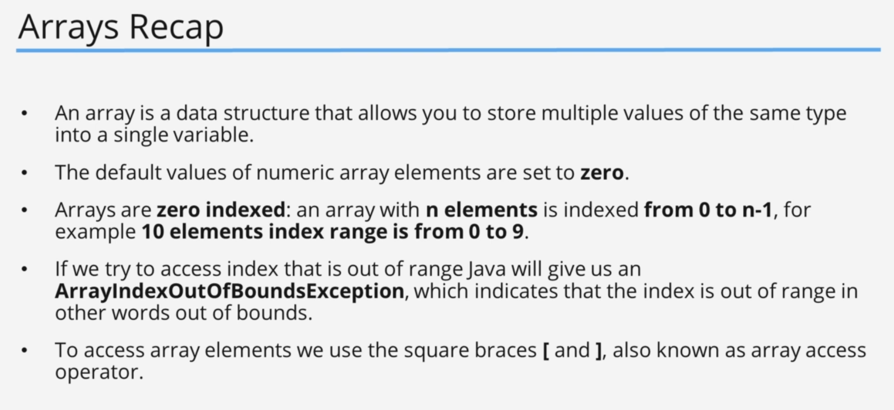
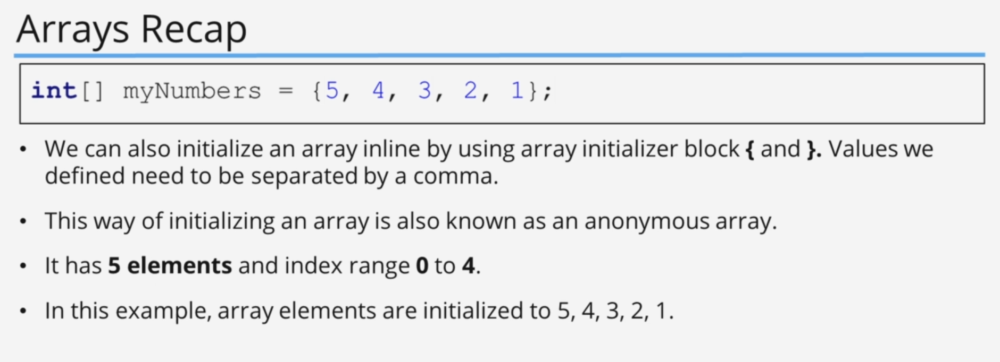

# Arrays, Java inbuilt Lists, Autoboxing and Unboxing

## 1. Arrays

### Code Example

#### code

```java
public class Main {
    public static void main(String[] args) {
        System.out.println("Hello world!");

        int[] myVariable;
        myVariable = new int[5];
        myVariable[2] = 12;

        double[] myDoubleArray = new double[3];

        int[] myIntArray = {1, 2, 3, 5};

        System.out.println(myIntArray[0]);
        System.out.println(myIntArray[1]);
        System.out.println(myIntArray[2]);
        System.out.println(myIntArray[3]);

        int[] myIntArray2 = new int[10];

        for (int i = 0; i < myIntArray2.length; i++) {
            myIntArray2[i] = i * 10;
        }

        printArray(myIntArray2);

    }

    public static void printArray(int[] array) {
        for (int i = 0; i < array.length; i++) {
            System.out.println("Iteration " + i + ", value " + array[i]);
        }
    }
}

```

#### output

```shell
1
2
3
5
Iteration 0, value 0
Iteration 1, value 10
Iteration 2, value 20
Iteration 3, value 30
Iteration 4, value 40
Iteration 5, value 50
Iteration 6, value 60
Iteration 7, value 70
Iteration 8, value 80
Iteration 9, value 90
```

### Code Example

#### code

```java

import java.util.Scanner;

public class Main {
    private static Scanner scanner = new Scanner(System.in);

    public static void main(String[] args) {
        int[] myIntValues = getIntegerValues(5);
        printArray(myIntValues);
        System.out.println("average is " + getAverage(myIntValues));

    }

    private static int[] getIntegerValues(int i) {
        int[] value = new int[i];
        System.out.println("please enter " + i + " values\r");
        for (int j = 0; j < i; j++) {
            value[j] = scanner.nextInt();
        }
        return value;
    }

    public static void printArray(int[] array) {
        for (int i = 0; i < array.length; i++) {
            System.out.println("Iteration " + i + ", value " + array[i]);
        }
    }

    public static double getAverage(int[] numbers) {
        int sum = 0;
        for (int i = 0; i < numbers.length; i++) {
            sum += numbers[i];
        }
        return (double) sum / (double) numbers.length;
    }
}

```

#### output

```shell
please enter 5 values
12
12
12
12
12
Iteration 0, value 12
Iteration 1, value 12
Iteration 2, value 12
Iteration 3, value 12
Iteration 4, value 12
average is 12.0

```

## 2. Arrays (Challenge Exercise)

### Challenge

My Answer

#### Question


#### Answer

##### Code

```java
import java.util.Scanner;

public class Main {
    private static Scanner scanner = new Scanner(System.in);

    public static void main(String[] args) {

        System.out.println("please enter values to sort\r");
        printArray(sortArray(getArrayFromUser(4)));
    }

    public static int[] getArrayFromUser(int value) {
        int[] array = new int[value];
        for (int i = 0; i < value; i++) {
            array[i] = scanner.nextInt();
        }
        return array;
    }

    public static int[] sortArray(int[] array) {

        for (int i = 0; i < array.length; i++) {
            int max = array[i];
            for (int j = i + 1; j < array.length; j++) {
                if (max < array[j]) {
                    int temp = array[j];
                    array[j] = max;
                    array[i] = temp;
                }
            }
        }
        return array;
    }

    public static void printArray(int[] array) {
        for (int i = 0; i < array.length; i++) {
            System.out.println("Element index " + i + ", value = " + array[i]);
        }
    }
}
```

###### output

```shell
34
2
5
1
Element index 0, value = 34
Element index 1, value = 5
Element index 2, value = 2
Element index 3, value = 1
```

---

### Challenge

second answer

#### Answer

##### Code

```java
import java.util.Scanner;

public class Main {
    private static Scanner scanner = new Scanner(System.in);

    public static void main(String[] args) {


        printArray(sortArray(getArrayFromUser(4)));
    }

    public static int[] getArrayFromUser(int value) {
        System.out.println("please enter values to sort\r");
        int[] array = new int[value];
        for (int i = 0; i < array.length; i++) {
            array[i] = scanner.nextInt();
        }
        return array;
    }

    public static int[] sortArray(int[] array) {
        int[] sortedArray = new int[array.length];
        for (int i = 0; i < array.length; i++) {
            sortedArray[i] = array[i];
        }
        boolean flag = true;
        int temp;
        while (flag) {
            flag = false;
            for (int i = 0; i < sortedArray.length - 1; i++) {
                if (sortedArray[i] < sortedArray[i + 1]) {
                    temp = sortedArray[i];
                    sortedArray[i] = sortedArray[i + 1];
                    sortedArray[i + 1] = temp;
                    flag = true;
                }
            }
        }
        return sortedArray;
    }

    public static void printArray(int[] array) {
        for (int i = 0; i < array.length; i++) {
            System.out.println("Element index " + i + ", value = " + array[i]);
        }
    }
}
```

###### output

```shell
please enter values to sort
33
4
167
1
Element index 0, value = 167
Element index 1, value = 33
Element index 2, value = 4
Element index 3, value = 1
```

## 4. Arrays Recap






## 5. References Types vs Value Types

### Code Example

#### code

```java
import java.lang.reflect.Array;
import java.util.Arrays;

public class Main {
    public static void main(String[] args) {
        System.out.println("------------------- value types---------------------------");
        int myInt = 12;
        int anotherInt = myInt;

        System.out.println("my int value : " + myInt);
        System.out.println("another int value : " + anotherInt);

        anotherInt = 1;

        System.out.println("my int value : " + myInt);
        System.out.println("another int value : " + anotherInt);

        System.out.println("------------------- reference types---------------------------");

        int[] myIntArray = new int[5];
        int[] anotherArray = myIntArray;

        System.out.println("myIntArray -> " + Arrays.toString(myIntArray));
        System.out.println("anotherArray -> " + Arrays.toString(anotherArray));

        System.out.println("-------------------after change reference types---------------------------");
        modifyArray(anotherArray);
        System.out.println("myIntArray -> " + Arrays.toString(myIntArray));
        System.out.println("anotherArray -> " + Arrays.toString(anotherArray));

        System.out.println("-------------------after de referencing reference types---------------------------");

        anotherArray = new int[]{23,1};
        System.out.println("myIntArray -> " + Arrays.toString(myIntArray));
        System.out.println("anotherArray -> " + Arrays.toString(anotherArray));
    }

    public static void modifyArray(int[] array) {
        array[0] = 10;

        array = new int[]{1,1,1,1,1,1,1,1,1};
    }
}

```

#### output

```shell
my int value : 12
another int value : 12
my int value : 12
another int value : 1
------------------- reference types---------------------------
myIntArray -> [0, 0, 0, 0, 0]
anotherArray -> [0, 0, 0, 0, 0]
-------------------after change reference types---------------------------
myIntArray -> [10, 0, 0, 0, 0]
anotherArray -> [10, 0, 0, 0, 0]
-------------------after de referencing reference types---------------------------
myIntArray -> [10, 0, 0, 0, 0]
anotherArray -> [23, 1]
```


## 6. Minimum Element Challenge

### Challenge

#### Question


#### Answer

##### Code

```java
import java.util.Scanner;

public class Main {
    private static Scanner scanner = new Scanner(System.in);

    public static void main(String[] args) {
        System.out.println("enter a count: ");
        int count = scanner.nextInt();
        scanner.nextLine();

        int[] arrayToFindTheMin = readIntegers(count);

        System.out.println("minimum value : " + findMin(arrayToFindTheMin));

    }

    public static int[] readIntegers(int count) {
        int[] array = new int[count];
        System.out.println("Enter " + count + " numbers\r");
        for (int i = 0; i < array.length; i++) {
            System.out.println("Enter numbers " + (i + 1) + "\r");
            int number = scanner.nextInt();
            scanner.nextLine();
            array[i] = number;
        }
        return array;
    }

    public static int findMin(int[] array) {
        int min = array[0];
        for (int i = 1; i < array.length; i++) {
            if (min > array[i]) {
                min = array[i];
            }
        }
        return min;
    }
}
```

###### output

```shell
enter a count: 
5
Enter 5 numbers
Enter numbers 1
2
Enter numbers 2
543
Enter numbers 3
8
Enter numbers 4
1
Enter numbers 5
55
minimum value : 1
```

## 7. Reverse Array Challenge

## 8. List and ArrayList Part 1

how to resize and Array.

### Code Example

#### code

```java
import java.util.Arrays;
import java.util.Scanner;

public class Main {
    private static Scanner scanner = new Scanner(System.in);
    private static int[] baseDate = new int[10];

    public static void main(String[] args) {
        System.out.println("Enter 10 digits : \r");
        getInput();
        System.out.println(Arrays.toString(baseDate));
        resizeTheArray();
        baseDate[10] = 12;
        baseDate[11] = 23;
        System.out.println(Arrays.toString(baseDate));
    }

    public static void getInput() {
        for (int i = 0; i < baseDate.length; i++) {
            baseDate[i] = scanner.nextInt();
            scanner.nextLine();
        }
    }

    public static void resizeTheArray(){
        int[] oldArray = baseDate;

        baseDate = new int[12];

        for (int i = 0; i < oldArray.length; i++) {
            baseDate[i] = oldArray[i];
        }
    }
}

```

#### output

```shell
Enter 10 digits : 
234
234
1234
234
123
123
123
123
12
3123
[234, 234, 1234, 234, 123, 123, 123, 123, 12, 3123]
[234, 234, 1234, 234, 123, 123, 123, 123, 12, 3123, 12, 23]
```

this can become not so easy as our code becomes more expansive.

so the array list is a resizable array.

### Code Example

#### code

```java
import java.util.ArrayList;

public class GroceryList {
    private final ArrayList<String> groceryList = new ArrayList<String>();

    public void addGroceryItem(String item) {
        groceryList.add(item);
    }

    public void printGroceryList() {
        System.out.println("You have " + groceryList.size() + " items in your grocery list");
        for (int i = 0; i < groceryList.size(); i++) {
            System.out.println((i + 1) + ". " + groceryList.get(i));
        }
    }

    public void updateGroceryList(int index, String item) {
        groceryList.set(index, item);
        System.out.println("Grocery list item " + index + "has been updated");
    }

    public void removeItemFromGroceryList(int index) {
        String item = groceryList.get(index);
        groceryList.remove(index);
        System.out.println(item + " has been removed from the grocery list");
    }
}
import java.util.ArrayList;

public class GroceryList {
    private final ArrayList<String> groceryList = new ArrayList<String>();

    public void addGroceryItem(String item) {
        groceryList.add(item);
    }

    public void printGroceryList() {
        System.out.println("You have " + groceryList.size() + " items in your grocery list");
        for (int i = 0; i < groceryList.size(); i++) {
            System.out.println((i + 1) + ". " + groceryList.get(i));
        }
    }

    public void updateGroceryList(int index, String item) {
        groceryList.set(index, item);
        System.out.println("Grocery list item " + index + "has been updated");
    }

    public void removeItemFromGroceryList(int index) {
        String item = groceryList.get(index);
        groceryList.remove(index);
        System.out.println(item + " has been removed from the grocery list");
    }
}


```

## 9. ArrayList Part 2

### Code Example

#### code

```java

import java.util.Scanner;

public class Main {
    private static final Scanner scanner = new Scanner(System.in);
    private static final GroceryList groceryList = new GroceryList();

    public static void main(String[] args) {
        boolean quit = false;
        int choice = 0;
        printInstruction();
        while (!quit) {
            System.out.println("Enter your choice: ");
            choice = scanner.nextInt();
            scanner.nextLine();

            switch (choice) {
                case 0 -> printInstruction();
                case 1 -> groceryList.printGroceryList();
                case 2 -> addItem();
                case 3 -> modifyItem();
                case 4 -> removeItem();
                case 5 -> searchForItem();
                case 6 -> quit = true;
            }
        }

    }

    public static void printInstruction() {
        System.out.println("\nPress ");
        System.out.println("\t 0 - To Print choice options.");
        System.out.println("\t 1 - To Print list of grocery items.");
        System.out.println("\t 2 - To add an item to the list.");
        System.out.println("\t 3 - To modify an item in the list.");
        System.out.println("\t 4 - To remove an item from the list.");
        System.out.println("\t 5 - To search an item from the list.");
        System.out.println("\t 6 - To exit from the list.");
    }

    public static void addItem() {
        System.out.println("Please enter the grocery item: ");
        groceryList.addGroceryItem(scanner.nextLine());
    }

    public static void modifyItem() {
        System.out.println("enter a grocery item number: ");
        int itemNumber = scanner.nextInt();
        scanner.nextLine();
        System.out.println("Enter replacement item: ");
        String newItem = scanner.nextLine();
        groceryList.updateGroceryList(itemNumber - 1, newItem);
    }

    public static void removeItem() {
        System.out.println("enter a grocery item number: ");
        int itemNumber = scanner.nextInt();
        groceryList.removeItemFromGroceryList(itemNumber - 1);
        scanner.nextLine();
    }

    public static void searchForItem() {
        System.out.println("Item to search for: ");
        String itemToSearchFor = scanner.nextLine();
        if (groceryList.findItem(itemToSearchFor) != null) {
            System.out.println("Found " + groceryList.findItem(itemToSearchFor) + " in our grocery list");
        } else {
            System.out.println(itemToSearchFor + " is not in the shopping list");
        }
    }

}
```

#### output

```shell
Press 
  0 - To Print choice options.
  1 - To Print list of grocery items.
  2 - To add an item to the list.
  3 - To modify an item in the list.
  4 - To remove an item from the list.
  5 - To search an item from the list.
  6 - To exit from the list.
Enter your choice: 
2
Please enter the grocery item: 
bread
Enter your choice: 
2
Please enter the grocery item: 
milk
Enter your choice: 
1
You have 2 items in your grocery list
1. bread
2. milk
Enter your choice: 
3
enter a grocery item number: 
1
Enter replacement item: 
amond milk
Grocery list item 01 has been updated
Enter your choice: 
1
You have 2 items in your grocery list
1. amond milk
2. milk
Enter your choice: 
4
enter a grocery item number: 
1
amond milk has been removed from the grocery list
Enter your choice: 
2
Please enter the grocery item: 
milk
Enter your choice: 
1
You have 2 items in your grocery list
1. milk
2. milk
Enter your choice: 
4
enter a grocery item number: 
1
milk has been removed from the grocery list
Enter your choice: 
1
You have 1 items in your grocery list
1. milk
Enter your choice: 
2
Please enter the grocery item: 
cheese
Enter your choice: 
1
You have 2 items in your grocery list
1. milk
2. cheese
Enter your choice: 
5
Item to search for: 
milk
Found milk in our grocery list
Enter your choice: 
6

Process finished with exit code 0
```

## 10. ArrayList Part 3

### Code Example

#### code

```java
import java.util.ArrayList;

public class GroceryList {
    private final ArrayList<String> groceryList = new ArrayList<String>();

    public ArrayList<String> getGroceryList() {
        return groceryList;
    }

    public void addGroceryItem(String item) {
        groceryList.add(item);
    }

    public void printGroceryList() {
        System.out.println("You have " + groceryList.size() + " items in your grocery list");
        for (int i = 0; i < groceryList.size(); i++) {
            System.out.println((i + 1) + ". " + groceryList.get(i));
        }
    }

    public void updateGroceryList(String currentItem, String newItem) {
        int index = findItem(currentItem);
        if (index >= 0) {
            updateGroceryList(index, newItem);
        }
    }

    private void updateGroceryList(int index, String item) {
        groceryList.set(index, item);
        System.out.println("Grocery list item " + index + 1 + " has been updated");
    }

    public void removeItemFromGroceryList(String item) {
        int index = findItem(item);
        if (index >= 0) {
            groceryList.remove(index);
        }
        System.out.println(item + " has been removed from the grocery list");
    }

    private int findItem(String item) {
//        boolean exists = groceryList.contains(item);
        return groceryList.indexOf(item);

    }

    public boolean onFile(String item) {
        int index = findItem(item);
        return index >= 0;
    }
}


-----------------------------------------------------------------------------

import java.util.ArrayList;
import java.util.Scanner;

public class Main {
    private static final Scanner scanner = new Scanner(System.in);
    private static final GroceryList groceryList = new GroceryList();

    public static void main(String[] args) {
        boolean quit = false;
        int choice = 0;
        printInstruction();
        while (!quit) {
            System.out.println("Enter your choice: ");
            choice = scanner.nextInt();
            scanner.nextLine();

            switch (choice) {
                case 0 -> printInstruction();
                case 1 -> groceryList.printGroceryList();
                case 2 -> addItem();
                case 3 -> modifyItem();
                case 4 -> removeItem();
                case 5 -> searchForItem();
                case 6 -> processGroceryList();
                case 7 -> quit = true;
            }
        }

    }

    public static void printInstruction() {
        System.out.println("\nPress ");
        System.out.println("\t 0 - To Print choice options.");
        System.out.println("\t 1 - To Print list of grocery items.");
        System.out.println("\t 2 - To add an item to the list.");
        System.out.println("\t 3 - To modify an item in the list.");
        System.out.println("\t 4 - To remove an item from the list.");
        System.out.println("\t 5 - To search an item from the list.");
        System.out.println("\t 6 - To process the list.");
        System.out.println("\t 7 - To exit from the list.");
    }

    public static void addItem() {
        System.out.println("Please enter the grocery item to add: ");
        groceryList.addGroceryItem(scanner.nextLine());
    }

    public static void modifyItem() {
        System.out.println("enter a grocery item to modify: ");
        String itemToModify = scanner.nextLine();
        System.out.println("Enter replacement item: ");
        String newItem = scanner.nextLine();
        groceryList.updateGroceryList(itemToModify, newItem);
    }

    public static void removeItem() {
        System.out.println("enter a grocery item to remove: ");
        String itemToRemove = scanner.nextLine();
        groceryList.removeItemFromGroceryList(itemToRemove);
    }

    public static void searchForItem() {
        System.out.println("Item to search for: ");
        String itemToSearchFor = scanner.nextLine();
        if (groceryList.onFile(itemToSearchFor)) {
            System.out.println("Found " + itemToSearchFor + " in our grocery list");
        } else {
            System.out.println(itemToSearchFor + " is not in the shopping list");
        }
    }

    public static void processGroceryList() {
        ArrayList<String> newArrayList = new ArrayList<>();
        newArrayList.addAll(groceryList.getGroceryList());
        ArrayList<String> nextArrayList = new ArrayList<>(groceryList.getGroceryList());

        String[] newArray = new String[groceryList.getGroceryList().size()];

        newArray = groceryList.getGroceryList().toArray(newArray);
    }

}

```

#### output

```shell
Press 
  0 - To Print choice options.
  1 - To Print list of grocery items.
  2 - To add an item to the list.
  3 - To modify an item in the list.
  4 - To remove an item from the list.
  5 - To search an item from the list.
  6 - To process the list.
  7 - To exit from the list.
Enter your choice: 
1
You have 0 items in your grocery list
Enter your choice: 
2
Please enter the grocery item to add: 
milk
Enter your choice: 
2
Please enter the grocery item to add: 
bread
Enter your choice: 
3
enter a grocery item to modify: 
milk
Enter replacement item: 
amond milk
Grocery list item 01 has been updated
Enter your choice: 
1
You have 2 items in your grocery list
1. amond milk
2. bread
Enter your choice: 
0

Press 
  0 - To Print choice options.
  1 - To Print list of grocery items.
  2 - To add an item to the list.
  3 - To modify an item in the list.
  4 - To remove an item from the list.
  5 - To search an item from the list.
  6 - To process the list.
  7 - To exit from the list.
Enter your choice: 
5
Item to search for: 
milk
milk is not in the shopping list
Enter your choice: 
5
Item to search for: 
bread
Found bread in our grocery list
Enter your choice: 
4
enter a grocery item to remove: 
bread
bread has been removed from the grocery list
Enter your choice: 
1
You have 1 items in your grocery list
1. amond milk
Enter your choice: 
7

Process finished with exit code 0

```

## 11. ArrayList Challenge Part 1

### Challenge

#### Question


#### Answer

##### Code

```java
public class Contact {
    private final String name;
    private final String PhoneNumber;

    public Contact(String name, String phoneNumber) {
        this.name = name;
        PhoneNumber = phoneNumber;
    }

    public static Contact createContact(String name, String phoneNumber) {
        return new Contact(name, phoneNumber);
    }

    public String getName() {
        return name;
    }

    public String getPhoneNumber() {
        return PhoneNumber;
    }
}


import java.util.ArrayList;

public class MobilePhone {
    private String mobilePhone;
    private ArrayList<Contact> myContacts;

    public MobilePhone(String mobilePhone) {
        this.mobilePhone = mobilePhone;
        this.myContacts = new ArrayList<Contact>();
    }

    public boolean addContact(Contact contact) {
        if (findContact(contact) >= 0) {
            System.out.println("contact already in the contact list");
            return false;
        }
        myContacts.add(contact);
        return true;
    }

    public boolean updateContact(Contact oldContact, Contact newContact) {
        int position = findContact(oldContact);
        if (position < 0) {
            System.out.println("this contact was not found");
            return false;
        }
        myContacts.set(position, newContact);
        System.out.println(oldContact.getName() + " is updated to " + newContact.getName());
        return true;
    }

    private int findContact(Contact contact) {
        return myContacts.indexOf(contact);
    }

    private int findContact(String contactName) {
        for (int i = 0; i < myContacts.size(); i++) {
            Contact contact = myContacts.get(i);
            if (contact.getName().equals(contactName)) {
                return i;
            }
        }
        return -1;
    }
}

```

## 12. ArrayList Challenge Part 2

```java
import java.util.ArrayList;

public class MobilePhone {
    private String mobileNumber;
    private ArrayList<Contact> myContacts;

    public MobilePhone(String mobilePhone) {
        this.mobileNumber = mobilePhone;
        this.myContacts = new ArrayList<Contact>();
    }

    public void printContactList() {
        System.out.println("your contact list has " + myContacts.size() + " items");
        for (Contact contact : myContacts) {
            System.out.println(contact.getName() + " : " + contact.getPhoneNumber());
        }
    }

    public boolean addContact(Contact contact) {
        if (findContact(contact) >= 0) {
            System.out.println("contact already in the contact list");
            return false;
        }
        myContacts.add(contact);
        return true;
    }

    public boolean updateContact(Contact oldContact, Contact newContact) {
        int position = findContact(oldContact);
        if (position < 0) {
            System.out.println("this contact was not found");
            return false;
        }
        myContacts.set(position, newContact);
        System.out.println(oldContact.getName() + " is updated to " + newContact.getName());
        return true;
    }

    public boolean removeContact(Contact contact) {
        int position = findContact(contact);
        if (position < 0) {
            System.out.println("this contact was not found");
            return false;
        }
        myContacts.remove(contact);
        System.out.println("this " + contact.getName() + " is deleted");
        return true;
    }

    private int findContact(Contact contact) {
        return myContacts.indexOf(contact);
    }

    private int findContact(String contactName) {
        for (int i = 0; i < myContacts.size(); i++) {
            Contact contact = myContacts.get(i);
            if (contact.getName().equals(contactName)) {
                return i;
            }
        }
        return -1;
    }

    public String queryContact(Contact contact) {
        if (findContact(contact) >= 0) {
            return contact.getName();
        }
        return null;
    }
}
```

adding main methods

```java
import java.util.Scanner;

public class Main {
    private static final Scanner scanner = new Scanner(System.in);
    private static final MobilePhone myPhone = new MobilePhone("+940702542");

    public static void main(String[] args) {
        boolean quit = false;
        int choise;
        printOptions();
        while (!quit) {
            System.out.println("please enter a option !");
            choise = scanner.nextInt();
            scanner.nextLine();
            switch (choise) {
                case 0 -> printOptions();
                case 1 -> printContactList();
                case 2 -> addContact();
                case 3 -> updateContact();
                case 4 -> removeContact();
                case 5 -> findContact();
                case 6 -> quit = true;
            }
        }

    }

    public static void printContactList() {
        myPhone.printContactList();
    }

    public static void printOptions() {
        System.out.println("\nPress ");
        System.out.println("\t 0 - To Print choice options.");
        System.out.println("\t 1 - To Print list of contacts.");
        System.out.println("\t 2 - To add a contact.");
        System.out.println("\t 3 - To modify a contact.");
        System.out.println("\t 4 - To remove a contact.");
        System.out.println("\t 5 - To search a contact.");
        System.out.println("\t 6 - To exit from the list.");
    }

    public static void addContact() {
        System.out.println("please enter the contact name : ");
        String contactName = scanner.nextLine();
        System.out.println("Please enter the number");
        String contactNumber = scanner.nextLine();
        Contact contact = Contact.createContact(contactName, contactNumber);
        if (myPhone.addContact(contact)) {
            System.out.println("Contact added successfully");
        } else {
            System.out.println("This contact exists already");
        }

    }
}
```

adding add contact list.

## 13. ArrayList Challenge Part 3

contact

```java
public class Contact {
    private final String name;
    private final String PhoneNumber;

    public Contact(String name, String phoneNumber) {
        this.name = name;
        PhoneNumber = phoneNumber;
    }

    public static Contact createContact(String name, String phoneNumber) {
        return new Contact(name, phoneNumber);
    }

    public String getName() {
        return name;
    }

    public String getPhoneNumber() {
        return PhoneNumber;
    }
}

```

MobilePhone

```java
import java.util.ArrayList;

public class MobilePhone {
    private String mobileNumber;
    private ArrayList<Contact> myContacts;

    public MobilePhone(String mobilePhone) {
        this.mobileNumber = mobilePhone;
        this.myContacts = new ArrayList<Contact>();
    }

    public void printContactList() {
        System.out.println("your contact list has " + myContacts.size() + " items");
        int index = 1;
        for (Contact contact : myContacts) {
            System.out.println(index + "." + contact.getName() + " -> " + contact.getPhoneNumber());
            index++;
        }
    }

    public boolean addContact(Contact contact) {
        if (findContact(contact) >= 0) {
            System.out.println("contact already in the contact list");
            return false;
        }
        myContacts.add(contact);
        return true;
    }

    public boolean updateContact(Contact oldContact, Contact newContact) {
        int position = findContact(oldContact);
        if (position < 0) {
            System.out.println("this contact was not found");
            return false;
        }
        myContacts.set(position, newContact);
        System.out.println(oldContact.getName() + " is updated to " + newContact.getName());
        return true;
    }

    public boolean removeContact(Contact contact) {
        int position = findContact(contact);
        if (position < 0) {
            System.out.println("this contact was not found");
            return false;
        }
        myContacts.remove(contact);
        System.out.println("this " + contact.getName() + " is deleted");
        return true;
    }

    private int findContact(Contact contact) {
        return myContacts.indexOf(contact);
    }

    private int findContact(String contactName) {
        for (int i = 0; i < myContacts.size(); i++) {
            Contact contact = myContacts.get(i);
            if (contact.getName().equals(contactName)) {
                return i;
            }
        }
        return -1;
    }

    public String queryContact(Contact contact) {
        if (findContact(contact) >= 0) {
            return contact.getName();
        }
        return null;
    }

    public Contact queryContact(String name) {
        int position = findContact(name);
        if (position >= 0) {
            return myContacts.get(position);
        }
        return null;
    }
}

```

Main

```java
import java.util.Scanner;

public class Main {
    private static final Scanner scanner = new Scanner(System.in);
    private static final MobilePhone myPhone = new MobilePhone("+940702542");

    public static void main(String[] args) {
        boolean quit = false;
        int choice;
        printOptions();
        while (!quit) {
            System.out.println("please enter a option !");
            choice = scanner.nextInt();
            scanner.nextLine();
            switch (choice) {
                case 0 -> printOptions();
                case 1 -> printContactList();
                case 2 -> addContact();
                case 3 -> updateMobileContact();
                case 4 -> removeContact();
                case 5 -> findContact();
                case 6 -> quit = true;
            }
        }

    }

    public static void printContactList() {
        myPhone.printContactList();
    }

    public static void printOptions() {
        System.out.println("\nPress ");
        System.out.println("\t 0 - To Print choice options.");
        System.out.println("\t 1 - To Print list of contacts.");
        System.out.println("\t 2 - To add a contact.");
        System.out.println("\t 3 - To modify a contact.");
        System.out.println("\t 4 - To remove a contact.");
        System.out.println("\t 5 - To search a contact.");
        System.out.println("\t 6 - To exit from the list.");
    }

    public static void addContact() {
        System.out.println("please enter the contact name : ");
        String contactName = scanner.nextLine();
        System.out.println("Please enter the number");
        String contactNumber = scanner.nextLine();
        Contact contact = Contact.createContact(contactName, contactNumber);
        if (myPhone.addContact(contact)) {
            System.out.println("Contact added successfully");
        } else {
            System.out.println("This contact exists already");
        }

    }


    public static void updateMobileContact() {
        System.out.println("please enter the contact name you want to update ");
        String contactName = scanner.nextLine();
        Contact existingContactRecord = myPhone.queryContact(contactName);
        if (existingContactRecord == null) {
            System.out.println("This contact doesn't exists");
            return;
        }
        System.out.println("enter the new contact name");
        String newContactName = scanner.nextLine();
        System.out.println("enter the new contact number");
        String newContactNumber = scanner.nextLine();
        Contact newContact = Contact.createContact(newContactName, newContactNumber);
        if (myPhone.updateContact(existingContactRecord, newContact)) {
            System.out.println("Successfully updated contact");
        } else {
            System.out.println("Error updating the contact");
        }


    }

    public static void removeContact() {
        System.out.println("please enter the contact name you want to remove ");
        String contactName = scanner.nextLine();
        Contact existingContactRecord = myPhone.queryContact(contactName);
        if (existingContactRecord == null) {
            System.out.println("This contact doesn't exists");
            return;
        }
        if (myPhone.removeContact(existingContactRecord)) {
            System.out.println("Successfully deleted");
        } else {
            System.out.println("Error deleting contact");
        }
    }

    public static void findContact() {
        System.out.println("enter the contact name to find");
        String contactName = scanner.nextLine();
        Contact existingContactRecord = myPhone.queryContact(contactName);
        if (existingContactRecord == null) {
            System.out.println("This contact doesn't exists");
            return;
        }
        System.out.println("contact name : " + existingContactRecord.getName());
        System.out.println("contact number : " + existingContactRecord.getPhoneNumber());
    }
}
```

## 14. Bug Fix for ArrayList Challenge

## 15. Autoboxing and Unboxing

## 16. Autoboxing & Unboxing (Challenge Exercise) - Part 1

## 17. Autoboxing & Unboxing (Challenge Exercise) - Part 2

## 18. Autoboxing & Unboxing (Challenge Exercise) - Part 3

## 19. LinkedList Part 1

## 20. LinkedList Part 2

## 21. LinkedList Part 3

## 22. LinkedList Challenge Part 1

## 23. Bug Fix for Track 1 Error

## 24. LinkedList Challenge Part 2

## 25. LinkedList Challenge Part 3 (Final video)
