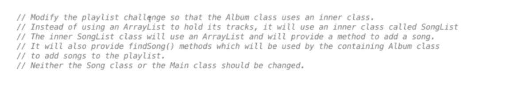
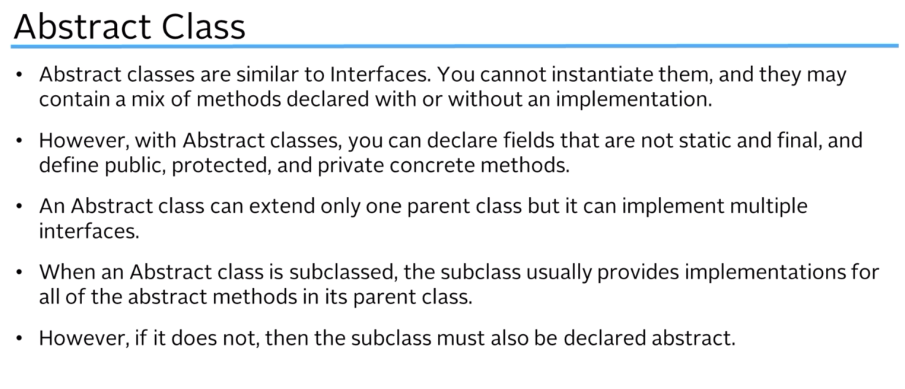
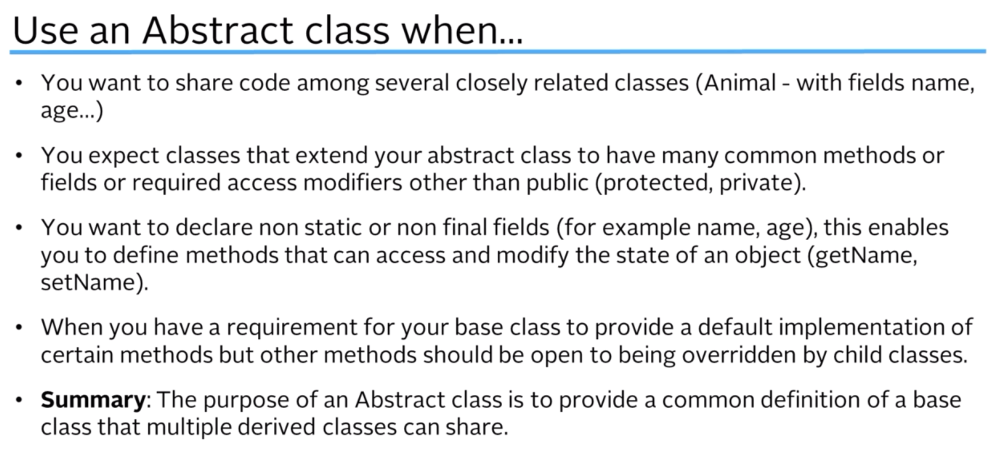
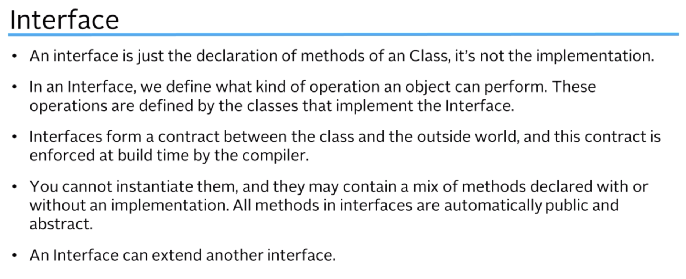
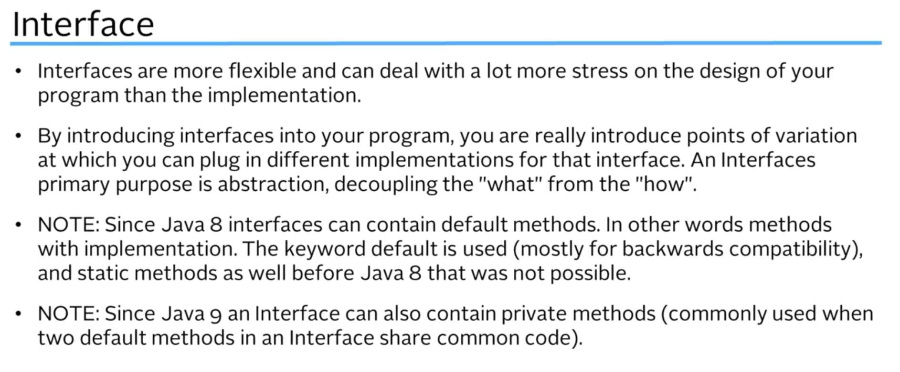
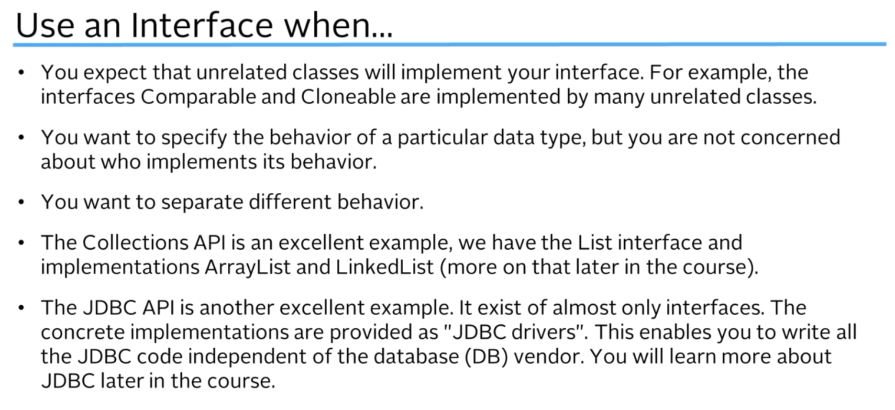

# [🏠 HOME PAGE](../../README.md)

## Inner and Abstract Classes & Interfaces

### 1. Interfaces

```java
public interface ITelephone {
    //    these are called signatures
    public void powerOn();

    public void dail(int phoneNumber);

    public void answer();

    public boolean callPhone(int phoneNumber);

    public boolean isRinging();
}

public class DeskPhone implements ITelephone {
    private final int myNumber;
    private boolean isRinging;

    public DeskPhone(int myNumber) {
        this.myNumber = myNumber;
    }

    @Override
    public void powerOn() {
        System.out.println("no action taken. desk phone don't have a power button");
    }

    @Override
    public void dail(int phoneNumber) {
        System.out.println("no ringing " + phoneNumber + " on the desk phone");
    }

    @Override
    public void answer() {
        if (isRinging) {
            System.out.println("answering the desk phone");
            this.isRinging = false;
        }
    }

    @Override
    public boolean callPhone(int phoneNumber) {
        if (phoneNumber == this.myNumber) {
            this.isRinging = true;
            System.out.println("Ring Ring");
        } else {
            this.isRinging = false;
        }
        return this.isRinging;
    }

    @Override
    public boolean isRinging() {
        return this.isRinging;
    }
}


public class Main {
    public static void main(String[] args) {
        ITelephone deskPhone;
        deskPhone = new DeskPhone(121212);
        deskPhone.powerOn();
        deskPhone.dail(121212);
        deskPhone.isRinging();
        deskPhone.callPhone(121212);
        if (deskPhone.isRinging()) {
            System.out.println("your phone is ringing");
        }
        ;
    }
}
```

```bash
no action taken. desk phone don't have a power button
no ringing 121212 on the desk phone
Ring Ring
your phone is ringing
```

### 2. Interfaces Part 2

let's create a mobile phone class.

```java
public class MobilePhone implements ITelephone {
    private final int myNumber;
    private boolean isRinging;
    private boolean isOn = false;

    public MobilePhone(int myNumber) {
        this.myNumber = myNumber;
    }

    @Override
    public void powerOn() {
        isOn = true;
        System.out.println("mobile phone powered on");
    }

    @Override
    public void dail(int phoneNumber) {
        if (isOn) {
            System.out.println("no ringing " + phoneNumber + " on the mobile phone");
        } else {
            System.out.println("phone is switched off");
        }
    }

    @Override
    public void answer() {
        if (isRinging) {
            System.out.println("answering the mobile phone");
            this.isRinging = false;
        }
    }

    @Override
    public boolean callPhone(int phoneNumber) {
        if (phoneNumber == this.myNumber && isOn) {
            this.isRinging = true;
            System.out.println("Melody" +
                    " Ring");
        } else {
            this.isRinging = false;
            System.out.println("Mobile phone is not on");
        }
        return this.isRinging;
    }

    @Override
    public boolean isRinging() {
        return this.isRinging;
    }

}

```

and test the object.

```java
public class Main {
    public static void main(String[] args) {
        ITelephone deskPhone;
        deskPhone = new DeskPhone(121212);
        deskPhone.powerOn();
        deskPhone.dail(121212);
        deskPhone.isRinging();
        deskPhone.callPhone(121212);
        if (deskPhone.isRinging()) {
            System.out.println("your phone is ringing");
        }
        System.out.println("--------------------- mobile phone -------------------");
        ITelephone chamara = new MobilePhone(123);
        chamara.callPhone(123);
        chamara.answer();
    }
}

```

```bash
no action taken. desk phone don't have a power button
no ringing 121212 on the desk phone
Ring Ring
your phone is ringing
--------------------- mobile phone -------------------
Mobile phone is not on
```

let's revisit the linked list challenge.

### 3. Interfaces Challenge Part 1

```java
import java.util.List;

public interface ISavable {
    List<String> write();

    void read(List<String> list);
}
```

```java
import java.util.ArrayList;
import java.util.List;

public class Player implements ISavable {
    private String name;
    private int hitPoints;
    private int strength;
    private String weapon;

    public Player(String name, int hitPoints, int strength) {
        this.name = name;
        this.hitPoints = hitPoints;
        this.strength = strength;
        this.weapon = "sword";
    }

    public String getName() {
        return name;
    }

    public void setName(String name) {
        this.name = name;
    }

    public int getHitPoints() {
        return hitPoints;
    }

    public void setHitPoints(int hitPoints) {
        this.hitPoints = hitPoints;
    }

    public int getStrength() {
        return strength;
    }

    public void setStrength(int strength) {
        this.strength = strength;
    }

    public String getWeapon() {
        return weapon;
    }

    public void setWeapon(String weapon) {
        this.weapon = weapon;
    }

    @Override
    public String toString() {
        return "Player{" + "name='" + name + '\'' + ", hitPoints=" + hitPoints + ", strength=" + strength + ", weapon='" + weapon + '\'' + '}';
    }

    @Override
    public List<String> write() {
        List<String> values = new ArrayList<>();
        values.add(0, this.name);
        values.add(1, String.valueOf(this.hitPoints));
        values.add(2, String.valueOf(this.strength));
        values.add(3, this.weapon);
        return values;
    }

    @Override
    public void read(List<String> savedValues) {
        if (savedValues != null && savedValues.size() > 0) {
            this.name = savedValues.get(0);
            this.hitPoints = Integer.parseInt(savedValues.get(1));
            this.strength = Integer.parseInt(savedValues.get(2));
            this.weapon = savedValues.get(3);
        }
    }
}

```

```java
import java.util.ArrayList;
import java.util.List;
import java.util.Scanner;

public class Main {
    public static void main(String[] args) {
    Player tim = new Player("chamara",12,100);
        System.out.println(tim.toString());

        tim.setHitPoints(122);
        System.out.println(tim.toString());

        tim.setWeapon("Storm bringer");
        System.out.println(tim.toString());
        System.out.println("---------------------------------------------------------------");
        saveObject(tim);
        loadObject(tim);
        System.out.println(tim.toString());


    }

    public static ArrayList<String> readvalues(){
        Scanner scanner = new Scanner(System.in);
        ArrayList<String> values = new ArrayList<>();
        boolean quit = false;
        int choice;
        printInstruction();
        int index = 0;
        while (!quit){
            System.out.println("please enter choice");
            choice = scanner.nextInt();
            scanner.nextLine();
            switch (choice){
                case 0 ->{
                    quit = true;
                }
                case 1->{
                    System.out.println("please enter a name");
                    String value = scanner.nextLine();
                    values.add(index,value);
                    index++;
                }
            }
        }
        return values;
    }

    public static void printInstruction(){
        System.out.println("""
                press
                0 - to exit
                1 - to enter a value
                """);
    }

    public static void saveObject(ISavable objectToSave){
        for(String item:objectToSave.write()){
            System.out.println("saving "+item+" to the storage device");
        }
    }

    public static void loadObject(ISavable objectTLoad){
        ArrayList<String> values = readvalues();
        objectTLoad.read(values);
    }
}
```

### 4. Interfaces Challenge Part 2

```java
import java.util.ArrayList;
import java.util.List;

public class Monster implements ISavable {
    private String name;
    private int hitPoints;
    private int strength;

    public Monster(String name, int hitPoints, int strength) {
        this.name = name;
        this.hitPoints = hitPoints;
        this.strength = strength;
    }

    public String getName() {
        return name;
    }

    public int getHitPoints() {
        return hitPoints;
    }

    public int getStrength() {
        return strength;
    }

    @Override
    public String toString() {
        return "Monster{" +
                "name='" + name + '\'' +
                ", hitPoints=" + hitPoints +
                ", strength=" + strength +
                '}';
    }

    @Override
    public List<String> write() {
        List<String> values = new ArrayList<>();
        values.add(0, this.name);
        values.add(1, String.valueOf(this.strength));
        values.add(2, String.valueOf(this.hitPoints));
        return values;
    }

    @Override
    public void read(List<String> list) {
        if (list != null && list.size() > 0) {
            this.name = list.get(0);
            this.strength = Integer.parseInt(list.get(1));
            this.hitPoints = Integer.parseInt(list.get(2));
        }
    }
}


```

````java
import java.util.ArrayList;
import java.util.Scanner;

public class Main {
    public static void main(String[] args) {
        Player tim = new Player("chamara", 12, 100);
        System.out.println(tim);

        tim.setHitPoints(122);
        System.out.println(tim);

        tim.setWeapon("Storm bringer");
        System.out.println(tim);
        System.out.println("---------------------------------------------------------------");
        saveObject(tim);
        loadObject(tim);
        System.out.println(tim);

        System.out.println("----------- Monster section----------------------------");

        ISavable wearwolf = new Monster("wearwolf", 12, 12);
//         here we can cast the object to the Monster or use the monster instead;
        System.out.println(((Monster) wearwolf).getName());
        saveObject(wearwolf);

    }

    public static ArrayList<String> readvalues() {
        Scanner scanner = new Scanner(System.in);
        ArrayList<String> values = new ArrayList<>();
        boolean quit = false;
        int choice;
        printInstruction();
        int index = 0;
        while (!quit) {
            System.out.println("please enter choice");
            choice = scanner.nextInt();
            scanner.nextLine();
            switch (choice) {
                case 0 -> {
                    quit = true;
                }
                case 1 -> {
                    System.out.println("please enter a name");
                    String value = scanner.nextLine();
                    values.add(index, value);
                    index++;
                }
            }
        }
        return values;
    }

    public static void printInstruction() {
        System.out.println("""
                press
                0 - to exit
                1 - to enter a choice
                """);
    }

    public static void saveObject(ISavable objectToSave) {
        for (String item : objectToSave.write()) {
            System.out.println("saving " + item + " to the storage device");
        }
    }

    public static void loadObject(ISavable objectTLoad) {
        ArrayList<String> values = readvalues();
        objectTLoad.read(values);
    }
}

````

### 5. Inner classes Part 1

```java
import java.util.ArrayList;

public class GearBox {
    private ArrayList<Gear> gears;
    private int maxGears;
    private int currentGear;
    private boolean isClutchIn;

    public GearBox(int maxGears) {
        this.maxGears = maxGears;
        gears = new ArrayList<>();
        Gear neutral = new Gear(0, 0.0);
        this.gears.add(neutral);
    }

    public void setClutchIn(boolean in) {
        this.isClutchIn = in;
    }

    public void addGear(int gearNumber, double ratio) {
        if (gearNumber > 0 && gearNumber <= this.maxGears) {
            this.gears.add(new Gear(gearNumber, ratio));
        }
    }

    public void changeGear(int gear) {
        if (gear >= 0 && gear < this.gears.size() && this.isClutchIn) {
            this.currentGear = gear;
            System.out.println("Gear " + gear + " selected");
        } else {
            System.out.println("Grind");
            this.currentGear = 0;
        }
    }

    public double wheelSpeed(int revs) {
        if (isClutchIn) {
            System.out.println("Scream !");
            return 0.0;
        } else {
            return revs * gears.get(currentGear).ratio;
        }
    }

    private class Gear {
        private int gearNumber;
        private double ratio;

        public Gear(int gearNumber, double ratio) {
            this.gearNumber = gearNumber;
            this.ratio = ratio;
        }

        public double getRatio() {
            return ratio;
        }

        public double driveSpeed(int revs) {
            return revs * (this.ratio);
        }
    }
}
```

### 6. Inner Classes Part 2

GearBox

```java
import java.util.ArrayList;

public class GearBox {
    private ArrayList<Gear> gears;
    private int maxGears;
    private int currentGear;
    private boolean isClutchIn;

    public GearBox(int maxGears) {
        this.maxGears = maxGears;
        gears = new ArrayList<>();
        Gear neutral = new Gear(0, 0.0);
        this.gears.add(neutral);
        for (int i = 0; i < maxGears; i++) {
            addGear(i, i * 5.3);
        }
    }

    public void setClutchIn(boolean in) {
        this.isClutchIn = in;
    }

    private void addGear(int gearNumber, double ratio) {
        if (gearNumber > 0 && gearNumber <= this.maxGears) {
            this.gears.add(new Gear(gearNumber, ratio));
        }
    }

    public void changeGear(int gear) {
        if (gear >= 0 && gear < this.gears.size() && this.isClutchIn) {
            this.currentGear = gear;
            System.out.println("Gear " + gear + " selected");
        } else {
            System.out.println("Grind");
            this.currentGear = 0;
        }
    }

    public double wheelSpeed(int revs) {
        if (isClutchIn) {
            System.out.println("Scream !");
            return 0.0;
        } else {
            return revs * gears.get(currentGear).ratio;
        }
    }

    private class Gear {
        private int gearNumber;
        private double ratio;

        public Gear(int gearNumber, double ratio) {
            this.gearNumber = gearNumber;
            this.ratio = ratio;
        }

        public double getRatio() {
            return ratio;
        }

        public double driveSpeed(int revs) {
            return revs * (this.ratio);
        }
    }
}

```

Main

```java
public class Main {
    public static void main(String[] args) {
        GearBox maclaren = new GearBox(6);

        maclaren.setClutchIn(true);
        maclaren.changeGear(1);
        maclaren.setClutchIn(false);
        System.out.println("Wheel Speed: " + maclaren.wheelSpeed(3000));
        maclaren.changeGear(2);
        System.out.println("Wheel Speed: " + maclaren.wheelSpeed(6000));
        maclaren.setClutchIn(true);
        maclaren.changeGear(3);
        maclaren.setClutchIn(false);
        System.out.println("Wheel Speed: " + maclaren.wheelSpeed(9000));

//        as we can see we are now not using the Gear Class


    }
}
```

output  

```bash
Gear 1 selected
Wheel Speed: 15900.0
Grind
Wheel Speed: 0.0
Gear 3 selected
Wheel Speed: 143100.0
```

second example with inner class

Button

```java
public class Button {
    private String name;
    private onClickListener onClickListener;

    public Button(String name) {
        this.name = name;
    }

    public String getName() {
        return name;
    }

    public void setOnClickListener(onClickListener onClickListener) {
        this.onClickListener = onClickListener;
    }

    public void onClick() {
        this.onClickListener.onClick(this.name);
    }

    public interface onClickListener {
        void onClick(String name);
    }
}

```

Main

```java
import java.util.Scanner;

public class Main {
    private static final Scanner scanner = new Scanner(System.in);
    private static final Button buttonPrint = new Button("print");

    public static void main(String[] args) {

//        this class applicable for this block only
        class ClickListener implements Button.onClickListener {
            public ClickListener() {
                System.out.println("i have been attached");
            }

            @Override
            public void onClick(String name) {
                System.out.println(name + " was clicked");
            }
        }

        buttonPrint.setOnClickListener(new ClickListener());
        listen();
    }

    public static void listen() {
        boolean quit = false;
        while (!quit) {
            int option = scanner.nextInt();
            scanner.nextLine();
            switch (option) {
                case 0 -> quit = true;
                case 1 -> {
                    buttonPrint.onClick();
                }
            }
        }
    }
}
```

output

```bash
i have been attached
1
print was clicked
1
print was clicked
```

let's move onto `anonymous classes`.

- they have to declared and instantiated at the same time.

- it's used when there is a local class is required only once.

they are very common for attaching event handlers for user inputs.

ex android apps.

```java
import java.util.Scanner;

public class Main {
    private static final Scanner scanner = new Scanner(System.in);
    private static final Button buttonPrint = new Button("print");

    public static void main(String[] args) {
//        new Button.onClickListener() is the anonymous class

        buttonPrint.setOnClickListener(new Button.onClickListener() {
            @Override
            public void onClick(String name) {
                System.out.println(name + " is set");
            }
        });
        listen();
    }

    public static void listen() {
        boolean quit = false;
        while (!quit) {
            int option = scanner.nextInt();
            scanner.nextLine();
            switch (option) {
                case 0 -> quit = true;
                case 1 -> {
                    buttonPrint.onClick();
                }
            }
        }
    }
}
```

output

```bash
1
print is set
1
print is set
1
print is set
0

Process finished with exit code 0
```

### 7. Inner Classes Challenge



here we are updating the Playlist Array only by the inner class.

```java
import java.util.ArrayList;
import java.util.List;
import java.util.Objects;

public class Album {
    private final SongsList songs;


    public Album(String name, String artistName) {
        this.songs = new SongsList();
    }

    public boolean addNewSong(String songName, double duration) {
        return this.songs.addSong(new Song(songName, duration));
    }


    public boolean addToPlaylist(int trackNumber, List<Song> playList) {
        Song checkedSong = this.songs.findSong(trackNumber);

        if (checkedSong != null) {
            playList.add(checkedSong);
            return true;
        }
        System.out.println("This album does not have a track " + trackNumber);
        return false;
    }

    public boolean addToPlaylist(String trackName, List<Song> playList) {
        Song checkedSong = this.songs.findSong(trackName);
        if (checkedSong != null) {
            playList.add(checkedSong);
            return true;
        }
        System.out.println("This song " + trackName + "in  not in this album.");
        return false;
    }

    private class SongsList {
        private final ArrayList<Song> songs;

        public SongsList() {
            this.songs = new ArrayList<>();
        }

        public boolean addSong(Song song) {

            if (songs.contains(song)) {
                return false;
            }
            songs.add(song);
            return true;
        }


        public Song findSong(String songName) {
            for (Song item : songs) {
                if (Objects.equals(item.getName(), songName)) {
                    return item;
                }
            }
            return null;
        }

        public Song findSong(int trackNumber) {
            int index = trackNumber - 1;
            for (int i = 0; i < songs.size(); i++) {
                if (index >= 0 && index < songs.size()) {
                    return songs.get(index);
                }
            }
            return null;
        }
    }
}

```

### 8. Abstract Classes Part 1

we can make the interface more resuable by doing this.

```java
import java.util.List;

public interface ISavable {
    List write();

    void read(List list);
}

```

but this must be balanced.

let's create a abstract animal class.

```java
public abstract class Animal {
    private final String name;

    public Animal(String name) {
        this.name = name;
    }

    public abstract void eat();
    public abstract void breathe();

    public String getName() {
        return name;
    }
}
```

let's create Dog class which will inherits from the abstract class.

```java
public class Dog extends Animal{
    public Dog(String name) {
        super(name);
    }

    @Override
    public void eat() {
        System.out.println(getName()+" is eating");
    }

    @Override
    public void breathe() {
        System.out.println(getName()+" is breathing");
    }
}

```

let's create the instance in our main class

```java
public class Main {
    public static void main(String[] args) {
        Dog dog = new Dog("cutie");
        dog.eat();
        dog.breathe();
    }
}
```

output

```bash
cutie is eating
cutie is breathing
```

let's create a bird class

```java
public abstract class Bird extends Animal{
    public Bird(String name) {
        super(name);
    }

    @Override
    public void eat() {
        System.out.println(getName()+ " is pecking and eating");
    }

    @Override
    public void breathe() {
        System.out.println(getName()+ "is breathing");
    }
}

```

let's use them in the main class

```java
public class Main {
    public static void main(String[] args) {
        

        Bird bird = new Bird("humming");
        bird.breathe();
        bird.eat();
    }
}
```

output

```bash
hummingis breathing
humming is pecking and eating
```

let's say we want to add a fly method to the bird class.

```java
public abstract void fly();
```

now let's create a Parrot class which will extend from the Bird Class.

```java
public class Parrot extends Bird{
    public Parrot(String name) {
        super(name);
    }

    @Override
    public void fly() {
        System.out.println(getName()+ "is flying");
    }
}
```

here we can override the bird class methods or inherit them.

in the main class

```java
 Parrot parrot = new Parrot("humming");
        parrot.breathe();
        parrot.eat();
        parrot.breathe();
```

output

```bash
hummingis breathing
humming is pecking and eating
hummingis breathing
```

let's create a penguin class as well.

```java
public class Penguin extends Bird{
    public Penguin(String name) {
        super(name);
    }

    @Override
    public void fly() {
        System.out.println("i am not very good at this can i go for a swim instead");
    }
}

```

here we are overriding the fly method.

in the main class

```java
Penguin penguin = new Penguin("mike");
penguin.fly();
```

output

```bash
i am not very good at this can i go for a swim instead
```

### 9. Abstract Classes Part 2

interface has a relationship

- Dog has a 4 legs

inheritance is a relationship

- Dog is a Animal

let's compare interfaces and abstract classes

in our Bird class we have added a abstract method fly(). but not every bird can fly.
so instead of adding the fly() abstract method we can use a interface to add the fly() method.

```java
public abstract class Bird extends Animal implements CanFly{ ....
```

```java
public interface CanFly {
    void fly();
}
```

then we can remove the abstract method from the bird class and implement the CanFly interface.

```java
@Override
public void fly() {
    System.out.println("flapping it's wings");
}
```

then we can remove the abstract implementation in Parrot class.

```java
@Override
public void fly() {
    System.out.println(getName()+ "is flying");
}
```

in our Penguin class we can add the bird class implementation for fly() as well.

### 10. Interface vs Abstract Class

#### Abstract Class



#### use Abstract Class When



#### Interface




#### When To Use Interfaces



### 11. Abstract Class Challenge Part 1

### 12. Abstract Class Challenge Part 2

### 13. Abstract Class Challenge Part 3 (includes recursion)
